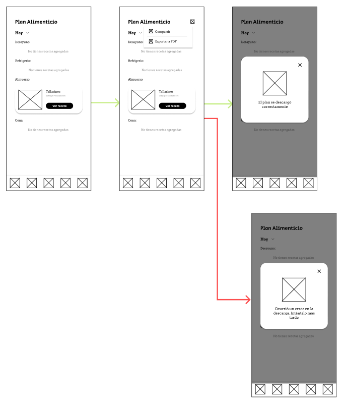
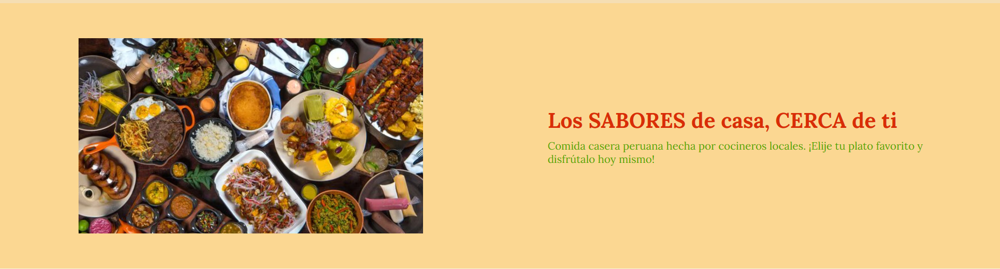
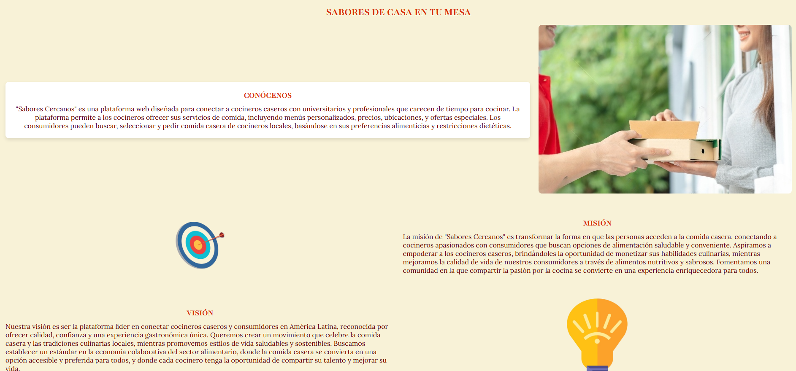
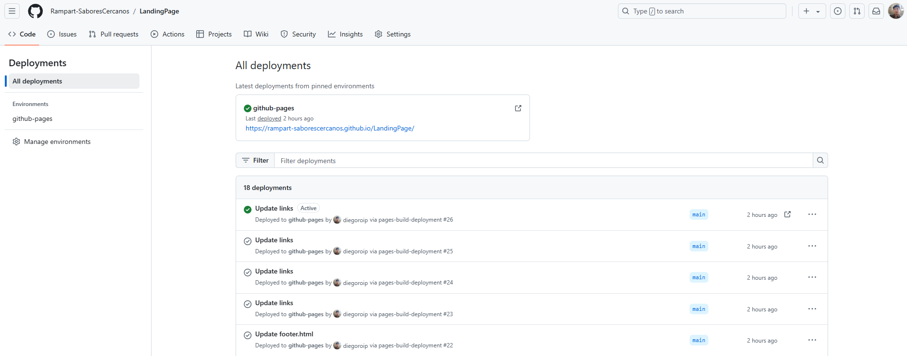
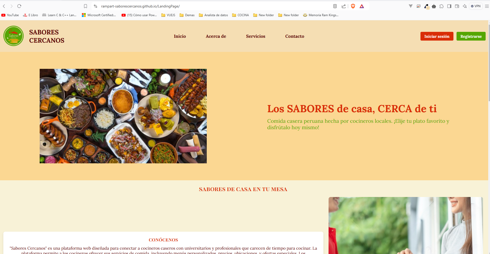
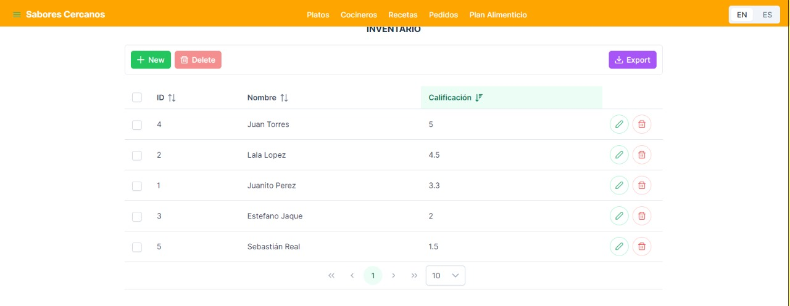

# Rampart

Product: Sabores Cercanos

# UNIVERSIDAD PERUANA DE CIENCIAS APLICADAS

## Ingenieria de Software

## 5to ciclo

## Aplicaciones Web

### **Sección:** WS51

### **Profesor:** Hugo Allan Mori Paiva

### Informe de Trabajo Final

### "Rampart"

### "Sabores Cercanos"

### **Integrantes:**

- Estefano Oscar Jaque Peña - u202225466
- Maria Jose Pezo Castilla - u20221c590
- Jose Antonio Alejo Cardenas - u202122484
- Diego Alonso Rosado Iporre - u201620127
- Sebastian Omar Real Calderón - u20221d964

### Agosto, 2024

## Registro de Versiones del Informe
|Version|Fecha|Autor|Descripcion|
|-|-|-|-|
|TB1|28/08/24|José Alejo| Desarrollé el Lean UX Hypothesis Statements, Lean UX Canvas, Segmentos objetivo, Registro de entrevistas (1 entrevista) y Análisis de entrevistas (1 entrevista) |
|TB1|29/08/24|José Alejo| Desarrollé el To-Be Scenario Mapping, 6 de las User Stories, Impact Mapping y todo el Information Architecture|
|TB1|26/08/2024|Estefano Jaque |Desarrollé el Lean UX Problem Statements,Lean UX Assumptions,Diseño de entrevistas|
|TB1|05/09/2024|Estefano Jaque|Desarrollé las User Stories,Product Backlog, Class Diagrams, Class Dictionary, Database Diagram, Sprint Planning 1, Sprint Backlog 1|
|TB1|29/08/2024|Maria Jose Pezo|Desarrollé la Descripción de la Startup, Solution Profile, Antecedentes y problemática|
|TB1|05/09/2024|Maria Jose Pezo|Desarrollé el regitro de una entrevista a un usuario del segmento 1, Landing Page Wireframe, Landing Page Mock-up, Web Applications UX/UI Design, Web Applications Wireframes, Web Applications Wireflow Diagrams, Web Applications Mock-ups y Web Applications User Flow Diagrams.|
|TB1|29/08/2024|Diego Alonso Rosado Iporre|Desarrollé la Descripción de la Startup, a su vez,  Competidores, Análisis competitivo, Registro de entrevistas, Análisis de entrevistas, Ubiquitous Language, User Stories, Web Applications Wireframes, Domain-Driven Software Architecture, Software Architecture Context Diagram, Software Architecture Container Diagrams, Software Architecture Components Diagrams.|
|TB1|08/09/2024|Diego Alonso Rosado Iporre|Desarrollé la documentacion de la evidencia de los commits realizados: Development Evidence for Sprint Review, Testing Suite Evidence for Sprint Review, Execution Evidence for Sprint Review, Services Documentation Evidence for Sprint Review, Software Deployment Evidence for Sprint Review, Team Collaboration Insights during Sprint, Avance de Conclusiones y Bibliografía. |
|TB1|18/08/2024|Sebastián Omar Real Calderón| Desarrollé el Needfinding, User Personas, User Task Matrix, User Journey Mapping, Empathy Mapping y As-Is Scenario Mapping. |
|TB1|3/09/2024|Sebastián Omar Real Calderón| Realicé los General y Web Style Guidelines. Realicé la documentación de los entornos de trabajo.|
|TP|28/09/2024|Estefano Oscar Jaque Peña| Realice el Sprint Planing, ademas de la implementacion de mi bounded context recetas para Sabores Cercanos y otros apartados que fueron grupales como el Product Backlog |
| TP | 26/09/2024 | Diego Alonso Rosado Iporre | Trabajé en Project Report Collaboration Insights, Sprint Backlog 1, Execution Evidence for Sprint Review, Software Deployment Evidence for Sprint Review, Bounded Context Plan Alimenticio y Conclusiones. |
| TP | 26/09/2024 | Sebastián Omar Real Calderón | Re alice el Team Collaboration Insights during Sprint, ademas de la implementacion de mi bounded context Cocineros para Sabores Cercanos|
|TP|26/09/2024|Jose Antonio Alejo Cardenas|Bounded Context de Pedidos,Sprint Backlog 1, Testing Suite Evidence for Sprint Review, Execution Evidence for Sprint Review y Software Deployment Evidence for Sprint Review|
| TP | 26/09/2024 | Maria Jose Pezo | Desarrollé el Sprint Backlog 1, Execution Evidence for Sprint Review, Services Documentation Evidence for Sprint Review, Bounded Context de Platos, Bibliografía y Conclusiones. |

## Project Report Collaboration Insights

TB1: 
|Integrante|Tarea Asignada|
|-|-|
|Alejo Cárdenas, Jose Antonio|Lean UX Hypothesis Statements, Lean UX Canvas, Segmentos objetivo, 1 Registro de entrevistas, 1 Análisis de entrevistas, To-Be Scenario Mapping, 6 User Stories, Impact Mapping, Organization Systems, Labeling Systems, SEO Tags and Meta Tags, Searching Systems, Navigation Systems, Creacion del keynote, Reporte de participacion y parte la estructuracion del informe.|
|Jaque Peña, Estefano Oscar|Lean UX Problem Statements,Lean UX Assumptions,Diseño de entrevistas,User Stories,Product Backlog, Class Diagrams, Class Dictionary, Database Diagram, Sprint Planning 1, Sprint Backlog 1|
|Pezo Castilla, Maria Jose|Descripción de la Startup, Solution Profile, Antecedentes y problemática, el regitro de una entrevista a un estudiante ocupado, Landing Page Wireframe, Landing Page Mock-up, Web Applications UX/UI Design, Web Applications Wireframes, Web Applications Wireflow Diagrams, Web Applications Mock-ups y Web Applications User Flow Diagrams.|
|Rosado Iporre, Diego Alonso|Descripción de la Startup, Competidores, Análisis Competitivo, Registro de Entrevistas, Análisis de Entrevistas, Ubiquitous Language, User Stories, Wireframes de Aplicaciones Web, Domain-Driven Software Architecture, Software Architecture Context Diagram, Software Architecture Container Diagrams, y Software Architecture Components Diagrams. Además, he trabajado en la creación y despliegue de la landing page, documentando el diseño y las pruebas realizadas. Documenté la evidencia de los commits realizados, incluyendo Development Evidence for Sprint Review, Testing Suite Evidence for Sprint Review, Execution Evidence for Sprint Review, Services Documentation Evidence for Sprint Review, Software Deployment Evidence for Sprint Review, y Team Collaboration Insights during Sprint. También incluí el avance de conclusiones y bibliografía.|
| Real Calderón, Sebastián Omar | User Personas, User Task Matrix, User Journey Mapping, Empathy Mapping, As-Is Scenario Mapping, Style Guidelines, Software Development Environment Configuration, Source Code Management, Source Code Style Guide & Conventions, Software Deployment Configuration. |

TP: 
|Integrante|Tarea Asignada|
|-|-|
|Diego Alonso Rosado Iporre | Colaboré en la Project Report Collaboration Insights, la elaboración del Sprint Backlog 1, y la documentación de Execution Evidence for Sprint Review y Software Deployment Evidence for Sprint Review. También trabajé en las Conclusiones del proyecto, el desarrollo de bounded context del Plan Alimenticio, así como en el despliegue y desarrollo de las User Stories 29 y 30 centradas en la creación y seguimiento de planes alimenticios personalizados.| 
|Sebastián Omar Real Calderón |Sprint Backlog 1, Execution Evidence for Sprint Review, Software Deployment Evidence for Sprint Review, Team Collaboration Insights during Sprint y las Conclusiones.|   
|Pezo Castilla, Maria Jose | En el Sprint Backlog 1, identifiqué y prioricé las tareas clave del sprint, estableciendo los entregables esenciales para el equipo de desarrollo. Para la Execution Evidence for Sprint Review, documenté el progreso del sprint mediante capturas y descripciones detalladas de las funcionalidades completadas. En la Services Documentation Evidence for Sprint Review, proporcioné una guía técnica de los servicios desarrollados, describiendo sus endpoints y lógica de negocio. El Bounded Context de Platos consistió en delimitar las responsabilidades y características del módulo de platos dentro de la arquitectura del sistema, teniendo en cuenta la US04 y la US06 . Finalmente, elaboré la Bibliografía para respaldar teóricamente el proyecto y formulé las Conclusiones, destacando los aprendizajes y resultados del sprint. |
|Jaque Peña, Estefano Oscar|En el Sprint Planing 1 se pudo redactar los apartados importantes de la reunion para la realizacion de este, como la separacion de bounded context.En el Sprint Backlog 1 se especifico la funcionalidad añadidad a cada bounded contexct respecto a las user stories. Ademas en los apartados en lo que se debio realizar la evidencia del sprint como el Execution Evidence for Sprint Review,Software Deployment Evidence for Sprint Review,Team Collaboration Insights during Sprint se añadio las evidencias especificando mi apartado del bounded context.|
|Alejo Cárdenas, Jose Antonio|Bounded Context de Pedidos: Define y gestiona todas las funcionalidades relacionadas con los pedidos, asegurando la separación de responsabilidades dentro del sistema. Sprint Backlog 1:Lista priorizada de tareas y funcionalidades que serán desarrolladas durante el Sprint. Testing Suite Evidence for Sprint Review:Evidencia de pruebas realizadas para validar que las funcionalidades cumplen con los requisitos, incluyendo resultados documentados. Execution Evidence for Sprint Review:Demostración de la ejecución de las funcionalidades desarrolladas, con evidencia visual o en video. Software Deployment Evidence for Sprint Review: Comprobación de que el software fue desplegado exitosamente, con documentación del proceso y resultados.|

*Pull requests evidence:*

*Commits evidence:*

*Issues evidence:*

## Contenido

### Tabla de contenidos
- [Rampart](#rampart)
- [UNIVERSIDAD PERUANA DE CIENCIAS APLICADAS](#universidad-peruana-de-ciencias-aplicadas)
  - [Ingenieria de Software](#ingenieria-de-software)
  - [5to ciclo](#5to-ciclo)
  - [Aplicaciones Web](#aplicaciones-web)
    - [**Sección:** WS51](#sección-ws51)
    - [**Profesor:** Hugo Allan Mori Paiva](#profesor-hugo-allan-mori-paiva)
    - [Informe de Trabajo Final](#informe-de-trabajo-final)
    - ["Rampart"](#rampart-1)
    - ["Sabores Cercanos"](#sabores-cercanos)
    - [**Integrantes:**](#integrantes)
    - [Agosto, 2024](#agosto-2024)
  - [Registro de Versiones del Informe](#registro-de-versiones-del-informe)
  - [Project Report Collaboration Insights](#project-report-collaboration-insights)
  - [Contenido](#contenido)
    - [Tabla de contenidos](#tabla-de-contenidos)
  - [Student Outcome](#student-outcome)
  - [Capítulo I: Introducción](#capítulo-i-introducción)
    - [1.1. Startup Profile](#11-startup-profile)
    - [1.1.1. Descripción de la Startup](#111-descripción-de-la-startup)
          - [Misión:](#misión)
          - [Visión:](#visión)
    - [1.1.2. Perfiles de integrantes del equipo](#112-perfiles-de-integrantes-del-equipo)
    - [1.2. Solution Profile](#12-solution-profile)
    - [1.2.1. Antecedentes y problemática](#121-antecedentes-y-problemática)
          - [What?](#what)
          - [When?](#when)
          - [Where?](#where)
          - [Who?](#who)
          - [Why?](#why)
          - [How?](#how)
          - [How much?](#how-much)
    - [1.2.2. Lean UX Process](#122-lean-ux-process)
    - [1.2.2.1. Lean UX Problem Statements](#1221-lean-ux-problem-statements)
    - [1.2.2.2. Lean UX Assumptions](#1222-lean-ux-assumptions)
    - [Assumptions para "Sabores Cercanos"](#assumptions-para-sabores-cercanos)
    - [1.2.2.3. Lean UX Hypothesis Statements](#1223-lean-ux-hypothesis-statements)
    - [1.2.2.4. Lean UX Canvas](#1224-lean-ux-canvas)
    - [1.3. Segmentos objetivo](#13-segmentos-objetivo)
  - [Capítulo II: Requirements Elicitation \& Analysis](#capítulo-ii-requirements-elicitation--analysis)
    - [2.1. Competidores](#21-competidores)
    - [2.1.1. Análisis competitivo](#211-análisis-competitivo)
    - [2.1.2. Estrategias y tácticas frente a competidores](#212-estrategias-y-tácticas-frente-a-competidores)
    - [2.2. Entrevistas](#22-entrevistas)
    - [2.2.1. Diseño de entrevistas](#221-diseño-de-entrevistas)
    - [Preguntas para Entrevistar a Estudiantes/Profesionales Ocupados](#preguntas-para-entrevistar-a-estudiantesprofesionales-ocupados)
    - [Preguntas para Entrevistar a Cocineros Caseros](#preguntas-para-entrevistar-a-cocineros-caseros)
    - [2.2.2. Registro de entrevistas](#222-registro-de-entrevistas)
    - [2.2.3. Análisis de entrevistas](#223-análisis-de-entrevistas)
  - [2.3. Needfinding](#23-needfinding)
    - [2.3.1. User Personas](#231-user-personas)
      - [2.3.1.1. **User Persona del Segmento Objetivo 1: Cocineros Caseros**](#2311-user-persona-del-segmento-objetivo-1-cocineros-caseros)
      - [2.3.1.2. **User Persona del Segmento Objetivo 2: Estudiantes/Profesionales Ocupados**](#2312-user-persona-del-segmento-objetivo-2-estudiantesprofesionales-ocupados)
    - [2.3.2. User Task Matrix](#232-user-task-matrix)
    - [2.3.3. User Journey Mapping](#233-user-journey-mapping)
      - [**User Persona 1: María**](#user-persona-1-maría)
      - [**User Persona 2: Ricardo**](#user-persona-2-ricardo)
    - [2.3.4. Empathy Mapping](#234-empathy-mapping)
      - [**User Persona 1: María**](#user-persona-1-maría-1)
      - [**User Persona 2: Ricardo**](#user-persona-2-ricardo-1)
    - [2.3.5. As-is Scenario Mapping](#235-as-is-scenario-mapping)
  - [2.4. Ubiquitous Language](#24-ubiquitous-language)
    - [Términos generales](#términos-generales)
    - [Perfiles de Usuario](#perfiles-de-usuario)
    - [Proceso de Pedido y Entrega](#proceso-de-pedido-y-entrega)
    - [Gestión y Administración](#gestión-y-administración)
    - [Datos y Análisis](#datos-y-análisis)
    - [Disponibilidad y Programación](#disponibilidad-y-programación)
  - [Capítulo III: Requirements Specification](#capítulo-iii-requirements-specification)
    - [3.1. To-Be Scenario Mapping](#31-to-be-scenario-mapping)
    - [3.2. User Stories](#32-user-stories)
    - [3.3. Impact Mapping](#33-impact-mapping)
    - [3.4. Product Backlog](#34-product-backlog)
  - [Capítulo IV: Product Design](#capítulo-iv-product-design)
    - [4.1. Style Guidelines.](#41-style-guidelines)
    - [4.1.1. General Style Guidelines](#411-general-style-guidelines)
    - [4.1.2. Web Style Guidelines](#412-web-style-guidelines)
    - [4.2. Information Architecture](#42-information-architecture)
    - [4.2.1. Organization Systems](#421-organization-systems)
    - [4.2.2. Labeling Systems](#422-labeling-systems)
    - [4.2.3. SEO Tags and Meta Tags](#423-seo-tags-and-meta-tags)
    - [4.2.4. Searching Systems](#424-searching-systems)
    - [4.2.5. Navigation Systems](#425-navigation-systems)
    - [4.3. Landing Page UI Design](#43-landing-page-ui-design)
    - [4.3.1. Landing Page Wireframe](#431-landing-page-wireframe)
    - [4.3.2. Landing Page Mock-up](#432-landing-page-mock-up)
    - [4.4. Web Applications UX/UI Design](#44-web-applications-uxui-design)
    - [4.4.1. Web Applications Wireframes](#441-web-applications-wireframes)
    - [4.4.2. Web Applications Wireflow Diagrams](#442-web-applications-wireflow-diagrams)
    - [4.4.2. Web Applications Mock-ups](#442-web-applications-mock-ups)
    - [4.4.3. Web Applications User Flow Diagrams](#443-web-applications-user-flow-diagrams)
      - [Happy path:](#happy-path)
      - [Unhappy path:](#unhappy-path)
      - [Happy path:](#happy-path-1)
      - [Happy path:](#happy-path-2)
      - [Happy path:](#happy-path-3)
      - [Unhappy path:](#unhappy-path-1)
      - [Happy path:](#happy-path-4)
      - [Unhappy path:](#unhappy-path-2)
      - [Happy path:](#happy-path-5)
      - [Unhappy path:](#unhappy-path-3)
      - [Happy path:](#happy-path-6)
    - [4.5. Web Applications Prototyping](#45-web-applications-prototyping)
    - [4.6. Domain-Driven Software Architecture](#46-domain-driven-software-architecture)
    - [4.6.1. Software Architecture Context Diagram](#461-software-architecture-context-diagram)
    - [4.6.2. Software Architecture Container Diagrams](#462-software-architecture-container-diagrams)
    - [4.6.3. Software Architecture Components Diagrams](#463-software-architecture-components-diagrams)
    - [4.7. Software Object-Oriented Design](#47-software-object-oriented-design)
    - [4.7.1. Class Diagrams](#471-class-diagrams)
    - [4.8. Database Design](#48-database-design)
    - [4.8.1. Database Diagram](#481-database-diagram)
    - [4.8.2. Database Dictionary](#482-database-dictionary)
      - [User](#user)
      - [Chef](#chef)
      - [Menu](#menu)
      - [Order](#order)
      - [Order-Details](#order-details)
      - [Dish](#dish)
      - [Publication](#publication)
      - [Reviews](#reviews)
      - [Category](#category)
      - [Plans-Type](#plans-type)
  - [Capítulo V: Product Implementation, Validation \& Deployment](#capítulo-v-product-implementation-validation--deployment)
    - [5.1. Software Configuration Management](#51-software-configuration-management)
    - [5.1.1. Software Development Environment Configuration](#511-software-development-environment-configuration)
    - [5.1.2. Source Code Management](#512-source-code-management)
    - [**Master o Main branch**](#master-o-main-branch)
      - [Notación: master o main](#notación-master-o-main)
    - [**Conventional Commits**](#conventional-commits)
    - [5.1.3. Source Code Style Guide \& Conventions](#513-source-code-style-guide--conventions)
    - [5.1.4. Software Deployment Configuration](#514-software-deployment-configuration)
    - [5.2. Landing Page, Services \& Applications Implementation](#52-landing-page-services--applications-implementation)
    - [5.2.1. Sprint 1](#521-sprint-1)
    - [5.2.1.1. Sprint Planning 1](#5211-sprint-planning-1)
    - [5.2.1.2. Sprint Backlog 1](#5212-sprint-backlog-1)
    - [5.2.1.3. Development Evidence for Sprint Review](#5213-development-evidence-for-sprint-review)
    - [5.2.1.4. Testing Suite Evidence for Sprint Review](#5214-testing-suite-evidence-for-sprint-review)
    - [5.2.1.5. Execution Evidence for Sprint Review](#5215-execution-evidence-for-sprint-review)
    - [5.2.1.6. Services Documentation Evidence for Sprint Review](#5216-services-documentation-evidence-for-sprint-review)
    - [Resumen de Acciones del Equipo](#resumen-de-acciones-del-equipo)
    - [5.2.1.7. Software Deployment Evidence for Sprint Review](#5217-software-deployment-evidence-for-sprint-review)
    - [5.2.1.8. Team Collaboration Insights during Sprint](#5218-team-collaboration-insights-during-sprint)
    - [5.2.1. Sprint 2](#521-sprint-2)
    - [5.2.1.1. Sprint Planning 2](#5211-sprint-planning-2)
    - [5.2.1.2. Sprint Backlog 2](#5212-sprint-backlog-2)
    - [5.2.1.3. Development Evidence for Sprint Review](#5213-development-evidence-for-sprint-review-1)
    - [5.2.1.4. Testing Suite Evidence for Sprint Review](#5214-testing-suite-evidence-for-sprint-review-1)
    - [5.2.1.5. Execution Evidence for Sprint Review](#5215-execution-evidence-for-sprint-review-1)
    - [5.2.1.6. Services Documentation Evidence for Sprint Review](#5216-services-documentation-evidence-for-sprint-review-1)
    - [5.2.1.7. Software Deployment Evidence for Sprint Review](#5217-software-deployment-evidence-for-sprint-review-1)
    - [5.2.2.8. Team Collaboration Insights during Sprint](#5228-team-collaboration-insights-during-sprint)
  - [Conclusiones](#conclusiones)
  - [Bibliografia](#bibliografia)
  - [Anexos](#anexos)

## Student Outcome

_ABET – EAC - Student Outcome 5_

**Criterio:**  La capacidad de funcionar efectivamente en un equipo cuyos miembros juntos proporcionan liderazgo, crean un entorno de colaboración e inclusivo, establecen objetivos, planifican tareas y cumplen objetivos. 

En el siguiente cuadro se describe las acciones realizadas y enunciados de conclusiones por parte del grupo, que permiten sustentar el haber alcanzado el logro del ABET – EAC - Student Outcome 5. 

| Criterio especifico                                                          | Acciones Realizadas                                                                                                                                                                                                                                                                                                                                                                                                                                                             | Conclusiones |
| :--------------------------------------------------------------------------- | :------------------------------------------------------------------------------------------------------------------------------------------------------------------------------------------------------------------------------------------------------------------------------------------------------------------------------------------------------------------------------------------------------------------------------------------------------------------------------ | ----------- |
| 1.Trabaja en equipo para proporcionar liderazgo en forma conjunta   | **Estefano Oscar Jaque Peña** TB1: Realice el Lean UX Prolem statements y los assumptions , luego me encargue de el diseño de las preguntas para las entrevistas, para finalizar el cap 3,4 y 5 realice 6 user stories, el product bakclog , el Diagrama de Clases y el diagrama de base de datos y luego el sprint planning y el spring backlog.  **Diego Alonso Rosado Iporre**  TB1: Realice la "Descripción de la estrategia de la Startup", Competidores, Análisis competitivo, Estrategias y tácticas frente a competidores, Registro de entrevistas, Análisis de entrevistas, Ubiquitous Language, User Stories, Domain-Driven Software Architecture, Software Architecture Context Diagram, Software Architecture Container Diagrams, Software Architecture Components Diagrams, Development Evidence for Sprint Review, Testing Suite Evidence for Sprint Review, Execution Evidence for Sprint Review, Services Documentation Evidence for Sprint Review, Software Deployment Evidence for Sprint Review y Team Collaboration Insights during Sprint  **Jose Antonio Alejo Cardenas:**  TB1: Para esta TB1, realicé actividades como Lean UX Hypothesis Statements, desarrollando hipótesis enfocadas en el usuario, Lean UX Canvas, realizando investigaciones y resaltando puntos clave, definición de Segmentos objetivo basados en datos demográficos, Registro y análisis de entrevistas para obtener informacion valiosa, To-Be Scenario Mapping, detallando escenarios futuros de como deberia ser, User Stories centradas en las necesidades del usuario, Impact Mapping para alinear entregables con sus respectivas user stories, desarrollo de Organization Systems y Labeling Systems para una mejor estructura, implementación de SEO Tags y Meta Tags para optimización de búsqueda, diseño de Searching Systems efectivos y configuración de Navigation Systems para mejorar la experiencia del usuario.  **Sebastian Omar Real Calderón**  TB1: Realicé los aspectos del Needfinding para hallar las necesidades de nuestros consumidores, realicé los User Persona como la representación de nuestros clientes ideales. Hice el diseño de los Style Guidelines con los que mis compañeros se guiaron para realizar el aspecto visual de la landing page, y documenté los espacios de trabajo utilizados para la realización de las actividades, así como de los lenguajes de programación y convenciones.  **Maria Jose Pezo Castilla**  TB1: Redacté la Descripción de la Startup, explicando su misión, visión y objetivos principales, completé el Solution Profile, destacando las características clave de la solución propuesta, analicé los Antecedentes y problemática a la que se enfrenta el público objetivo de la startup, realicé y registré una entrevista a un estudiante ocupado, obteniendo información directa de sus necesidades, creé la Landing Page Wireframe que sirva de prototipo visual básico, desarrollé el Landing Page Mock-up, mostrando una versión más refinada y visualmente atractiva, diseñé la UX/UI de la aplicación web, enfocándose en la experiencia y la interfaz de usuario, creé el Web Applications Wireframes, estableciendo las bases del diseño de la estructura, elaboré los Wireflow Diagrams para detallar el flujo de interacción entre pantallas, desarrollé los Mock-ups de la aplicación web, reflejando el diseño final con mayor detalle visual y creé los User Flow Diagrams que representen la navegación completa del usuario dentro de la aplicación.  **Diego Alonso Rosado Iporre ** TP:Colaboré en la Project Report Collaboration Insights, la elaboración del Sprint Backlog 1, y la documentación de Execution Evidence for Sprint Review y Software Deployment Evidence for Sprint Review. También trabajé en las Conclusiones del proyecto, el desarrollo de bounded context del Plan Alimenticio, así como en el despliegue y desarrollo de las User Stories 29 y 30 centradas en la creación y seguimiento de planes alimenticios personalizados. **Jose Antonio Alejo Cardenas**  TP: Para esta TP, realicé actividades como el Bounded Context de Pedidos, delimitando las funcionalidades específicas de la gestión de pedidos y asegurando la correcta separación de responsabilidades dentro del sistema. También trabajé en el Sprint Backlog 1, donde se organizó y priorizó la lista de funcionalidades a desarrollar durante el sprint, asegurando una correcta asignación de tareas al equipo. Además, preparé el Testing Suite Evidence for Sprint Review, generando las evidencias de las pruebas para validar que las nuevas funcionalidades cumplen con los requisitos establecidos. Asimismo, desarrollé la Execution Evidence for Sprint Review, demostrando la ejecución efectiva de cada funcionalidad implementada, y el Software Deployment Evidence for Sprint Review, comprobando que el software fue desplegado exitosamente, con la documentación necesaria para su integración en los ambientes de QA o producción. **Maria Jose Pezo Castilla**  TP: El trabajo en equipo durante el Sprint Backlog 1 resultó en una gestión efectiva de las tareas clave, donde identifiqué y prioricé los entregables esenciales para el desarrollo del proyecto. La documentación del progreso en la Execution Evidence for Sprint Review mediante capturas y descripciones detalladas permitió una revisión clara de las funcionalidades completadas. Adicionalmente, en la Services Documentation Evidence for Sprint Review, proporcioné una guía técnica completa que detalla los servicios desarrollados, sus endpoints y la lógica de negocio. El Bounded Context de Platos facilitó la delimitación de responsabilidades dentro del sistema, alineando las características del módulo con las user stories relevantes. Finalmente, la elaboración de la Bibliografía y las Conclusiones resaltó los aprendizajes adquiridos y los resultados alcanzados en este sprint, consolidando el progreso del equipo en un entorno colaborativo. **Estefano Oscar Jaque Peña** TP: En esta entrega, me enfoqué en el Sprint Planning y el Product Backlog. También trabajé en la Execution Evidence y Software Deployment Evidence for Sprint Review, además de documentar el Team Collaboration Insights y el Report Collaboration Insights. Asimismo, desarrollé el Bounded Context para las recetas, lo que mejora la claridad en el código y fomenta una colaboración efectiva en el equipo. **Real Calderón, Sebastián Omar**: TP: Realicé parte de los User Personas, User Task Matrix, User Journey Mapping, Empathy Mapping, As-Is Scenario Mapping, Style Guidelines, Software Development Environment Configuration, Source Code Management, Source Code Style Guide & Conventions, Software Deployment Configuration.|     **Jose Antonio Alejo Cardenas**  TB1:  El desarrollo de actividades como las User Stories, Lean UX Canvas e Impact Mapping refleja el liderazgo colaborativo, pues estas tareas implican tener las ideas de todos los miembros centradas en los mismos objetivos y necesidades que se buscan satisfacer o solucionar mediante nuestro producto. Asi mismo, el desarrollo de la arquitectura informacion es tambien un punto importante para la colaboracion y comunicacion constante del equipo pues sera un apartado a cumplir proximamente durante las siguientes entregas. **Estefano Oscar Jaque Peña** TB1:El realizar parte del Lean Ux Process me ayudo a poder aprender mas de la problematica actual en la que nos centramos como equipo para poder crear el aplicativo, asi como tambien aprender de nuestro usuario objetivo. Con la resolución del modelo físico de la base de datos, aprendí a optimizar el almacenamiento de usuarios, pedidos, y menús, así como a organizar eficientemente las relaciones entre tablas para mejorar el rendimiento de la plataforma 'Sabores Cercanos'. Y para finalizar con el Sprint planning y el Sprint Backlog, concluí que una planificación clara de tareas y la descomposición de user stories son fundamentales para organizar el trabajo del equipo, mantener el enfoque en los objetivos del sprint y garantizar un seguimiento eficiente del progreso en la plataforma. **Maria Jose Pezo Castilla**  TB1: El trabajo en equipo para proporcionar liderazgo conjunto resultó en un proceso colaborativo y estructurado que facilitó el desarrollo del proyecto de manera eficiente. Las acciones realizadas, como la descripción de la startup, el perfil de la solución y el análisis de antecedentes, permitieron al equipo alinear su visión y tomar decisiones estratégicas en conjunto. La entrevista con un estudiante proporcionó información valiosa para ajustar prioridades, mientras que los diseños de la landing page y la aplicación web reflejaron una planificación detallada y una contribución equitativa de todos los miembros. Esto fortaleció las dinámicas de equipo y el liderazgo compartido, asegurando un progreso efectivo.  **Diego Alonso Rosado Iporre**  TB1: Desde mi perspectiva, el trabajo en el desarrollo del proyecto ha sido muy enriquecedor. He liderado la creación de la Descripción de la Startup, el análisis de competidores, y la documentación de los resultados de las entrevistas, así como la elaboración del Ubiquitous Language y los Wireframes de la aplicación web. Mi enfoque en la creación y despliegue de la landing page ha incluido la documentación detallada del diseño, la implementación, y el despliegue, reflejando un proceso bien estructurado. A pesar de ser el único en realizar commits, he asegurado una documentación completa de cada fase, incluyendo pruebas y evidencia del despliegue. La planificación meticulosa y el enfoque en la colaboración han sido claves para avanzar de manera efectiva y estructurada en el proyecto. **Sebastián Omar Real Calderón**  TB1: El trabajo en equipo fue clave para lograr un liderazgo compartido, ya que cada integrante pudo aportar desde sus habilidades y conocimientos específicos, siempre con un enfoque en los objetivos comunes. Al participar en tareas como el desarrollo de User Personas, User Journey Mapping, y la configuración del entorno de desarrollo, se garantizó una colaboración fluida y eficiente. La coordinación en la gestión del código fuente y el despliegue de software reflejó una planificación clara que permitió cumplir con los hitos del proyecto de manera organizada y precisa.  **Diego Alonso Rosado Iporre** TP: Trabajar en equipo es crucial para el éxito del proyecto, ya que permite que cada miembro aporte sus habilidades. En esta entrega, contribuí al Project Report Collaboration Insights, al Sprint Backlog 1 y a la Execution Evidence for Sprint Review. También desarrollé el Bounded Context para el Plan Alimenticio y participé en el deployment de las User Stories 29 y 30, asegurando documentación clara en cada etapa. **Jose Antonio Alejo Cardenas**  TP: En esta TP, atraves del Bounded Context de Pedidos, logré definir claramente las responsabilidades en la gestión de pedidos, lo que facilitó una colaboración efectiva entre todos los miembros del equipo. Además, el trabajo realizado en el Sprint Backlog 1 me permitió organizar y priorizar las tareas, asegurando que cada integrante asumiera un rol activo y contribuyera al liderazgo compartido en el desarrollo de las funcionalidades. La preparación del Testing Suite Evidence for Sprint Review también fue fundamental, ya que proporcionó un marco claro para validar las funcionalidades, y la Execution Evidence for Sprint Review demostró cómo cada tarea fue ejecutada efectivamente por el equipo. **Maria Jose Pezo Castilla**  TP: En esta TP, atraves del Bounded Context de Pedidos, logré definir claramente las responsabilidades en la gestión de pedidos, lo que facilitó una colaboración efectiva entre todos los miembros del equipo. Además, el trabajo realizado en el Sprint Backlog 1 me permitió organizar y priorizar las tareas, asegurando que cada integrante asumiera un rol activo y contribuyera al liderazgo compartido en el desarrollo de las funcionalidades. La preparación del Testing Suite Evidence for Sprint Review también fue fundamental, ya que proporcionó un marco claro para validar las funcionalidades, y la Execution Evidence for Sprint Review demostró cómo cada tarea fue ejecutada efectivamente por el equipo. **Estefano Oscar Jaque Peña** TP: La colaboración en equipo es fundamental para el éxito del proyecto, ya que cada miembro puede aportar sus talentos. En esta entrega, participé en el Project Report Collaboration Insights, el Sprint Backlog 1 y la Execution Evidence for Sprint Review. Además, trabajé en el Bounded Context para la Receta y estuve involucrado en el deployment de las User Stories 29 y 30, garantizando una documentación clara en cada fase **Sebastián Omar Real Calderón:** TP: Para nuestro proyecto, hemos logrado trabajar en equipo para proporcionar un liderazgo de forma conjunta, permitiendo que cada miembro aporte en gran medida al avance efectivo del proyecto. En esta entrega, aporte a mis compañeros en el desarrollo conjunto del Sprint Backlog 1, la Execution Evidence for Sprint Review, el Software Deployment Evidence for Sprint Review y las conclusiones. Por mi cuenta, hice el desarrollo del bounded context de Cocineros y el Team Collaboration Insights during Sprint.|
|2. Crea un entorno colaborativo e inclusivo, establece metas, planifica tareas y cumple objetivos. | **Estefano Oscar Jaque Peña** TB1: TB1: Realice el Lean UX Prolem statements y los assumptions , luego me encargue de el diseño de las preguntas para las entrevistas, para finalizar el cap 3,4 y 5 realice 6 user stories, el product bakclog , el Diagrama de Clases y el diagrama de base de datos y luego el sprint planning y el spring backlog. **Diego Alonso Rosado Iporre**  TB1: Realice la "Descripción de la estrategia de la Startup", Competidores, Análisis competitivo, Estrategias y tácticas frente a competidores, Registro de entrevistas, Análisis de entrevistas, Ubiquitous Language, User Stories, Domain-Driven Software Architecture, Software Architecture Context Diagram, Software Architecture Container Diagrams, Software Architecture Components Diagrams, Development Evidence for Sprint Review, Testing Suite Evidence for Sprint Review, Execution Evidence for Sprint Review, Services Documentation Evidence for Sprint Review, Software Deployment Evidence for Sprint Review y Team Collaboration Insights during Sprint  **Jose Antonio Alejo Cardenas**  TB1: En esta TB1, creé un entorno colaborativo e inclusivo al involucrar a todos lotesis clave. Se establecio metas claras a través del Lean UX Canvas, donde planificamos tareas alineadas con nuestros objetivos. Definimos Segmentoss miembros del equipo en la elaboración de cada uno de los siguientes puntos ,tales como Lean UX Hypothesis Statements, definiendo conjuntamente hipó objetivo basados en datos compartidos y analizamos en equipo el Registro y análisis de entrevistas para tomar decisiones informadas. El To-Be Scenario Mapping nos ayudó a visualizar escenarios futuros y planificar el cumplimiento de nuestras metas. A través de la creación conjunta de User Stories, Impact Mapping, Organization Systems, y Labeling Systems, garantizamos una planificación efectiva y estructurada, mientras que los SEO Tags, Meta Tags, Searching Systems, y Navigation Systems se diseñaron con una visión compartida para cumplir los objetivos establecidos que se implementaran en siguientes entregas.  **Sebastian Omar Real Calderón**  TB1: Realicé los aspectos del Needfinding para hallar las necesidades de nuestros consumidores, realicé los User Persona como la representación de nuestros clientes ideales. Hice el diseño de los Style Guidelines con los que mis compañeros se guiaron para realizar el aspecto visual de la landing page, y documenté los espacios de trabajo utilizados para la realización de las actividades, así como de los lenguajes de programación y convenciones. **Maria Jose Pezo Castilla**  TB1: Redacté la Descripción de la Startup, explicando su misión, visión y objetivos principales, completé el Solution Profile, destacando las características clave de la solución propuesta, analicé los Antecedentes y problemática a la que se enfrenta el público objetivo de la startup, realicé y registré una entrevista a un estudiante ocupado, obteniendo información directa de sus necesidades, creé la Landing Page Wireframe que sirva de prototipo visual básico, desarrollé el Landing Page Mock-up, mostrando una versión más refinada y visualmente atractiva, diseñé la UX/UI de la aplicación web, enfocándose en la experiencia y la interfaz de usuario, creé el Web Applications Wireframes, estableciendo las bases del diseño de la estructura, elaboré los Wireflow Diagrams para detallar el flujo de interacción entre pantallas, desarrollé los Mock-ups de la aplicación web, reflejando el diseño final con mayor detalle visual y creé los User Flow Diagrams que representen la navegación completa del usuario dentro de la aplicación.  **Diego Alonso Rosado Iporre ** TP:Colaboré en la Project Report Collaboration Insights, la elaboración del Sprint Backlog 1, y la documentación de Execution Evidence for Sprint Review y Software Deployment Evidence for Sprint Review. También trabajé en las Conclusiones del proyecto, el desarrollo de bounded context del Plan Alimenticio, así como en el despliegue y desarrollo de las User Stories 29 y 30 centradas en la creación y seguimiento de planes alimenticios personalizados.  **Jose Antonio Alejo Cardenas**  TP: Para esta TP, realicé actividades como el Bounded Context de Pedidos, delimitando las funcionalidades específicas de la gestión de pedidos y asegurando la correcta separación de responsabilidades dentro del sistema. También trabajé en el Sprint Backlog 1, donde se organizó y priorizó la lista de funcionalidades a desarrollar durante el sprint, asegurando una correcta asignación de tareas al equipo. Además, preparé el Testing Suite Evidence for Sprint Review, generando las evidencias de las pruebas para validar que las nuevas funcionalidades cumplen con los requisitos establecidos. Asimismo, desarrollé la Execution Evidence for Sprint Review, demostrando la ejecución efectiva de cada funcionalidad implementada, y el Software Deployment Evidence for Sprint Review, comprobando que el software fue desplegado exitosamente, con la documentación necesaria para su integración en los ambientes de QA o producción. **Maria Jose Pezo Castilla**  TP: El trabajo en equipo durante el Sprint Backlog 1 resultó en una gestión efectiva de las tareas clave, donde identifiqué y prioricé los entregables esenciales para el desarrollo del proyecto. La documentación del progreso en la Execution Evidence for Sprint Review mediante capturas y descripciones detalladas permitió una revisión clara de las funcionalidades completadas. Adicionalmente, en la Services Documentation Evidence for Sprint Review, proporcioné una guía técnica completa que detalla los servicios desarrollados, sus endpoints y la lógica de negocio. El Bounded Context de Platos facilitó la delimitación de responsabilidades dentro del sistema, alineando las características del módulo con las user stories relevantes. Finalmente, la elaboración de la Bibliografía y las Conclusiones resaltó los aprendizajes adquiridos y los resultados alcanzados en este sprint, consolidando el progreso del equipo en un entorno colaborativo. **Estefano Oscar Jaque Peña** En esta entrega, me enfoqué en el Sprint Planning y el Product Backlog. También trabajé en la Execution Evidence y Software Deployment Evidence for Sprint Review, además de documentar el Team Collaboration Insights y el Report Collaboration Insights. Asimismo, desarrollé el Bounded Context para las recetas, lo que mejora la claridad en el código y fomenta una colaboración efectiva en el equipo. **Sebastián Omar Real Calderón:** TP: Creo que un entorno de trabajo colaborativo e inclusivo es clave para el éxito de nuestro proyecto. Fomentar la participación activa de todos los miembros del equipo asegura que se aprovechen al máximo nuestras fortalezas individuales. En esta entrega, colaboré en el Sprint Backlog 1, Execution Evidence for Sprint Review y Software Deployment Evidence for Sprint Review, ayudando a garantizar que cada etapa del proceso estuviera bien documentada y alineada con nuestros objetivos. También desarrollé la User Story 03, centrada en la visualización de reseñas y perfiles de cocineros, lo que permitirá a los usuarios tomar decisiones informadas antes de realizar pedidos. Este esfuerzo asegura una mejor experiencia de usuario y refuerza nuestro compromiso con la calidad del producto.|   **Jose Antonio Alejo Cardenas**  TB1: Crear un entorno colaborativo, donde cada integrante cumpla sus tareas establecidas, fue un punto crucial durante el desarrollo de este entregable, ya que al planificar y ejecutar actividades como la definicion de Segmentos Objetivos y la distribucion de las entrevistas nos permitio obtener informacion vital para el desarrollo cada punto de los entregables. En otras palabras, gracias a nuestro entorno colaborativo se aseguraron metas claras y compartidas por todos lo que permitio cumplir con los objetivos de este entregable. **Maria Jose Pezo Castilla**  TB1: La creación de un entorno colaborativo e inclusivo, junto con metas claras y planificación efectiva, fue clave para el éxito del proyecto. El equipo trabajó en conjunto para definir la visión de la startup, desarrollar el perfil de la solución y analizar antecedentes, distribuyendo responsabilidades y garantizando el cumplimiento de plazos. La entrevista a un estudiante permitió ajustar objetivos en función de las necesidades reales. Además, el diseño de la landing page y la aplicación web reflejó una colaboración eficiente y una planificación detallada, lo que consolidó al equipo y permitió cumplir con los hitos establecidos. **Diego Alonso Rosado Iporre**  TB1: He creado un entorno colaborativo e inclusivo al asegurar que cada aspecto del proyecto esté bien documentado y comunicado. He establecido metas claras y planificado tareas con precisión, como la descripción de la startup, el análisis competitivo, y el desarrollo de la landing page. A través de la documentación exhaustiva y la evidencia de cada fase, he garantizado que los objetivos del proyecto se cumplan de manera efectiva. Mi enfoque ha sido mantener un progreso constante y transparente, facilitando la colaboración y asegurando que cada tarea se complete con calidad y precisión. **Sebastián Omar Real Calderón**  TB1: El trabajo en equipo y la colaboración fueron clave para alcanzar los objetivos de esta primera etapa del proyecto. Con una buena planificación y distribución de tareas, pude aportar con la creación de las User Personas, el desarrollo de la User Task Matrix y el User Journey Mapping, además de trabajar en el Empathy Mapping y el As-Is Scenario Mapping. También me enfoqué en definir las Style Guidelines, configurar el entorno de desarrollo de software y gestionar el código fuente con lineamientos claros, así como asegurar una correcta configuración para el despliegue. Estas acciones contribuyeron a que cada etapa del proyecto avanzara sin contratiempos, cumpliendo con los plazos y garantizando un desarrollo exitoso. **Diego Alonso Rosado Iporre** TP: Creo en la importancia de un entorno colaborativo e inclusivo, donde todos se sientan valorados. Al establecer metas claras y planificar tareas, garantizamos el compromiso del equipo con los objetivos del proyecto. En esta entrega, contribuí al Project Report Collaboration Insights, al Sprint Backlog 1 y a la Execution Evidence for Sprint Review. Además, desarrollé el Bounded Context para el Plan Alimenticio y participé en el deployment de las User Stories 29 y 30, asegurando una documentación clara en cada etapa del proceso. **Jose Antonio Alejo Cardenas**  TP: La realización de actividades como el Testing Suite Evidence for Sprint Review y la Execution Evidence for Sprint Review fomentó un ambiente inclusivo donde cada miembro del equipo participó en la validación y demostración de las funcionalidades implementadas. Además, al recopilar el Software Deployment Evidence for Sprint Review, aseguré que el equipo mantuviera el compromiso con la planificación y la ejecución eficaz. Todas estas actividades, desde el Bounded Context de Pedidos hasta la revisión final del despliegue, contribuyeron a que lográramos cumplir con las metas establecidas dentro de los plazos y con la calidad necesaria. **Maria Jose Pezo Castilla**  TP: La creación de un entorno colaborativo y bien estructurado fue fundamental para el éxito del Sprint Backlog 1. Identifiqué y prioricé las tareas clave, estableciendo entregables esenciales que facilitaron la organización y el enfoque del equipo de desarrollo. La documentación del progreso en la Execution Evidence for Sprint Review, con capturas y descripciones detalladas de las funcionalidades completadas, permitió una evaluación clara de los avances. Además, la Services Documentation Evidence for Sprint Review proporcionó una guía técnica completa que describió los servicios desarrollados, sus endpoints y la lógica de negocio. El Bounded Context de Platos ayudó a delimitar responsabilidades dentro del sistema, asegurando que se cumplieran las user stories relevantes. Finalmente, la elaboración de la Bibliografía y las Conclusiones destacaron los aprendizajes y resultados del sprint, consolidando así el progreso del equipo en un marco de colaboración efectiva.  **Estefano Oscar Jaque Peña** La creación de un entorno colaborativo e inclusivo es esencial para el éxito de cualquier proyecto. Un espacio donde cada miembro del equipo se sienta valorado y escuchado fomenta la creatividad y el intercambio de ideas. Al alentar la diversidad de opiniones, se enriquece la toma de decisiones y se fortalecen las soluciones propuestas. Además, un ambiente inclusivo motiva a todos a contribuir activamente, lo que mejora la cohesión del equipo y permite alcanzar nuestras metas con mayor eficacia. Al establecer metas claras y fomentar una comunicación abierta, podemos asegurar que todos estén alineados y comprometidos con el objetivo común.|

## Capítulo I: Introducción

### 1.1. Startup Profile

### 1.1.1. Descripción de la Startup

   "Sabores Cercanos" es una plataforma web diseñada para conectar a cocineros caseros con universitarios y profesionales que carecen de tiempo para cocinar. La plataforma permite a los cocineros ofrecer sus servicios de comida, incluyendo menús personalizados, precios, ubicaciones, y ofertas especiales. Los consumidores pueden buscar, seleccionar y pedir comida casera de cocineros locales, basándose en sus preferencias alimenticias y restricciones dietéticas. Además, "Sabores Cercanos" promueve una comunidad culinaria activa donde se pueden compartir y descubrir recetas, fomentando la interacción entre cocineros y consumidores.

   La propuesta de valor de "Sabores Cercanos" se centra en proporcionar comida casera de calidad, personalizada y a precios asequibles, mientras que ofrece a los cocineros una vía para generar ingresos adicionales de forma flexible. A través de una interfaz intuitiva y procesos eficientes, "Sabores Cercanos" crea un ecosistema donde la pasión por la cocina y la necesidad de comidas prácticas y saludables se encuentran.

###### Misión:

   La misión de "Sabores Cercanos" es transformar la forma en que las personas acceden a la comida casera, conectando a cocineros apasionados con consumidores que buscan opciones de alimentación saludable y conveniente. Aspiramos a empoderar a los cocineros caseros, brindándoles la oportunidad de monetizar sus habilidades culinarias, mientras mejoramos la calidad de vida de nuestros consumidores a través de alimentos nutritivos y sabrosos. Fomentamos una comunidad en la que compartir la pasión por la cocina se convierte en una experiencia enriquecedora para todos.

###### Visión:

   Nuestra visión es ser la plataforma líder en conectar cocineros caseros y consumidores en América Latina, reconocida por ofrecer calidad, confianza y una experiencia gastronómica única. Queremos crear un movimiento que celebre la comida casera y las tradiciones culinarias locales, mientras promovemos estilos de vida saludables y sostenibles. Buscamos establecer un estándar en la economía colaborativa del sector alimentario, donde la comida casera se convierta en una opción accesible y preferida para todos, y donde cada cocinero tenga la oportunidad de compartir su talento y mejorar su vida.

### 1.1.2. Perfiles de integrantes del equipo

- Estefano Oscar Jaque Peña - U202225466

| 
 
 | Soy Estefano Oscar Jaque Peña, tengo 23 años y soy estudiante de la carrera de Ingeniería de Software,  una disciplina enfocada en el diseño, desarrollo y gestión de software para solucionar problemas  complejos. Desde temprana edad, he sentido fascinación por la tecnología y he buscado aprender  constantemente sobre las últimas tendencias en programación. He ampliado mis conocimientos a  través de cursos en Python, SQL, y C++, así como también explorando otros lenguajes de programación  por mi cuenta. Además, tengo habilidades en el uso avanzado de Excel para análisis de datos y gestión  de información. Mi experiencia trabajando en equipos me ha brindado habilidades de comunicación y  colaboración que considero fundamentales para contribuir de manera efectiva a proyectos innovadores en el área de la Ingeniería de Software. |
| ------------------------------------------------------------------------------------------------------------------------------------------------------------------------------------------------------------------------ | :------------------------------------------------------------------------------------------------------------------------------------------------------------------------------------------------------------------------------------------------------------------------------------------------------------------------------------------------------------------------------------------------------------------------------------------------------------------------------------------------------------------------------------------------------------------------------------------------------------------------------------------------------------------------------------------------------------------------------------------------------------------------------------------------------------------------------------------------------------------------------------------- |

- Diego Alonso Rosado Iporre -   u201620127

| 
 
 | Mi nombre es Diego Rosado, tengo 24 años. Mi interés en las base de datos y arquitectura de páginas web me impulsó a estudiar Ingeniería de Software. Tengo conocimiento de lenguajes como C#, C++, JavaScript, Python, base de datos como MySQL y me atrae el diseño de páginas web con HTML y CSS. Me considero una persona positiva, tolerante y creativa. Mi aporte al grupo es mi total compromiso, apoyo mutuo y el esfuerzo por asegurar que todos tengamos una visión compartida del proyecto a elaborar. Mis habilidades son resolución de problemas, adaptabilidad, trabajo en equipo y toma de decisiones.  |
| -------------------------------------------------------------------------------------------------------------------------------------------------------------------------------------------------------------------------------------------------------------------------------------- | :------------------------------------------------------------------------------------------------ |

- Maria Jose Pezo Castilla - u20221c590

| 
 
 | Mi nombre es Maria Jose Pezo Castilla tengo 22 años, actualmente curso el quinto ciclo de la carrera de Ingeniería de Software. Soy una persona responsable, disciplinada y dedicada, tengo gran capacidad para adaptarme a diversos entornos y aportar siempre lo mejor de mi. Me caracterizo por mi facilidad para el trabajo en equipo y mi entusiasmo por aprender y desarrollar mis habilidades. He estudiado lenguajes de programación como C++, C# y HTML; y bases de datos como Microsoft SQL Server y Mongo DB.Asimismo, me considero una persona asertiva y empática con predisposición al aprendizaje continuo. Poseo habilidades para la programación y elaboracion de algoritmos que brinden soluciones efectivas a necesidades o problemáticas específicas.Mis principales hobbies son bailar, entrenar y lee. Para el desarrollo eficiente del presente proyecto pondre en práctica todos mis conocimientos aprendidos, brindare apoyo y entablare una comunicación efectiva. 
|-|-|
- José Antonio Alejo Cárdenas - U202122484

| 
 | Soy José Alejo Cárdenas tengo 23 años soy estudiante de la carrera de Ingeniería de Software del quinto ciclo. Desde pequeño he sentido facinacion por la tecnologia en general sobretodo por el funcionamiento, desarrollo y proteccion del software. He estudiado lenguajes de programacion (java, python y C++), bases de datos (Microsoft SQL Server y Mongo DB) y Sistemas Operativos (Kali Linux y Windows). Asi mismo, tengo experiencia con hardware a nivel de esamblamiento de equipos y funcionamiento del mismo con sus especificaciones tecnicas. Además, mi constante comunicacion y organizacion durante cualquier trabajo grupal aportara mucho dinamismo al proyecto. Mis principales hobbies son entrenar en el gimnasio, jugar videojuegos con mis amigos y salir a conversar con estos ultimos durante algun almuerzo o cena. Para el proyecto aportare organizacion, comunicacion e inspiracion durante todo el transcurso del mismo.
|-|-|
- Sebastián Omar Real Calderón - U20221D964

| 
 
 | Soy Sebastián Real Calderón, tengo 19 años y soy estudiante de la carrera de Ingeniería de Software. Tengo conocimientos sobre lenguajes de programación como C++, C# y Java. Principalmente me dedico al desarrollo de proyectos que me permitan desarrollar mis habilidades de programación, tales como videojuegos o programas sencillos, ya que apunto a volverme desarrollador. Dentro de mis hobbies están los videojuegos, las series, el baile y el fútbol.
|-|-|

### 1.2. Solution Profile

### 1.2.1. Antecedentes y problemática

###### What?

- _¿Qué problema hay?_

   Muchas personas, especialmente universitarios y profesionales, no tienen tiempo para cocinar debido a sus horarios ocupados. Esto los lleva a depender de comida rápida o de baja calidad, afectando su salud y bienestar. Por otro lado, hay muchas personas que disfrutan cocinar y buscan una manera de generar ingresos adicionales desde casa.

- _¿Qué relación tiene el problema con el usuario/cliente?_

   Los consumidores buscan una opción de comida casera y saludable que se ajuste a su estilo de vida ocupado. Los cocineros buscan una manera de monetizar su habilidad culinaria sin tener que invertir en un restaurante completo o un negocio de catering.

###### When?

- _¿Cuándo sucede el problema?_

   El problema es continuo. Ocurre diariamente cuando los consumidores enfrentan la necesidad de comer mientras equilibran otras responsabilidades, como el trabajo o los estudios. El problema se intensifica durante las horas pico de almuerzo y cena, cuando el tiempo es limitado.

- _¿Cuándo el cliente necesita el programa?_

   Los consumidores necesitan la plataforma durante sus horarios de comida, especialmente durante el almuerzo y la cena. Los cocineros necesitan la plataforma para poder planificar y gestionar sus servicios de manera eficiente, incluyendo la publicación de menús y la preparación de pedidos.

###### Where?

- _¿Dónde el cliente usara el producto?_

   La aplicación se usará principalmente en entornos urbanos y semiurbanos, donde hay una alta concentración de profesionales y estudiantes. Los consumidores usarán la aplicación desde sus teléfonos móviles o computadoras para hacer pedidos mientras están en casa, en la oficina o en el campus.

- _¿A quién está destinado?_

   Está destinado a dos segmentos principales: cocineros caseros que buscan ingresos adicionales y consumidores, principalmente universitarios y profesionales, que buscan comida casera y saludable sin tener que cocinar.

###### Who?

- _¿Quiénes van a involucrarse con nuestra aplicación?_

   Cocineros caseros, consumidores (universitarios y profesionales), repartidores (si se incluye el servicio de entrega), y administradores de la plataforma. Además, pueden involucrarse socios de pago y servicios de logística.

- _¿Quiénes son afectados por el problema?_

   Los consumidores afectados son aquellos que tienen poco tiempo para cocinar pero valoran una alimentación saludable. Los cocineros que tienen habilidades culinarias y buscan monetizarlas también están afectados por la falta de plataformas accesibles para ofrecer sus servicios.

- _¿Quién utilizará este producto?_

   El producto será utilizado por cocineros caseros para ofrecer sus servicios y por consumidores que buscan comidas caseras y saludables. También podría ser utilizado por repartidores para gestionar las entregas.

###### Why?

- _¿Por qué ocurre el problema?_

   El ritmo de vida moderno es acelerado, dejando poco tiempo para cocinar. Además, hay una falta de opciones accesibles que ofrezcan comida casera y saludable. A menudo, la comida rápida es la opción más conveniente, pero no siempre es la más saludable.

- _¿Por qué los clientes elegirían utilizar nuestro producto?_

   Los clientes elegirían "Sabores Cercanos" porque ofrece una alternativa conveniente, saludable y asequible a la comida rápida, con el beneficio añadido de apoyar a cocineros locales. Además, la posibilidad de personalizar pedidos y conocer de antemano quién prepara la comida añade un valor significativo.

- _¿Por qué las personas estarán motivadas a usar nuestra aplicación?_

   Las personas estarán motivadas por la conveniencia de recibir comida casera y saludable, la variedad de opciones disponibles, y la conexión con su comunidad. Para los cocineros, la motivación proviene de la oportunidad de ganar dinero haciendo lo que aman, sin los costos y riesgos asociados con un negocio de restauración tradicional.

###### How?

- _¿Cómo nos descubren nuestros clientes?_

   Los clientes pueden descubrir "Sabores Cercanos" a través de estrategias de marketing digital, publicidad en redes sociales, colaboraciones con universidades y espacios de trabajo, y a través del boca a boca en la comunidad local.

- _¿Cómo pueden los clientes acceder a nuestro contenido?_

   Los clientes pueden acceder al contenido a través de la aplicación móvil o el sitio web de "Sabores Cercanos". Además, recibirán notificaciones y alertas sobre nuevas ofertas y publicaciones de recetas.

- _¿Qué factores llevan a los clientes a elegirnos?_

   Factores como la conveniencia, la personalización de los pedidos, la calidad y la frescura de los ingredientes, la posibilidad de apoyar a cocineros locales, y la interacción dentro de una comunidad culinaria atractiva son claves para que los clientes elijan "Sabores Cercanos".

###### How much?

   La aplicación generará ingresos principalmente a través de comisiones por transacción. Los cocineros pueden usar la plataforma de forma gratuita, pero se retendrá un porcentaje de cada pedido realizado. Los consumidores pagan por los pedidos que realicen, con precios establecidos por los cocineros. Además, podría haber modelos de suscripción para acceder a recetas exclusivas o servicios premium.

### 1.2.2. Lean UX Process
El proceso Lean UX se adapta especialmente bien a startups como SSVR que buscan crear soluciones innovadoras y efectivas en el mercado. Este enfoque se caracteriza por su agilidad y centrado en el usuario, lo que significa que estamos constantemente buscando validar nuestras ideas y prototipos con los usuarios para garantizar que estamos abordando sus necesidades de manera adecuada. 
### 1.2.2.1. Lean UX Problem Statements
La aplicación generará ingresos principalmente a través de comisiones por transacción. Los cocineros pueden usar la plataforma de forma gratuita, pero se retendrá un porcentaje de cada pedido realizado. Los consumidores pagan por los pedidos que realicen, con precios establecidos por los cocineros. Además, podría haber modelos de suscripción para acceder a recetas exclusivas o servicios premium.

Hemos identificado un desafío significativo para los consumidores, quienes a menudo recurren a comida rápida o de baja calidad debido a la falta de tiempo para cocinar. Esto impacta negativamente su salud y bienestar. Simultáneamente, existen cocineros caseros que buscan oportunidades para monetizar sus habilidades culinarias, pero no tienen acceso a una plataforma que les permita hacerlo de manera flexible y sin grandes inversiones.

¿Cómo podemos mejorar la experiencia de los consumidores que buscan opciones de comida saludable y casera, y al mismo tiempo, ofrecer a los cocineros caseros una vía efectiva para generar ingresos adicionales?
### 1.2.2.2. Lean UX Assumptions
### Assumptions para "Sabores Cercanos"
**Assumptions:** 
1. Creo que mis clientes necesitan una opción accesible y saludable de comida casera que se adapte a su estilo de vida ocupado.
2. Estas necesidades se pueden resolver con una plataforma que conecte a consumidores con cocineros caseros locales.
3. Mis clientes iniciales son (o serán) universitarios y profesionales que tienen poco tiempo para cocinar.
4. El valor #1 que un cliente quiere de mi servicio es la conveniencia de recibir comida casera y personalizada.
5. El cliente también puede obtener estos beneficios adicionales apoyo a la economía local, la posibilidad de personalizar sus pedidos, y el acceso a una comunidad culinaria.
6. Voy a adquirir la mayoría de mis clientes a través de marketing digital, redes sociales, y colaboraciones con universidades y espacios de trabajo.
7. Haré dinero a través de comisiones por transacción en los pedidos realizados a través de la plataforma.
8. Mi competencia principal en el mercado será servicios de comida rápida y aplicaciones de delivery.
9. Los venceremos debido a la personalización, la calidad de la comida casera, y la conexión con la comunidad local.
10. Mi mayor riesgo de producto es que los cocineros no puedan cumplir con la demanda o que los consumidores no encuentren suficiente variedad.
11. Resolveremos esto a través de una cuidadosa gestión de la oferta y la demanda, y mediante incentivos para atraer a más cocineros a la plataforma.
Aquí tienes un conjunto de **assumptions (supuestos)** para "Sabores Cercanos":

1) **¿Quién es el usuario?**
   - Universitarios y profesionales ocupados que buscan opciones de comida casera y saludable.
   - Cocineros caseros interesados en generar ingresos adicionales.

2) **¿Dónde encaja nuestro producto en su trabajo o vida?**
   - Para los consumidores, la plataforma encaja en su rutina diaria, especialmente en las horas de almuerzo y cena, ofreciendo una solución conveniente y saludable.
   - Para los cocineros, la plataforma encaja en su vida como una oportunidad flexible para monetizar sus habilidades culinarias desde casa.

3) **¿Qué problemas tiene nuestro producto y cómo se pueden resolver?**
   - Problema: Dificultad en personalizar las ofertas para diferentes dietas y preferencias alimenticias.
   - Solución: Implementar filtros avanzados y opciones de personalización en la plataforma para adaptarse a las necesidades específicas de los usuarios.

4) **¿Cuándo y cómo es usado nuestro producto?**
   - El producto se usa principalmente durante las horas de comida, cuando los consumidores necesitan una solución rápida y saludable. Se accede a través de dispositivos móviles o computadoras.

5) **¿Qué características son importantes?**
   - Facilidad de uso, personalización de menús, comunicación fluida entre cocineros y consumidores, y un sistema de notificaciones eficaz para pedidos y promociones.

6) **¿Cómo debe verse nuestro producto y cómo debe comportarse?**
   - El diseño debe ser atractivo, limpio y fácil de navegar, destacando la frescura y calidad de los ingredientes. Debe ser intuitivo, rápido, y confiable, con un énfasis en la comunidad y la conexión personal entre cocineros y consumidores.

**Business Outcomes:**

1. Incrementar la base de cocineros registrados en un 20% en los próximos seis meses.
2. Aumentar el número de pedidos diarios en un 30% en el primer año.
3. Mejorar la retención de clientes recurrentes en un 25% mediante promociones personalizadas.
4. Expandir la presencia de la plataforma en cinco nuevas ciudades dentro del próximo año.
5. Maximizar las ganancias por transacción incrementando el ticket promedio en un 15%.

**User Outcomes:**

1. Los consumidores obtendrán acceso rápido a comidas caseras personalizadas según sus preferencias dietéticas.
2. Los cocineros podrán generar ingresos adicionales sin complicaciones, ofreciendo sus menús a través de la plataforma.
3. Los usuarios disfrutarán de notificaciones oportunas sobre ofertas y promociones que se adapten a sus necesidades.
4. Facilitar la planificación de comidas diarias para profesionales ocupados con una experiencia de usuario intuitiva.
5. Garantizar la frescura y calidad de la comida casera entregada dentro de tiempos de espera reducidos.
   
### 1.2.2.3. Lean UX Hypothesis Statements

1. Creemos que mejorar la interfaz de búsqueda para encontrar cocineros cercanos incrementará la frecuencia con la que los usuarios realizan pedidos. Sabremos que hemos tenido éxito cuando veamos un aumento del 10% en la tasa de pedidos repetidos en un mes.

2. Creemos que añadir perfiles detallados de los cocineros con su historia y especialidades aumentará la confianza de los consumidores. Sabremos que esto es cierto cuando veamos que el 15% de los nuevos usuarios eligen cocineros con perfiles completos sobre los que no tienen esa información.

3. Creemos que ofrecer una opción de chat directo entre cocineros y clientes mejorará la personalización de los pedidos. Sabremos que hemos tenido éxito cuando veamos un aumento del 20% en la satisfacción del cliente en los pedidos personalizados.

4. Creemos que implementar un sistema de reseñas y calificaciones para los cocineros aumentará la confianza en la plataforma. Sabremos que esto es cierto cuando veamos un incremento del 25% en el número de nuevos clientes que completan su primer pedido.

5. Creemos que ofrecer descuentos para los primeros tres pedidos atraerá a nuevos usuarios a la plataforma. Sabremos que hemos tenido éxito cuando veamos un aumento del 30% en las inscripciones y los pedidos dentro del primer mes de uso.

6. Creemos que incluir una opción de "menú saludable" incrementará el interés de los consumidores en opciones de comida nutritiva. Sabremos que esto es cierto cuando veamos un aumento del 40% en los pedidos de menús etiquetados como saludables.

7. Creemos que añadir una función de “pedido recurrente” facilitará la planificación de comidas para los usuarios. Sabremos que hemos tenido éxito cuando veamos un 15% de usuarios configurando pedidos recurrentes en sus cuentas.

8. Creemos que destacar las cocinas más populares en la página de inicio incentivará a más cocineros a registrarse en la plataforma. Sabremos que esto es cierto cuando veamos un aumento del 20% en el número de cocineros que se inscriben mensualmente.

9. Creemos que ofrecer recetas exclusivas y consejos de cocina a través de la plataforma aumentará la fidelidad de los cocineros y usuarios. Sabremos que hemos tenido éxito cuando veamos una disminución del 10% en la tasa de cancelación de cuentas en los siguientes 6 meses.

10. Creemos que implementar un sistema de notificaciones para recordar a los usuarios sobre promociones y nuevos cocineros incrementará la actividad en la plataforma. Sabremos que esto es cierto cuando veamos un aumento del 15% en la interacción con las notificaciones y el consiguiente aumento de pedidos.

### 1.2.2.4. Lean UX Canvas

| Sección                                                                                             | Contenido                                                                                                                                                                                                                                                                                                                                                                                                                                                                                                                                                                                                                                                                                                                                                                                                                                                                                                                 |
| --------------------------------------------------------------------------------------------------- | ------------------------------------------------------------------------------------------------------------------------------------------------------------------------------------------------------------------------------------------------------------------------------------------------------------------------------------------------------------------------------------------------------------------------------------------------------------------------------------------------------------------------------------------------------------------------------------------------------------------------------------------------------------------------------------------------------------------------------------------------------------------------------------------------------------------------------------------------------------------------------------------------------------------------- |
| **Business Problem**                                                                                | Problema que se trata de resolver: Las personas que buscan opciones de comida saludable y conveniente a menudo se enfrentan a una oferta limitada y estandarizada, mientras que los cocineros caseros tienen pocas oportunidades de monetizar sus habilidades culinarias y llegar a un público más amplio. Por lo tanto, existe una falta de conexión entre consumidores que desean comida casera y saludable y cocineros apasionados.                                                                                                                                                                                                                                                                                                                                                                                                                                                                                                                                                                                                                                                                                  |
| **Business Outcomes**                                                                               | - Aumento del 30% en la tasa de adquisición de nuevos usuarios (cocineros y consumidores) en los primeros 6 meses.   - Incremento del 20% en la retención mensual de usuarios activos.   - Generar un aumento del 25% en los ingresos provenientes de comisiones por transacciones.                                                                                                                                                                                                                                                                                                                 |
| **Users and Customers**                                                                             | Nos enfocaremos principalmente en :  * Cocineros Caseros: Personas apasionadas por la cocina, con habilidades culinarias que desean monetizar y compartir con una comunidad más amplia. * Consumidores Ocupados: Universitarios y profesionales con poco tiempo para cocinar, pero que buscan opciones de comida casera, saludable y conveniente.  Nos enfocaremos secundariamente en:     * Familias: Grupos familiares que buscan una alternativa saludable y casera para sus comidas diarias.   * Personas con necesidades dietéticas específicas: Usuarios que requieren opciones alimenticias personalizadas debido a alergias, preferencias o restricciones dietéticas.                                                                                                                                                                                                                                                                                                                                                                                                                                                                                                                                                                                                                                                                                                                                                               |
| **User Benefits**                                                                                   | * Cocineros Caseros:  - Outcomes: Monetizar sus habilidades culinarias, alcanzar a un público más amplio, recibir reconocimiento y satisfacción personal por compartir su pasión. - Benefits: Ingresos adicionales, mayor autoestima y oportunidades de crecimiento dentro de una comunidad culinaria. * Consumidores Ocupados:  - Outcomes: Acceder a comidas caseras, saludables y convenientes de manera rápida y sin esfuerzo.  - Benefits: Mejor calidad de vida, ahorro de tiempo, y satisfacción por consumir alimentos nutritivos.                                                                                                                                                                                                                                                                                                                                                                                                                                                                                                                                                                                                                                                                                                                                                                                                            |
| **Solution Ideas**                                                                                  | Consideramos los siguientes medios para resolver el problema principal y conocer las necesidades de nuestros clientes:  - Plataforma de Conexión: Crear una plataforma que permita a los cocineros caseros registrarse, publicar sus menús, y gestionar pedidos de manera sencilla. - Personalización de Pedidos: Implementar una opción que permita a los consumidores personalizar sus pedidos según sus preferencias dietéticas y necesidades. - Sistema de Reseñas y Recomendaciones: Desarrollar un sistema de reseñas y recomendaciones para que los consumidores puedan elegir con confianza a los cocineros. - Ofertas y Promociones: Crear ofertas especiales para nuevos usuarios y promociones para incentivar la fidelidad y la repetición de pedidos.                                                                                                                                                                                                                                                                                                                                                                                                                                                                                                                                                                                                                                        |
| **Hypotheses**                                                                                      | - Ejemplo 1: Creemos que mejorar la interfaz de búsqueda para encontrar cocineros cercanos incrementará la frecuencia con la que los usuarios realizan pedidos.  -Ejemplo 2: Creemos que añadir perfiles detallados de los cocineros con su historia y especialidades aumentará la confianza de los consumidores.  -Ejemplo 3: Creemos que implementar un sistema de notificaciones personalizadas aumentará la actividad en la plataforma. |
| **What's the most important   thing we need to learn first?**                                    | ¿Los consumidores están dispuestos a probar y pagar por comida casera hecha por cocineros locales en lugar de opciones más comerciales?   Con esta pregunta podemos identificar los principales riesgos a conocer como conocer el ingreso de los clientes, la calidad de la comida, el tiempo de espera, etc.                                                                                                                                                                                                                                                                                                                                                                                                                                                                                                                                                                                                                                                                                                                  |
| **What's the least amount of   work we need to do to learn   the next most important thing?** | MVP : Lanzar una versión beta de la plataforma con un grupo reducido de cocineros y consumidores, centrada en una sola ciudad o área geográfica, para validar la demanda y obtener feedback directo sobre la experiencia de usuario.                                                                                                                                                                                                                                                                                                                                                                                                                                                                                                                                                                                                                                                                                                   |

### 1.3. Segmentos objetivo

Hemos optado por elegir dos segmentos objetivos Cocineros Caseros y Universitarios o Profesionales Ocupados , ya que representan tanto la oferta como la demanda en este ecosistema que busca revalorizar la comida casera y mejorar la calidad de vida de todos los involucrados.

* Segmento Objetivo 1: Universitarios o Profesionales Ocupados
   * Edad: 18-33 años.
   * Género: Mixto, con ligera predominancia masculina.
   * Ubicación: Zonas urbanas y metropolitanas, cerca de universidades y centros empresariales.
   * Nivel Educativo: Actualmente cursando estudios universitarios o con educación superior completa.
   * Estado Civil: Predominantemente solteros o conviviendo.
   * Nivel de ingresos: Medio a medio-alto. Pueden permitirse servicios que les ahorren tiempo y mejoren su calidad de vida.
   * Estilo de Vida: Activo, con poco tiempo libre. Interesados en la conveniencia, la salud, y el bienestar.
   * Descripción: Personas altamente activas en plataformas digitales, especialmente a través de smartphones. Prefieren aplicaciones que ofrezcan soluciones rápidas y personalizadas. Así mismo, están interesados en opciones de comida saludable y conveniente con poco tiempo para realizar la tarea de cocinar debido a sus estudios o trabajo. Por ello, buscan servicios que les ahorren tiempo, ofrezcan opciones personalizadas y les permitan mantener un estilo de vida saludable sin sacrificar la conveniencia.

* Segmento Objetivo 2: Cocineros Caseros
   * Edad: 30-60 años.
   * Género: Mixto.
   * Ubicación: Zonas urbanas y suburbanas, con mayor presencia en comunidades con tradición culinaria.
   * Nivel Educativo: Varía desde educación secundaria hasta superior. Considerando una formación culinaria informal, formal o autodidacta.
   * Estado Civil: Mayormente casados o en relaciones estables, con hijos o dependientes.
   * Nivel de ingresos: Medio-bajo a medio con intereses por generar ingresos adicionales.
   * Estilo de Vida: Orientado al hogar, con pasión por la cocina y el deseo de compartir su talento culinario con otros.
   * Descripción: Personas especializados en platos caseros, tradicionales y confortables. Así mismo, estos quieren monetizar sus habilidades culinarias y compartir su amor por la cocina con su comunidad. Ven en la plataforma una oportunidad para obtener ingresos adicionales y conectarse con otros a través de la comida. Por esta razón, requieren una medio que les permita mostrar sus habilidades culinarias, atraer clientes y gestionar pedidos de manera fácil y eficiente.
   
## Capítulo II: Requirements Elicitation & Analysis

### 2.1. Competidores

En esta sección, se presenta un análisis de los principales competidores de nuestra startup, centrado en aquellos que operan con modelos de negocio digitales similares o que, aunque no sean idénticos, ofrecen productos o servicios que se superponen parcialmente con los de Sabores Cercanos. Evaluamos tanto competidores directos, que se encuentran en el mismo segmento de mercado, como competidores indirectos, que abordan áreas relacionadas como la comida casera, recetas y servicios de entrega de alimentos. 

Este análisis nos permitirá comprender mejor el entorno competitivo y cómo podemos diferenciar nuestra oferta para destacar en el mercado.

Los competidores relevantes para nuestra startup son:

- **Cookpad (recetas de cocina, Global)**

Cookpad es una plataforma en línea dedicada a compartir recetas de cocina. Fundada en Japón en 1999, Cookpad se ha convertido en una de las comunidades de recetas más grandes del mundo, con usuarios de muchos países contribuyendo y compartiendo ideas culinarias.

En Cookpad, los usuarios pueden buscar recetas basadas en ingredientes, tipo de plato, o tiempo de preparación. La plataforma permite a los usuarios publicar sus propias recetas, así como seguir y comentar en las recetas de otros. Además, ofrece aplicaciones móviles para facilitar el acceso a recetas en cualquier momento.

 
 
 

- **Uber Eats (compra/venta de comida, Global)**

Uber Eats es una plataforma de entrega de alimentos a domicilio lanzada por Uber en 2014. Se ha convertido en una de las aplicaciones de entrega de comida más grandes y conocidas a nivel mundial.

Características destacadas:

- Cobertura Global: Opera en numerosas ciudades y países alrededor del mundo, ofreciendo una gran variedad de opciones de comida.

- Sistema de Calificación: Incluye calificaciones y reseñas para restaurantes y repartidores.

- Optimización de Rutas: Utiliza tecnología avanzada para optimizar las rutas de entrega.

- Innovaciones: Incluye características como entregas con drones y cocina en la nube.

 
 

- **HomeCooked (compra/venta de comida casera, Estados Unidos)**

HomeCooked es una plataforma que conecta a cocineros caseros con personas que buscan comidas preparadas en sus comunidades locales. Permite a los cocineros ofrecer sus comidas a través de la plataforma, donde los clientes pueden buscar opciones cercanas, ordenar y recoger las comidas directamente de las casas de los cocineros o recibirlas a domicilio.

Características principales:

- Marketplace de Comida Casera: Los cocineros pueden listar sus comidas, precios y horarios de disponibilidad.

- Flexibilidad: Los cocineros tienen la libertad de decidir qué platos ofrecer y cuándo.

- Diversidad Culinaria: Ofrece una variedad de opciones culinarias.

- Recogida o Entrega: Los consumidores pueden recoger las comidas en la casa del cocinero o recibirlas a domicilio.

 

- **DishDivvy (compra/venta comida casera, Estados Unidos)**

DishDivvy es una plataforma que conecta a cocineros caseros con personas que buscan comidas caseras frescas y auténticas en sus comunidades locales. Permite a los cocineros ofrecer sus platos a vecinos y clientes cercanos.

Características principales:

- Marketplace de Comida Casera: Los cocineros pueden crear perfiles, listar platos, fijar precios y horarios de disponibilidad.

- Entrega y Recogida: Los usuarios pueden optar por recoger la comida en la casa del cocinero o recibirla a domicilio.

- Diversidad Culinaria: Ofrece una amplia gama de platos que reflejan la diversidad cultural de las comunidades locales.

 

- **Nestlecocina (recetas de cocina, España)**

Nestlé Cocina es una plataforma digital creada por Nestlé que ofrece una amplia gama de recetas, desde platos principales y postres hasta opciones saludables y rápidas.

Características principales:

- Recetas Variadas: Incluye recetas categorizadas según los productos Nestlé utilizados.

- Recetas por Producto: Facilita la búsqueda de recetas basadas en productos específicos de Nestlé.

 

- **Tasty (recetas de cocina y videos de cocina, Global)**

Tasty, lanzada por BuzzFeed en 2015, es conocida por sus videos cortos y visuales que muestran cómo preparar recetas de manera clara y atractiva. Está disponible a nivel mundial y se ha expandido a aplicaciones móviles y un sitio web.

Características principales:

- Recetas por Tipo y Ingredientes: Permite buscar recetas por tipo de plato, ingredientes, o nivel de dificultad.

- Secciones Temáticas: Incluye recomendaciones de recetas basadas en tendencias actuales o eventos especiales.

 

### 2.1.1. Análisis competitivo

Para hacer el análisis competitivo, decidimos centrarnos en el modelo de negocio de:

- HomeCooked: Enfocado en comida casera y local. Ofrece una comparación directa en cuanto a cómo se gestionan los servicios de comida casera y las interacciones con la comunidad.

- DishDivvy: Se centra en la venta de comida casera en comunidades locales. Compararnos con esta plataforma nos dará ideas sobre la gestión y promoción de comida casera, así como sobre la logística de la plataforma.

- Cookpad: Aunque se enfoca en recetas, la comunidad activa y las funcionalidades para compartir recetas pueden inspirarnos en cómo fomentar una comunidad culinaria activa y mejorar la interacción entre usuarios y cocineros en nuestra plataforma.

Estas comparaciones nos permitirán entender mejor cómo otras plataformas manejan sus modelos de negocio, incluyendo la conexión con la comunidad, la gestión de comida casera y la funcionalidad de recetas, lo que nos ayudará a presentar una startup excelente.

| Nombre de  los Startups   o Empresas |                                                               | Nuestra startup | Competidor 1                                                                                                                                                                                                                                                                                                     | Competidor 2                                                                                                                                                                                       | Competidor 3                                                                                                                                                                                                      |
| ------------------------------------------ | ------------------------------------------------------------- | --------------- | ---------------------------------------------------------------------------------------------------------------------------------------------------------------------------------------------------------------------------------------------------------------------------------------------------------------- | -------------------------------------------------------------------------------------------------------------------------------------------------------------------------------------------------- | ----------------------------------------------------------------------------------------------------------------------------------------------------------------------------------------------------------------- |
| Perfil                                     | Overview                                                      | Sabores Cercanos   | HomeCooked                                                                                                                                                                                                                                                                                                            | DishDivvy                                                                                                                                                                                             | Cookpad                                                                                                                                                                                                           |
|                                            | Ventaja competitiva: ¿Qué valor ofrece  a los clientes? | Ofrecemos comidas caseras auténticas preparadas por cocineros locales que entienden las preferencias de la comunidad. Facilitamos el acceso a opciones personalizadas y promovemos una conexión directa entre cocineros y consumidores, enriqueciendo la experiencia culinaria con interacción comunitaria y diversidad cultural.             | Se centra en conectar cocineros caseros con consumidores locales, ofreciendo una experiencia culinaria más personalizada y auténtica. Esto permite a los cocineros adaptar sus ofertas a las preferencias locales y a los consumidores acceder a comidas caseras que no están disponibles en restaurantes tradicionales.      | Destaca por su amplia gama de platos que reflejan la diversidad cultural de las comunidades locales. La plataforma permite a los usuarios explorar y disfrutar de comidas caseras de diferentes cocinas del mundo, ofreciendo una alternativa única a la comida de restaurantes.         | Se beneficia de su gran comunidad de usuarios que contribuyen y comparten recetas. La plataforma fomenta la interacción entre los entusiastas de la cocina, permitiendo el intercambio de recetas, consejos y adaptaciones, lo que enriquece la experiencia del usuario. |
| Perfil de Marketing                        | Mercado Objetivo                                              | Nos dirigimos a cocineros caseros que desean monetizar sus habilidades y a universitarios y profesionales ocupados que buscan comidas caseras convenientes y nutritivas.            | Personas que buscan comida casera y auténtica en sus comunidades locales, así como cocineros caseros que desean monetizar sus habilidades culinarias. Principalmente enfocado en consumidores y cocineros en Estados Unidos.                                                                                                                                   | Consumidores que desean comidas caseras frescas y variadas, y cocineros caseros interesados en ofrecer sus platos a vecinos y clientes locales. Enfocado en comunidades locales en Estados Unidos.                       | Entusiastas de la cocina y personas que buscan recetas, consejos culinarios y una comunidad activa de cocina. La plataforma tiene un alcance global y atrae a usuarios interesados en compartir y descubrir recetas de todo el mundo. |
|                                            | Estrategias de Marketing                                      | Utilizamos influencers locales, campañas en redes sociales y eventos comunitarios para promover la plataforma y destacar nuestra oferta de comidas auténticas y personalizadas.            | Marketing Localizado: Enfoque en comunidades específicas.   Redes Sociales: Campañas para destacar la comida casera. | Marketing de Comunidad: Recomendaciones de usuarios y publicidad local.   Eventos Locales: Participación en ferias y eventos. | SEO y Contenido: Optimización para búsquedas de recetas.   Redes Sociales: Contenido visual y colaboración con influencers.       |
| Perfil del producto                        | Productos y servicios                                         | Ofrecemos un marketplace para la venta de comida casera y una funcionalidad para compartir recetas, con opciones de recogida o entrega.            | Comida Casera: Marketplace para vender comidas preparadas.   Recogida o Entrega: Opciones para recoger o recibir a domicilio.   Perfiles de Cocineros: Listado de menús, precios y disponibilidad.                | Comida Casera: Plataforma para ofrecer y vender platos locales.   Recogida o Entrega: Opciones para recoger o entrega a domicilio.   Perfiles de Cocineros: Menús, precios y horarios.        | Recetas de Cocina: Plataforma para buscar y compartir recetas.   Comunidad Culinaria: Comentarios y adaptaciones de recetas.   Aplicaciones Móviles: Acceso a recetas desde apps.            |
|                                            | Precios y Costos                                              | Los precios son fijados por los cocineros y los costos incluyen comisiones y tarifas por servicios premium, diseñados para ser accesibles y claros.            | Precios: Varían según el cocinero.   Costos: Comisión sobre ventas o tarifas de servicio.                                                                                                                                         | Precios: Establecidos por los cocineros.   Costos: Comisiones o tarifas de servicio.                                                                                     | Precios: Gratuito; funciones avanzadas pueden tener costo.   Costos: Financiado por anuncios y suscripciones premium.                                                                                                                                 |
|                                            | Canales de distribución  (Web y/o Móvil)                   | Contamos con una plataforma web y una app móvil para facilitar el acceso, navegación y pedidos desde cualquier dispositivo.            | Se distribuye principalmente a través de su sitio web oficial.                                                                                           | Se distribuía a través de su sitio web                                                      | Se distribuye principalmente a través de su sitio web oficial.   También cuenta con aplicación móvil.                                                                     |
| Análisis SWOT                              | Fortalezas                                                    | Nuestra conexión local y la diversidad de opciones culinarias nos permiten ofrecer comidas auténticas adaptadas a las necesidades de la comunidad.            | Comida Casera Auténtica: Ofrece comidas auténticas preparadas en casa.   Flexibilidad: Cocineros pueden ajustar menús y precios según sus preferencias.                                                                                                                                                                                                            | Diversidad Culinaria: Amplia variedad de platos de diferentes culturas.   Conexión Local: Fomenta la interacción dentro de la comunidad local.                                                                                                          | Comunidad Activa: Gran base de usuarios que comparte y comenta recetas.   Amplia Base de Recetas: Extensa colección de recetas de todo el mundo.                                                                                                                          |
|                                            | Debilidades                                                   | Enfrentamos desafíos de cobertura limitada y retención de usuarios frente a competidores más establecidos.            | Cobertura Limitada: Operaciones concentradas en ciertas áreas geográficas.   Control de Calidad: Variedad en la calidad y seguridad de las comidas.                                                                                                                                                                                                                                                       | Competencia Local: Competencia con otras opciones de comida casera y restaurantes.   Escalabilidad: Dificultad para expandir rápidamente a nuevas áreas.                                                                                                                | Dependencia de Usuarios: Calidad del contenido depende de las contribuciones de los usuarios.   Publicidad y Suscripciones: Anuncios y costos premium pueden afectar la experiencia del usuario.                                                                                                                         |
|                                            | Oportunidades                                                 | Podemos expandirnos a nuevos mercados y desarrollar nuevas funcionalidades, como suscripciones y recomendaciones personalizadas.            | Expansión en mercados emergentes,  desarrollo de nuevas   funcionalidades de IA.                                                                                                                                                                                                                           | Expansión de integraciones  y nuevas áreas locales y regionales.                                                                                                                  | Expansión en mercados globales,  mejoras continuas en  automatización y AI.                                                                                                                                 |
|                                            | Amenazas                                                      | La competencia intensa y posibles cambios regulatorios representan desafíos que necesitamos monitorear y adaptar nuestras estrategias.            | Presión de plataformas de entrega de comida más grandes y consolidadas.                                                                                                                                                                                                                                      | Desafíos para mantener una base de usuarios activa y una red de cocineros confiables.                                                                                                           | Competencia con otras plataformas de recetas y comunidades culinarias.                                                                                                                    |

### 2.1.2. Estrategias y tácticas frente a competidores

Nuestra estrategia se apoya en destacar la autenticidad y personalización de las comidas caseras que ofrecemos, aprovechando la rica y diversa tradición gastronómica de Perú, un país donde la comida es central en la vida social y cultural. A diferencia de plataformas más grandes que se enfocan en la eficiencia y rapidez, nos centramos en proporcionar una experiencia culinaria enriquecida que facilita una conexión directa entre cocineros locales y consumidores. En un entorno donde las personas son sociables y disfrutan compartir momentos alrededor de la comida, fomentamos una comunidad activa y diversa, adaptando nuestra oferta a las preferencias específicas de nuestros usuarios. Además, nuestra funcionalidad para compartir recetas nos diferencia de competidores centrados solo en la venta, posicionándonos como una opción más cercana y auténtica, ideal para quienes buscan una experiencia culinaria significativa y personalizada.

### 2.2. Entrevistas

En esta sección del informe se realizará el diseño, registro y análisis de las entrevistas de nuestros segmentos objetivos

### 2.2.1. Diseño de entrevistas

Antes de poder realizar las entrevistas, consideramos prudente poder concretar un análisis previo para poder realizar las entrevistas de una mejor manera. Es por ello, que para cada uno de nuestros segmentos proponemos estas preguntas para poder conocer un poco más sobre nuestro público objetivo.

### Preguntas para Entrevistar a Estudiantes/Profesionales Ocupados

**Preguntas principales:**

1. ¿Podrías presentarte y contarme un poco sobre tu rutina diaria y tus responsabilidades?
2. ¿Cómo manejas tus comidas diarias durante la semana laboral/estudiantil?
3. ¿Cuánto tiempo dedicas, en promedio, a cocinar tus propias comidas durante la semana?
4. ¿Qué haces cuando no tienes tiempo para cocinar? ¿Qué tipo de comida tiendes a elegir?
5. ¿Puedes contarme una experiencia reciente en la que te resultó difícil encontrar una comida saludable y conveniente?
6. ¿Qué importancia le das a la calidad nutricional de las comidas que consumes diariamente?
7. ¿Alguna vez te has sentido frustrado/a por no poder encontrar opciones de comida saludable y casera cerca de ti?
8. ¿Qué opinas de la idea de poder pedir comida casera a través de una plataforma que conecta a cocineros locales con consumidores?
9. ¿Te gustaría tener más opciones de comida casera accesible en tu área? ¿Por qué?
10. ¿Cómo te sentirías si pudieras personalizar un menú casero según tus preferencias alimenticias a través de una aplicación?
11. ¿Podrías compartir una situación en la que te hubiera gustado tener acceso a una opción de comida casera rápida y no lo encontraste?

**Preguntas Complementarias:**

12. ¿Qué tan a menudo comes fuera de casa? ¿Prefieres hacerlo por comodidad o por falta de tiempo?
13. ¿Qué importancia le das a saber quién prepara la comida que consumes?
14. ¿Qué opinas sobre la posibilidad de apoyar a cocineros locales al pedir comida casera?
15. ¿Cómo te sentirías si pudieras planificar tus comidas semanales con antelación a través de una plataforma?
16. ¿Alguna vez has utilizado servicios de comida a domicilio? ¿Cómo ha sido tu experiencia con ellos en cuanto a calidad y conveniencia?

### Preguntas para Entrevistar a Cocineros Caseros

**Preguntas principales:**

1. ¿Podrías presentarte y contarnos sobre tu experiencia en la cocina y tu interés en cocinar para otros?
2. ¿Qué tan a menudo cocinas para ti y/o para otras personas?
3. ¿Has considerado alguna vez monetizar tus habilidades culinarias? ¿Por qué?
4. ¿Qué barreras has encontrado al intentar vender comida casera o al considerar iniciar un negocio relacionado con la cocina?
5. ¿Puedes contarme una experiencia en la que te hubiera gustado poder vender tus comidas pero no tuviste los medios para hacerlo?
6. ¿Qué piensas sobre la posibilidad de ofrecer tus comidas caseras a través de una plataforma en línea?
7. ¿Cómo te sentirías si pudieras ganar dinero cocinando desde casa, sin necesidad de invertir en un restaurante o negocio formal?
8. ¿Qué tan importante sería para ti poder gestionar tu tiempo y pedidos de manera flexible a través de una aplicación?
9. ¿Crees que existe una demanda real de comida casera en tu comunidad? ¿Por qué?
10. ¿Alguna vez has recibido comentarios positivos de amigos o familiares sobre tu cocina? ¿Cómo te hizo sentir eso?
11. ¿Qué tan interesado/a estarías en unirte a una comunidad de cocineros caseros donde pudieras compartir recetas y aprender de otros?

**Preguntas Complementarias:**

12. ¿Qué tipo de platos disfrutas más cocinar? ¿Por qué?
13. ¿Has vendido alguna vez comida casera de manera informal? Si es así, ¿cómo fue esa experiencia?
14. ¿Qué opinas sobre la posibilidad de que tus clientes puedan personalizar los platos que ofreces?
15. ¿Cómo te sentirías si pudieras recibir retroalimentación directa de tus clientes a través de una aplicación?
16. ¿Qué valoras más en una plataforma que te permita vender tus comidas caseras: flexibilidad, facilidad de uso, o seguridad?

### 2.2.2. Registro de entrevistas

* Segmento 1: Universitarios o Profesionales Ocupados
   1. Entrevista 1: 
   
   Nombre: Omar 
   Apellidos: Luquillas Asto  
   Edad: 20  
   Distrito: San Martin de Porres  
   URL: [Link de entrevista](https://drive.google.com/file/d/1WrxFb_8KqRk6mWSrgUbvFpkfpjyIU0vI/view?usp=sharing)  
   Inicio: 00:48 
   Duracion: 03:58  
   Resumen:  
   La entrevista con omar proporcionó información valiosa sobre como un universitario ocupado realiza sus actividades y sus principales desafios respecto a su alimentacion. Omar nos comenta que tiene muy poco tiempo para cocinar durante el horario del almuerzo y tiene que almorzar en restaurantes de comida rapida. Cuando el no tiene tiempo para cocinar pide deliverys mediante aplicativos de celular para ahorrarse el tiempo de cocinar. Por otro lado, el considera que la calidad de la comida nutricional es minima en los restaurantes locales. Así mismo, El considera que una plataforma que permita a las personas ocupadas conseguir buena comida y accesible es una gran idea. El espera que una herramienta le brinde la tranquilidad de encontrar comidas saludables y caseras para su bien estar diario y semanal.

   2. Entrevista 2: 
  
    Nombre: Lourdes 
   Apellidos: Huamaní  
   Edad: 22  
   Distrito: Comas  
   URL: [Link de entrevista](https://upcedupe-my.sharepoint.com/:v:/g/personal/u201620127_upc_edu_pe/EZqi-zxLyZVGscRiJPALEp8BdR6hU-lJQ7V4tnMdmRLlEQ?nav=eyJyZWZlcnJhbEluZm8iOnsicmVmZXJyYWxBcHAiOiJTdHJlYW1XZWJBcHAiLCJyZWZlcnJhbFZpZXciOiJTaGFyZURpYWxvZy1MaW5rIiwicmVmZXJyYWxBcHBQbGF0Zm9ybSI6IldlYiIsInJlZmVycmFsTW9kZSI6InZpZXcifX0%3D&e=I7mfOl)  
   Inicio: 00:40 
   Duracion: 07:43  
   Resumen:  
   En la entrevista con Lourdes, se discutió su rutina diaria y las dificultades que enfrenta en cuanto a la alimentación debido a su apretada agenda. Lourdes, quien está en el séptimo ciclo de enfermería y trabaja, comienza su día temprano para ayudar a su hermana y, debido a su ocupada rutina, compra la mayor parte de sus comidas en la calle, ya que le falta tiempo y recursos para cocinar y calentar alimentos en su lugar de trabajo o estudio.Lourdes expresó que, aunque a veces puede preparar meriendas o algo simple, no tiene tiempo para cocinar comidas más elaboradas. Prefiere comida rápida por su conveniencia, pero ha tenido malas experiencias con la calidad nutricional de estos alimentos y desearía opciones más saludables y caseras. La comida casera es importante para ella, especialmente para el desayuno, aunque su almuerzo suele ser algo rápido debido a su falta de tiempo. Lourdes consideraría muy interesante una plataforma que le permita pedir comida casera a través de una aplicación móvil, ya que le ofrecería la flexibilidad de recibir comida a la hora que desee y revisar menús de antemano. Ella valoraría la posibilidad de personalizar su menú según sus preferencias y horarios, y estaría dispuesta a usar la aplicación si los precios son accesibles y la calidad es buena. Además, Lourdes espera que la aplicación incluya información sobre la salubridad de los cocineros y sus métodos de cocina. Le gustaría ver categorías de comidas en la aplicación y utilizar filtros para encontrar opciones que se ajusten a sus gustos, como la comida asiática.

   3. Entrevista 3: 

    Nombre: Pia  
   Apellidos: Barandiaran  
   Edad: 22  
   Distrito: San Miguel  
   URL: [Link de entrevista](https://upcedupe-my.sharepoint.com/:v:/g/personal/u201913495_upc_edu_pe/ETavGC5q4nxIhwrjuExv0NYBNt1Zw0AWpBjLssBDm5Gvsg?nav=eyJyZWZlcnJhbEluZm8iOnsicmVmZXJyYWxBcHAiOiJPbmVEcml2ZUZvckJ1c2luZXNzIiwicmVmZXJyYWxBcHBQbGF0Zm9ybSI6IldlYiIsInJlZmVycmFsTW9kZSI6InZpZXciLCJyZWZlcnJhbFZpZXciOiJNeUZpbGVzTGlua0NvcHkifX0&e=s4zokS)  
   Inicio: 00:24 
   Duración: 05:12  
   Resumen:  
   Pia Barandiaran, de 22 años, se desempeña como administradora. Durante la entrevista, nos comentó que, debido a su trabajo y la falta de tiempo, suele comer fuera de casa de lunes a viernes. Esto le representa un desafío, ya que le resulta difícil encontrar opciones de comida casera y saludable, además por cuestiones de tiempo, se le es complicado cocinar. Pia expresó que una aplicación como Sabores Cercanos sería un gran beneficio para su día a día.

* Segmento 2: Cocineros Caseros
   1. Entrevista 1: 

    Nombre: Alejandro 
   Apellidos: Luján  
   Edad: 25  
   Distrito: Comas  
   URL: [Link de entrevista](https://upcedupe-my.sharepoint.com/:v:/g/personal/u201620127_upc_edu_pe/EWtbYFhqidpIn5iPjJuaBdsB3_stAPSMxF8eeBT2ae81HA?e=2XvEiF&nav=eyJyZWZlcnJhbEluZm8iOnsicmVmZXJyYWxBcHAiOiJTdHJlYW1XZWJBcHAiLCJyZWZlcnJhbFZpZXciOiJTaGFyZURpYWxvZy1MaW5rIiwicmVmZXJyYWxBcHBQbGF0Zm9ybSI6IldlYiIsInJlZmVycmFsTW9kZSI6InZpZXcifX0%3D)  
   Inicio: 00:24 
   Duración: 05:21  
   Resumen:  
   De la entrevista con Alejandro sabemos que Alejandro trabaja en Rustica, donde ha desarrollado y perfeccionado sus habilidades culinarias mientras explora diversas recetas. Cocinar es una parte importante de su vida, tanto en el trabajo como en casa, y disfruta de cada momento en la cocina. Alejandro está interesado en monetizar sus habilidades culinarias, ya que cocina a diario y cree que podría ser rentable. Sin embargo, ha enfrentado barreras como la falta de tiempo y la falta de permisos para vender. Hubo una ocasión en la que intentó vender comida, pero no contaba con los medios necesarios. Alejandro considera que vender comida casera a través de una plataforma en línea sería una excelente manera de llegar a más clientes sin grandes inversiones. La flexibilidad de trabajar desde casa y gestionar sus tiempos y pedidos sin descuidar su trabajo en Rustica es fundamental para él. También ha notado una demanda real de comida casera, ya que muchas personas buscan opciones más auténticas y diferentes de las ofrecidas por los restaurantes. Los comentarios positivos que ha recibido de amigos y familiares sobre su cocina lo han motivado a considerar seriamente esta opción. Alejandro está entusiasmado con la idea de formar parte de una comunidad de cocineros caseros, donde podría compartir experiencias y aprender nuevas recetas.

  2. Entrevista 2: 
   
    Nombre: Alberto 
   Apellidos: Bringas  
   Edad: 25  
   Distrito: San Martin de Porres  
   URL: [Link de entrevista](https://upcedupe-my.sharepoint.com/:v:/g/personal/u201620127_upc_edu_pe/EUz1alumG8NJjr8FgnYmofQB6KcUXZC3zzz1B_S-on2j7w?e=gRaz5M&nav=eyJyZWZlcnJhbEluZm8iOnsicmVmZXJyYWxBcHAiOiJTdHJlYW1XZWJBcHAiLCJyZWZlcnJhbFZpZXciOiJTaGFyZURpYWxvZy1MaW5rIiwicmVmZXJyYWxBcHBQbGF0Zm9ybSI6IldlYiIsInJlZmVycmFsTW9kZSI6InZpZXcifX0%3D)  
   Inicio: 00:24 
   Duración: 09:24  
   Resumen:  
   De la entrevista con Alberto sabemos que es una persona aficionada por la cocina, cocina 3 veces por semana para su familia, la dificultad que encuentra al momento de iniciar un negocio de cocina es que no calcula la cantidad correcta de sal para muchas personas, pero si se tratara de un circulo pequeño de consumidores si podría preparar unos buenos platillos. Opina que muchas veces las comidas que ha preparado ha sido del agrado de sus familiares, es por eso que ve nuestra aplicación como una gran oportunidad para ganarse un dinerito ya que le gusta la idea de poder vender desde su hogar sin tener que viajar hasta un restaurante para ofrecer sus platillos. También nos comenta que la demanda de menús sigue vigente hasta la actualidad ya que hay muchas personas que no tienen tiempo de trabajar y por eso que van al puesto más cercano para comprar un menú cuando llega la hora del almuerzo.
   
  3. Entrevista 3: 
   
    Nombre: Candice 
   Apellidos: Zegarra  
   Edad: 29  
   Distrito: Comas  
   URL: [Link de entrevista](https://upcedupe-my.sharepoint.com/:v:/g/personal/u201620127_upc_edu_pe/EWpMOEd4Vc1Ol3iN7Lx34IwBERQruAPBEsPfNkBR8QOstw?e=Z072ST&nav=eyJyZWZlcnJhbEluZm8iOnsicmVmZXJyYWxBcHAiOiJTdHJlYW1XZWJBcHAiLCJyZWZlcnJhbFZpZXciOiJTaGFyZURpYWxvZy1MaW5rIiwicmVmZXJyYWxBcHBQbGF0Zm9ybSI6IldlYiIsInJlZmVycmFsTW9kZSI6InZpZXcifX0%3D)  
   Inicio: 00:24 
   Duración: 06:09  
   Resumen:  
   De la entrevista con Candice Zegarra, podemos concluir que ella es una trabajadora pero que si tiene tiempo para cocinar 5 veces por semanas, ya los fines de semana decide comer afuera por el hecho de que no tiene que trabajar esos días. Ella cocina solo para si misma, pero las veces que ha cocinado para su famlia ha sido halagada por la buen sasón de sus platillos. Una vez pensó en monetizar sus comidas, pero le genera incomodidad el no poder encontrar rapidamente los ingredientes que ella necesita, ya que ella cocina comida de la selva y aqui en Lima no están todos los ingredientes que ella necesita. No ha tenido experiencia vendiendo comida hasta el momento. Pero una aplcacición que facilite la venta sería una buena oportunidad para generar más ingresos. Ella piensa que la demanda por los menús o comida rápida sigue creciendo debido a que las personas actualmente no aprenden a cómo cocinar y solo toman el camino fácil que es comprar una comida lista para servir. Y ella está interesada en unirse a una comunidad de cocineros por el hecho de aprender otros platillos y otras recetas también.

### 2.2.3. Análisis de entrevistas
* Segmento 1: Universitarios o Profesionales Ocupados  

Necesidades:

Falta de tiempo: Todos los entrevistados mencionan la dificultad de cocinar debido a su apretada agenda (Omar, Lourdes, Pia). Esto los lleva a buscar alternativas rápidas, como comida rápida o delivery.

Comida saludable y casera: Existe un deseo generalizado de tener acceso a alimentos más saludables y caseros, ya que la comida rápida no cubre sus expectativas nutricionales (Omar, Lourdes, Pia).

Conveniencia y accesibilidad: Lourdes y Omar mencionan la importancia de la facilidad de uso de una plataforma que les permita acceder a comida casera, con opciones personalizables y precios accesibles.

Expectativas:

Comida personalizada: Lourdes quiere la posibilidad de personalizar su menú y utilizar filtros para encontrar opciones que se ajusten a sus gustos.

Flexibilidad en la entrega: Omar y Lourdes valoran la posibilidad de recibir comida a la hora que prefieran, lo cual ayuda a gestionar su apretada agenda.

Seguridad y salubridad: Lourdes destaca la importancia de la salubridad de los cocineros y sus métodos de cocina, lo que sugiere que la confianza es un factor clave para este segmento.
  
* Segmento 2: Cocineros Caseros  

Necesidades:

Monetización de habilidades culinarias: Los entrevistados (Alejandro, Alberto, Candice) ven una oportunidad en la plataforma para generar ingresos a partir de sus habilidades culinarias, especialmente porque muchos cocinan regularmente para ellos mismos o sus familias.

Flexibilidad para vender desde casa: Alejandro y Alberto mencionan que vender desde sus hogares sería ideal, ya que les permitiría gestionar sus tiempos y evitar los desplazamientos.

Acceso a ingredientes específicos: Candice, que cocina comida de la selva, enfrenta desafíos para encontrar ciertos ingredientes en Lima, lo cual afecta su capacidad para ofrecer sus platos típicos.

Expectativas:

Facilidad de uso y flexibilidad: Alejandro y Alberto valoran la capacidad de gestionar los pedidos desde casa y sin grandes inversiones. Candice también menciona que una aplicación que facilite la venta le permitiría generar ingresos.

Formación de comunidad: Alejandro y Candice ven valor en la posibilidad de unirse a una comunidad de cocineros caseros, lo que les permitiría compartir recetas y aprender de otros.

**Conclusiones Generales del Análisis**

Problemas Identificados:

Hemos identificado que los consumidores están insatisfechos con las opciones actuales de comida rápida o delivery, principalmente debido a la falta de calidad nutricional en las comidas que suelen consumir. Por otro lado, los cocineros caseros enfrentan dificultades para monetizar sus habilidades culinarias debido a la falta de recursos, barreras legales y la dificultad para acceder a ingredientes específicos.

Oportunidades de Mejora:

Vemos la oportunidad de crear una plataforma que permita a los usuarios ocupados acceder a comida casera saludable y de manera accesible. Además, es esencial ofrecer flexibilidad a los cocineros caseros, permitiéndoles vender desde casa sin la necesidad de realizar grandes inversiones. Finalmente, existe una gran oportunidad para desarrollar una comunidad de cocineros, donde puedan compartir recetas, aprender entre ellos y crear relaciones que enriquezcan tanto la oferta gastronómica como la experiencia de los consumidores.

Este análisis nos revela que tanto los consumidores como los cocineros caseros tienen necesidades claras: los primeros buscan comidas caseras y saludables, mientras que los segundos desean una forma flexible y rentable de monetizar sus habilidades culinarias. Estos insights nos brindan una base sólida para seguir mejorando la propuesta de valor de Sabores Cercanos.

## 2.3. Needfinding

Tras la identificación de los segmentos objetivo (cocineros caseros y estudiantes/profesionales ocupados), se realizaron entrevistas a individuos pertenecientes a dichos segmentos con el objetivo de de hallar información relevante para el desarrollo del producto final, tal como sentimientos, deseos y necesidades. En esta sección se incluirán los esquemas de _User Personas_, _User Task Matrix_, _User Journey Mapping_ y _Empathy Mapping_.

### 2.3.1. User Personas

#### 2.3.1.1. **User Persona del Segmento Objetivo 1: Cocineros Caseros**
---
| Attributes | 
Values
 |
|--|--|
| Name | María Gonzales |
| Age | 42 Años |
| Occupation | Ama de casa |
| Status | Casada |
| Location | Lima, Perú |
| Tier | Madre de Familia |
| Archetype | Cocinera |
| Image |  

 |
| Quote | _"Cada comida que preparo es una manera de compartir mi corazón con los demás."_ |
| Motivations | 
<ul><li>Incentive: **70 de 100**<li>Fear: **60 de 100**<li>Achievement: **60 de 100**<li>Growth: **50 de 100**<li>Power: **60 de 100**<li>Social: **80 de 100** |
| Goals | 
<ul><li>Generar ingresos adicionales para su familia.</li><li>Ser flexible en su trabajo, para poder gestionar mejor sus responsabilidades familiares.</li><li>Compartir su pasión por la cocina con una comunidad.</li></ul>
 |
| Frustrations | 
<ul><li>No muy hábil con la tecnología.<li>Competencia local.<li>No tiene suficiente espacio como para preparar grandes cantidades de comida todos los días. |
| Biography |  
Desde que era pequeña, María siempre tuvo pasión por la cocina. Pasó su juventud ayudando y aprendiendo a cocinar en restaurantes locales, con lo que mejoró sus habilidades. Hoy en día es madre de dos niños pequeños, para los que prepara comida a diario. Ella busca una manera de sacarle provecho a sus habilidades culinarias de una manera que le permita ganar dinero y aportar a la economía familiar sin comprometer la cantidad de tiempo que puede pasar en casa para cuidar a sus hijos. |
| Personality | 
<ul><li>Extrovert: **80 de 100**<li>Thinking: **80 de 100**<li>Judging: **50 de 100** |
| Technology | 
<ul><li>IT and Internet: **50 de 100**<li>Software: **50 de 100**<li>Mobile Apps: **60 de 100**<li>Social Networks: **60 de 100** |
| Brands | 
<ul><li>Facebook<li>Youtube |

#### 2.3.1.2. **User Persona del Segmento Objetivo 2: Estudiantes/Profesionales Ocupados**
---
| Attributes | 
Values
 |
|--|--|
| Name | Ricardo Martinez |
| Age | 21 Años |
| Occupation | Estudiante Universitario |
| Status | Soltero |
| Location | Lima, Perú |
| Tier | Estudiante Pregrado |
| Archetype | Estudiante |
| Image |  

 |
| Quote | _"El tiempo lo es todo, pero la salud también, por eso es importante encontrar un balance."_ |
| Motivations | 
<ul><li>Incentive: **90 de 100**<li>Fear: **60 de 100**<li>Achievement: **80 de 100**<li>Growth: **80 de 100**<li>Power: **60 de 100**<li>Social: **50 de 100** |
| Goals | 
<ul><li>Ahorrar tiempo.</li><li>Estar saludable.</li><li>Disfrutar de buena comida.</li></ul>
 |
| Frustrations | 
<ul><li>Poco tiempo libre para cocinar.<li>Falta de presupuesto.<li>No posee muchas opciones para obtener comida saludable. |
| Biography |  
Ricardo es un estudiante de ingeniería de software(porque todos sabemos que en esta carrera nos sobreexplotan) que busca rendir lo mejor posible con tal de alcanzar sus metas de carrera. Sin embargo, la cantidad de clases, tareas y trabajos le hacen imposible conseguir un balance entre lo académico y su salud. Por ello, busca maneras de tener acceso a una dieta balanceada que a su vez sea asequible con los pocos ingresos con los que cuenta.  |
| Personality | 
<ul><li>Extrovert: **90 de 100**<li>Thinking: **80 de 100**<li>Judging: **60 de 100** |
| Technology | 
<ul><li>IT and Internet: **80 de 100**<li>Software: **80 de 100**<li>Mobile Apps: **90 de 100**<li>Social Networks: **60 de 100** |
| Brands | 
<ul><li>Uber Eats<li>Domicilios.com |

### 2.3.2. User Task Matrix

| Tareas | María | | Ricardo | |
|-|-|-|-|-|
|  | Frecuencia | Importancia | Frecuencia | Importancia |
| Preparar Comidas Caseras | Alta | Alta | Baja | Media |
| Planificar Menús Diarios | Media | Alta | Baja | Media |
| Comprar Ingredientes Frescos | Alta | Alta | Baja | Baja |
| Monitorear Gastos e Ingresos | Media | Media | Media | Alta |
| Mantener una Dieta Equilibrada | Media | Alta | Alta | Alta |
| Ordenar Comida en Linea | Baja  | Baja | Alta | Alta |
| Comparar Precios y Calidad de la Comida | Baja | Baja | Media | Media |
| Buscar Recetas Nuevas | Alta | Media | Baja | Baja |
| Participar en Comunidades Culinarias | Baja | Media | Baja | Baja |
| Aprender Nuevas Técnicas de Cocina | Media | Media | Baja | Baja |

### 2.3.3. User Journey Mapping

#### **User Persona 1: María**

| **Journey Phases** | **Necesidad Inicial** | **Búsqueda de Opciones** | **Preparación para la Venta** | **Promoción del servicio** | **Gestión de Pedidos** | **Entrega y Servicio al Cliente** | **Retroalimentación y Repetición** |
|-|-|-|-|-|-|-|-|
| **Jobs to be done** | Identificar la Necesidad de Ingresos. | Investigar formas de vender comida. | Preparar comidas para venta. | Promocionar el servicio. | Recibir pedidos de comida. | Coordinar entregas. | Solicitar comentarios y ajustar el servicio en base a ellos. |
| **Context & Touchpoints** | Hogar; Familia. | Redes Sociales; Internet. | Hogar; Cocina. | Redes Sociales; Recomendaciones. | Internet; Teléfono. | A Domicilio. | Comunicación con clientes. |
| **Gains** | Ingresos adicionales. | Encuentra grupos locales de venta. | Practica sus habilidades culinarias. | Capta nuevos clientes. | Consigue pedidos de clientes. | Completa entregas satisfactoriamente. | Retroalimentación positiva. |
| **Pains** | Falta de conocimiento sobre como iniciar un negocio. | Dificultad para encontrar modelos confiables. | Inversión inicial. | Proceso manual. | No recibir tantos pedidos. | Cansancio y logística de entregas. | Dificultad para obtener retroalimentación detallada. |
| **Emotion** | 🟡 (Neutra) | 🟢 (Positiva) | 🟡 (Neutra) | 🟠 (Levemente Negativa) | 🟢 (Positiva) | 🟠 (Levemente Negativa) | 🟢 (Positiva) |

#### **User Persona 2: Ricardo**

| **Journey Phases** | **Necesidad Inicial** | **Búsqueda de Opciones** | **Selección de Comida** | **Espera de Entrega** | **Recepción de Comida y Consumo** | **Evaluación y decisión** |
|-|-|-|-|-|-|-| 
| **Jobs to be done** | Hallar comida saludable y conveniente. | Explorar distintos servicios de delivery. | Elegir un proveedor y realizar el pedido. | Monitorear la entrega. | Verificación de la comida, y consumo. | Evaluar si está satisfecho con el servicio, y decidir si repetir. |
| **Context & Touchpoints** | Universidad; Clases | Internet; Anuncios. | Redes Sociales. | Aplicaciones Móviles; Páginas Web. | Hogar o Universidad. | Redes Sociales. |
| **Gains** | Manenerse saludable sin perder eficiencia de trabajo. | Encuentra opciones convenientes a sus necesidades. | Realizar un pedido de forma eficaz y sencilla. | Seguridad y control sobre los tiempos de su pedido. | Recibe la comida sin complicaciones. | Obtiene una forma confiable de realizar pedidos de comida, con la cuál puede repetir cuando lo necesite. |
| **Pains** | Falta de opciones convenientes. | Las opciones que se ajustan a sus necesidades son limitadas. | Incertidumbre sobre la calidad del servicio. | Tiempos de espera inconvenientes. | Si la calidad de la comida es inconsistente. | Si la calidad no es buena, se ve obligado a buscar una nueva plataforma. |
| **Emotion** | 🟡 (Neutra) | 🟠 (Levemente Negativa) | 🟢 (Positiva) | 🟠 (Levemente Negativa) | 🟢 (Positiva) | 🟡 (Neutra) |

### 2.3.4. Empathy Mapping

#### **User Persona 1: María**
| 
Think and Feel | 
Hear | 
See | 
Say and Do | 
Pain | 
Gain |
|-|-|-|-|-|-|
| 
<ul><li>Piensa en como aportar ingresos a su hogar para apoyar a su familia.<li>Siente orgullo por sus habilidades culinarias y quiere compartirlas con su comunidad. | 
<ul><li>Escucha los comentarios positivos de su familia y consumidores.<li>Oye historias de otros cocineros que lograron monetizar su pasión. | 
<ul><li>Observa que otros cocineros locales mejoraron sus ventas gracias a los negocios online.<li>Nota que otros cocineros tienen presentaciones más profesionales, lo que les otorga mayor visibilidad.  | 
<ul><li>Ofrece menús variados e intenta adaptarse a sus clientes.<li>Publica fotos de sus platos en internet. | 
<ul><li>La competencia online le parece abrumadora.<li>Le cuesta gestionar los pedidos durante horas pico. | 
<ul><li>Una plataforma que le permita manejarse de manera sencilla en el ámbito de las ventas online.<li>Retroalimentación directa de los clientes para mejorar sus platillos y servicio. |

#### **User Persona 2: Ricardo**
| 
Think and Feel | 
Hear | 
See | 
Say and Do | 
Pain | 
Gain |
|-|-|-|-|-|-|
| 
<ul><li>Piensa en como gestionar su tiempo con sus estudios.<li>Siente que su salud se ve afectada por la falta de una dieta balanceada. | 
<ul><li>Oye recomendaciones de amigos sobre comprar comida online.<li>Escucha a sus compañeros quejarse de la falta de opciones de comida saludable en el mercado. | 
<ul><li>Ve a muchos estudiantes dependiendo de la comida rápida.<li>Observa a algunos compañeros aprendiendo a cocinar, pero él no tiene tiempo para ello. | 
<ul><li>Suele usar aplicaciones de comida rápida, pero siente que no son buenas para su salud a largo plazo<li>Investiga sobre formas de ordenar comida saludable a través de internet. | 
<ul><li>No tener opciones de comida saludable, o que estás estén fuera de su presupuesto.<li>No tener tiempo para aprender a cocinar por si mismo. | 
<ul><li>Una plataforma que ofrezca una variedad de platos sin tener que invertir demasiado tiempo.<li>Una experiencia de compra fluida que se adapte a sus horarios ajustados. |

### 2.3.5. As-is Scenario Mapping

* Segmento 1: Cocineros Caseros

| **Fases**|**Preparar la comida diaria para la familia**|**Explorar opciones para generar ingresos**| **Vender comida en eventos o a conocidos**|
|-|-|-|-|
|**Doing**|Prepara comidas para su familia diariamente y busca optimizar su tiempo y recursos.|Considera opciones para vender comida como un negocio secundario, investigando el mercado.| Participa en ventas pequeñas, vendiendo a amigos o en eventos locales.|
|**Thinking**|"¿Cómo puedo aprovechar mis habilidades de cocina para apoyar a mi familia?"|"¿Qué plataformas o herramientas existen para vender comida casera y hacerlo viable?"|"¿Vale la pena invertir tiempo en esto?"|
| **Feeling**|Motivación por encontrar maneras de contribuir a la economía familiar.|Incertidumbre sobre cómo iniciar un negocio en línea sin suficiente conocimiento tecnológico.|Orgullo al vender comida, pero cansancio por el trabajo de logística.|

* Segmento 2: Universitarios/Profesionales ocupados para cocinar

|**Fases**|**Identificar la necesidad de comida**|**Buscar opciones y hacer el pedido**|**Recibir y consumir la comida**|
|-|-|-|-|
|**Doing**|El usuario reconoce que necesita una comida rápida y conveniente.| Investiga diferentes opciones de comida rápida o servicios de entrega.| Recibe la comida, la consume y continúa con sus actividades.|
|**Thinking**|"No tengo tiempo para cocinar, pero quiero algo saludable y económico."|"¿Cuál de estas opciones me permite comer bien sin gastar demasiado y esperar demasiado?"|"¿Será lo suficientemente bueno a largo plazo o tendré que buscar otra opción la próxima vez?"|
|**Feeling**|Frustración por no tener tiempo para cocinar o preparar algo nutritivo.| Dudas sobre si la opción que eligió es la más conveniente en términos de calidad y precio.|Alivio si la comida llega a tiempo y satisface sus expectativas, o decepción si no.|

## 2.4. Ubiquitous Language

En Sabores Cercanos, utilizamos un lenguaje común para asegurar una comunicación clara y efectiva entre todos los miembros del equipo, cocineros, y usuarios. A continuación, se describen algunos de los términos clave:

### Términos generales

- Cocinero Casero: Persona que prepara comidas en su hogar para ofrecerlas a través de la plataforma. Este término abarca tanto a quienes cocinan de manera ocasional como a aquellos que lo hacen regularmente.

- Consumidor: Universitarios, profesionales y cualquier persona que busca acceder a comidas caseras a través de Sabores Cercanos.

- Ubicación: Lugar donde un cocinero casero prepara y/o entrega la comida, o donde el consumidor puede recoger su pedido.

- Perfil de Usuario: Información personal y preferencias de un consumidor o cocinero casero, utilizada para personalizar la experiencia en la plataforma.

- Plataforma de Pago: Mecanismos y proveedores utilizados para procesar pagos en la plataforma (e.g., tarjeta de crédito, billetera digital).

- Costo de Servicio: Comisiones o tarifas aplicadas a los cocineros caseros por usar la plataforma, o costos adicionales para los usuarios por servicios como la entrega a domicilio.

- Comunicación en Tiempo Real: Canal dentro de la plataforma para que cocineros y usuarios se comuniquen directamente sobre detalles del pedido.

### Perfiles de Usuario

Para el Consumidor:

- Menú: Conjunto de platos que un cocinero casero ofrece en la plataforma, incluyendo detalles como ingredientes, precios y disponibilidad.

- Filtro de Búsqueda: Herramienta que permite a los usuarios buscar platos y cocineros según criterios como precio, tipo de comida, horario de disponibilidad, etc.

- Recomendaciones Personalizadas: Sugerencias de platos y cocineros basadas en las preferencias y hábitos de compra de un usuario.

- Cesta de Compras: Sección donde un consumidor puede revisar y modificar los platos seleccionados antes de completar un pedido.

- Punto de Recogida: Lugar designado donde el consumidor puede ir a recoger su pedido.

- Entrega a Domicilio: Opción ofrecida por algunos cocineros caseros para llevar el pedido directamente al domicilio del consumidor.

- Reseña: Opinión y valoración que un consumidor deja sobre un cocinero casero o un plato después de haber realizado un pedido.

- Feedback: Retroalimentación que los usuarios proporcionan sobre su experiencia, utilizada para mejorar los servicios y la calidad en la plataforma.

- Notificación: Alerta enviada a los usuarios sobre nuevos menús, ofertas especiales, o actualizaciones de recetas en la plataforma.

- Programa de Lealtad: Sistema de recompensas para usuarios frecuentes, incentivando su permanencia en la plataforma.

Para el Cocinero Casero:

- Receta: Descripción detallada de los ingredientes y pasos para preparar un plato, compartida por cocineros en la plataforma.

- Oferta Especial: Promoción o descuento que un cocinero casero ofrece por tiempo limitado.

- Horario de Disponibilidad: Períodos en los que un cocinero casero está disponible para preparar y vender comidas a través de la plataforma.

- Capacidad de Producción: El número máximo de pedidos que un cocinero casero puede manejar en un período determinado.

- Certificación de Cocinero: Programas o insignias que certifican la calidad o especialización de un cocinero en la plataforma.

- Gestión de Reseñas: Sistema que permite a los cocineros y a la plataforma manejar y responder a las reseñas de los usuarios.

- Receta Estrella: Recetas destacadas que han recibido las mejores valoraciones de la comunidad y que son promovidas en la plataforma.

### Proceso de Pedido y Entrega

- Pedido: Transacción realizada por un consumidor para adquirir uno o más platos del menú de un cocinero casero.

- Cesta de Compras: Sección donde un consumidor puede revisar y modificar los platos seleccionados antes de completar un pedido.

- Tiempo de Preparación: Duración estimada que le toma a un cocinero casero preparar un plato después de que se realiza el pedido.

- Tiempo de Llegada: Tiempo estimado que tarda un pedido en llegar a su destino desde el momento en que se completa la preparación.

### Gestión y Administración

Para Administradores:

- Política de Devoluciones: Reglas y procedimientos para manejar devoluciones o reembolsos en caso de problemas con un pedido.

- Costo de Servicio: Comisiones o tarifas aplicadas a los cocineros caseros por usar la plataforma, o costos adicionales para los usuarios por servicios como la entrega a domicilio.

- Certificación de Cocinero: Programas o insignias que certifican la calidad o especialización de un cocinero en la plataforma. (Puede ser gestionado por administradores para asegurar estándares de calidad).

Para Cocineros Caseros:

- Gestión de Reseñas: Sistema que permite a los cocineros y a la plataforma manejar y responder a las reseñas de los usuarios.

- Receta Estrella: Recetas destacadas que han recibido las mejores valoraciones de la comunidad y que son promovidas en la plataforma.

- Oferta Especial: Promoción o descuento que un cocinero casero ofrece por tiempo limitado.

- Capacidad de Producción: El número máximo de pedidos que un cocinero casero puede manejar en un período determinado.

- Horario de Disponibilidad: Períodos en los que un cocinero casero está disponible para preparar y vender comidas a través de la plataforma.

### Datos y Análisis

- Tendencia de Consumo: Datos y patrones sobre las preferencias de comida de los usuarios, utilizados para mejorar la oferta de platos y servicios.

### Disponibilidad y Programación

- Horario de Disponibilidad: Períodos en los que un cocinero casero está disponible para preparar y vender comidas a través de la plataforma.

- Comunicación en Tiempo Real: Canal dentro de la plataforma para que cocineros y usuarios se comuniquen directamente sobre detalles del pedido.

Estos son los términos identificados hasta el avance de esta primera entrega del proyecto, fechada el 29 de agosto de 2024. Se actualizarán y ampliarán conforme avancemos en las siguientes etapas del desarrollo.

## Capítulo III: Requirements Specification

### 3.1. To-Be Scenario Mapping

* Segmento 1: Universitarios/Profesionales ocupados para cocinar

|Fases|Registrarse en la plataforma|Seleccionar y personalizar un pedido|Realizar el pago y programar la entrega|
|-|-|-|-|
|Doing|El usuario se registra, inicia sesion en "Sabores Cercanos" y navega por las opciones de comida casera disponible cerca de su ubicación.|Elige un menú que le interese, personaliza los ingredientes según sus preferencias dietéticas, y lo añade al carrito.|Completa la compra con su método de pago preferido y selecciona la hora de entrega más conveniente según su horario.|
|Thinking|¿Encontraré una opción que se ajuste a mis gustos y necesidades dietéticas?|¿Puedo confiar en que este cocinero me ofrecerá una comida saludable y bien preparada?|¿Llegará mi comida a tiempo para que pueda comer antes de mi próxima reunión/clase?|
|Feeling|Se siente aliviado de no tener que cocinar después de un día largo y ocupado, y satisfecho por haber encontrado una opción saludable.|Desarrolla confianza en la plataforma y en el cocinero seleccionado al recibir un servicio de calidad.|Siente una conexión con la comunidad al saber que está apoyando a un cocinero local.|

* Segmento 2: Cocineros Caseros

|Fases|Registrarse en la plataforma|Configurar perfil y menú|Gestionar y entregar pedidos|
|-|-|-|-|
|Doing|El cocinero casero se registra en la plataforma como cocinero completando los datos solicitados como conocimientos culinarios, fotos y disponibilidad. |El cocinero casero inicia sesión en la plataforma, completa su perfil, y publica su menú semanal con descripciones detalladas de los platos.|Revisa y acepta los pedidos entrantes, organiza los ingredientes necesarios, y planifica el tiempo de preparación y entrega.   Prepara el pedido, empaqueta la comida cuidadosamente, y la entrega al servicio de reparto o directamente al cliente.|
|Thinking|¿Cómo puedo destacar mi trabajo y atraer a más clientes? | ¿Están bien las fotos, descripciones y horarios de atencion? | ¿Cómo puedo optimizar mi tiempo para cumplir con todos los pedidos sin comprometer la calidad? ¿Mis clientes estarán satisfechos con la comida que preparo? ¿Volverán a pedir?|
|Feeling|Se siente comprometido con la comunidad de "Sabores Cercanos" y motivado para mejorar continuamente su servicio.|Siente orgullo al compartir su pasión por la cocina y recibir buenos comentarios de los clientes.|Se siente empoderado al generar ingresos adicionales y contribuir a la economía familiar.|

### 3.2. User Stories

EPICS:
|EPIC(ID)|Titulo|Descripcion|
|--------|------|-----------|
|EP01|Registro y Búsqueda de Comida|Como usuario ocupado, quiero poder registrarme fácilmente en la plataforma y buscar comida según mis preferencias dietéticas, para ahorrar tiempo en la preparación de comidas y encontrar opciones adecuadas rápidamente.|
|EP02|Gestión y Personalización de Pedidos|Como usuario de la plataforma, quiero tener la capacidad de gestionar y personalizar mis pedidos para adaptarlos a mis horarios y preferencias, asegurando una experiencia de compra eficiente y adaptada a mis necesidades.|
|EP03|Mejoras en la Experiencia de Pedido y Gestión en Sabores Cercanos.|Como usuario, quiero que hacer y gestionar pedidos sea más fácil y rápido, con opciones personalizadas, programación de entregas y métodos de pago flexibles, para que todo el proceso sea cómodo y se ajuste a mis necesidades diarias.|
|EP04| Interacción con la comunidad.|Como usuario de la plataforma, quiero interactuar con otros usuarios para compartir recetas y tips de cocina. |
|EP05|Gestión de Perfiles y Seguridad|Como usuario, quiero gestionar fácilmente mi perfil, controlar mis datos personales, actualizar mis métodos de pago y configurar mis preferencias de seguridad para sentirme seguro y cómodo al usar la plataforma.|

|Story ID|Título|Descripción|Criterios de Aceptación|Epic ID|
|-|-|-|-|-|
|US01|Registro de usuario|Como usuario ocupado, quiero poder acceder al servicio para ahorar tiempo en la preparacion de comidas diarias y semanales. |-Escenario 1: Registro rápido Dado que el usuario es un profesional ocupado que necesita acceder rápidamente a la plataforma, Cuando el usuario introduce su correo electrónico y una contraseña para registrarse, Entonces el aplicativo completa el proceso de registro en menos de 2 minutos, permitiéndole explorar de inmediato las opciones de comida disponibles.  -Escenario 2: Registro con redes sociales Dado que el usuario prefiere utilizar sus cuentas de redes sociales para registrarse rápidamente, Cuando el usuario selecciona la opción de registrarse con Google o Facebook, Entonces el aplicativo realiza el registro automáticamente y lo redirige a la página de inicio en cuestión de segundos.|EP01|
|US02|Busqueda por preferencias|Como usuario ocupado, quiero poder filtrar las opciones de comida según mis preferencias dietéticas, para encontrar rápidamente algo que se ajuste a mi dieta.|-Escenario 1: Filtro por dieta vegetariana Dado que el usuario sigue una dieta vegetariana y quiere encontrar opciones que se ajusten a sus necesidades, Cuando el usuario aplica el filtro de comida vegetariana en la búsqueda, Entonces el aplicativo muestra solo opciones de comidas vegetarianas, facilitando la selección rápida de un plato adecuado.  -Escenario 2: Búsqueda por preferencias de bajo contenido calórico Dado que el usuario está cuidando su ingesta calórica, Cuando el usuario aplica el filtro de “bajo en calorías”, Entonces el aplicativo presenta únicamente las opciones que cumplen con este criterio, ayudando al usuario a hacer una elección informada. |EP01|
|US03|Visualización de reseñas|Como usuario, quiero poder ver reseñas detalladas y perfiles de cocineros, para sentirme seguro de que estoy eligiendo la mejor opción.|-Escenario 1: Ver reseñas antes de hacer un pedido Dado que el usuario quiere asegurarse de que el cocinero ofrece comida de calidad, Cuando el usuario revisa las reseñas y calificaciones de otros clientes, Entonces el aplicativo muestra de forma clara y detallada las opiniones y calificaciones, permitiéndole tomar una decisión informada.  -Escenario 2: Comparar cocineros antes de elegir Dado que el usuario tiene varias opciones de cocineros y quiere elegir la mejor, Cuando el usuario compara las reseñas y perfiles de varios cocineros, Entonces el aplicativo facilita la comparación lado a lado, ayudando al usuario a seleccionar el cocinero que mejor se ajusta a sus expectativas. |EP01|
|US04|Visualizacion de informacion nutricional|Como usuario, quiero ver información nutricional detallada de cada plato, para poder tomar decisiones informadas sobre mi alimentación y elegir opciones que se adapten a mis necesidades nutricionales.|-Escenario 1: Revisión de información nutricional para una comida específica Dado que el usuario está preocupado por la cantidad de calorías y nutrientes en su comida, Cuando el usuario revisa la información nutricional detallada de un plato antes de pedirlo, Entonces el aplicativo despliega la información de manera clara y comprensible, permitiéndole tomar una decisión basada en sus objetivos de salud.  -Escenario 2: Comparación de platos por contenido nutricional Dado que el usuario está tratando de elegir entre dos opciones de platos, Cuando el usuario compara la información nutricional de ambos platos, Entonces el aplicativo facilita la comparación, ayudándole a elegir la opción que mejor se ajuste a sus necesidades dietéticas. |EP01|
|US05|Programacion de entrega|Como usuario, quiero poder programar la entrega de mi pedido para que llegue en un momento conveniente, ajustándose a mi agenda.|-Escenario 1: Programación para recibir la comida después del trabajo Dado que el usuario tiene un horario de trabajo ocupado y quiere cenar a una hora específica, Cuando el usuario programa la entrega para que llegue justo después de que termine su jornada laboral, Entonces el aplicativo asegura que la comida sea entregada puntualmente, sin interrupciones en su rutina diaria.  -Escenario 2: Entrega programada durante un descanso corto Dado que el usuario tiene un breve periodo de descanso para comer, Cuando el usuario programa la entrega para que coincida con el inicio de su descanso, Entonces el aplicativo gestiona la entrega para que llegue en el momento preciso, permitiéndole disfrutar de su comida sin retrasos. |EP01|
|US06|Experiencia personalizada|Como usuario ocupado, quiero recibir recomendaciones personalizadas de comidas basadas en mis pedidos anteriores y preferencias, para ahorrar tiempo en la selección de opciones que se ajusten a mis gustos.|-Escenario 1: Recomendaciones basadas en pedidos anteriores Dado que el usuario suele pedir comidas similares cada semana, Cuando el usuario recibe recomendaciones basadas en sus pedidos anteriores, Entonces el aplicativo sugiere opciones que se alinean con sus preferencias, facilitando la selección de sus comidas habituales.  -Escenario 2: Recomendaciones basadas en preferencias dietéticas Dado que el usuario tiene preferencias dietéticas específicas (por ejemplo, bajo en carbohidratos), Cuando el usuario recibe sugerencias de platos que cumplen con sus criterios, Entonces el aplicativo presenta opciones personalizadas, ahorrándole tiempo y esfuerzo en la búsqueda de comidas adecuadas.|EP01|
|US07|Personalización de Menús|Como usuario, quiero poder personalizar los menús según mis gustos y necesidades dietéticas para asegurarme de recibir comidas que cumplan con mis preferencias.|-Escenario 1:  Dado que el usuario quiere ajustar un menú,  cuando seleccione opciones de personalización,  entonces el sistema debe actualizar el menú de acuerdo con sus elecciones. -Escenario 2:  Dado que el usuario tiene restricciones dietéticas,  cuando elija opciones específicas,  entonces el sistema debe mostrar sólo los platos que cumplen con esas restricciones. |EP02|
|US08| Programación de Repetición de Pedidos|Como usuario frecuente, quiero poder programar la repetición de mis pedidos para recibir mis comidas favoritas de manera regular sin tener que hacer un pedido manualmente cada vez. |-Escenario 1:  Dado que el usuario selecciona un pedido recurrente,  cuando configure la frecuencia de repetición,  entonces el sistema debe automatizar el pedido según el intervalo seleccionado.  -Escenario 2:  Dado que el menú ha cambiado,  cuando el usuario programa la repetición,  entonces el sistema debe notificarle si el pedido ya no está disponible y ofrecer alternativas.|EP02|
|US09| Recordatorios de Entrega|Como usuario, quiero recibir recordatorios antes de la entrega de mi pedido para asegurarme de estar disponible para recibirlo.|-Escenario 1:  Dado que el usuario ha programado una entrega,  cuando la fecha se acerque,  entonces el sistema debe enviar un recordatorio de la entrega programada.  -Escenario 2:  Dado que el usuario ha cambiado la hora de entrega,  cuando el nuevo horario se acerque,  entonces el sistema debe actualizar y enviar el recordatorio con la nueva hora. |EP02|
|US10| Opción de Entrega en Múltiples Direcciones|Como usuario, quiero poder elegir diferentes direcciones de entrega para recibir mis pedidos en varios lugares según mi ubicación en el momento.|-Escenario 1:  Dado que el usuario quiere cambiar la dirección de entrega,  cuando seleccione una nueva dirección durante el proceso de pedido,  entonces el sistema debe actualizar la entrega para esa dirección.  -Escenario 2:  Dado que el usuario tiene varias direcciones guardadas,  cuando elija una dirección de su lista,  entonces el sistema debe usar esa dirección para la entrega del pedido. |EP02|
|US11|Confirmación de Recepción de Pedido|Como usuario, quiero confirmar la recepción de mi pedido para asegurarme de que el servicio ha sido entregado correctamente y para actualizar el estado del pedido.|-Escenario 1:  Dado que el usuario recibe su pedido,  cuando confirme la recepción a través de la aplicación , entonces el sistema debe marcar el pedido como entregado.  -Escenario 2:  Dado que el usuario no confirma la recepción,  cuando el cocinero notifique la entrega,  entonces el sistema debe solicitar confirmación del usuario antes de completar el pedido. |EP02|
|US12|Opciones de Suscripción para Ofertas Exclusivas|Como usuario, quiero poder suscribirme a ofertas y menús exclusivos para recibir descuentos y acceso anticipado a nuevas opciones.|-Escenario 1:  Dado que el usuario se suscribe a una oferta exclusiva,  cuando se publiquen nuevas ofertas,  entonces el sistema debe notificar al usuario y aplicar los descuentos automáticamente.  -Escenario 2:  Dado que el usuario no desea recibir ofertas exclusivas,  cuando cancele la suscripción,  entonces el sistema debe detener el envío de notificaciones y ofertas exclusivas.|EP02|
|US13|Notificaciones de nuevo menús|Como profesional ocupado, quiero recibir notificaciones sobre nuevos menús cerca de mi ubicación para aprovechar las ofertas más recientes. |-Escenario 1:  Dado que el usuario está suscrito a notificaciones Cuando se publique un nuevo menú, Entonces el sistema debe enviar una alerta en tiempo real.  -Escenario 2:  Dado que el usuario no desea recibir notificaciones,  cuando cambie esta opción en su perfil,  entonces el sistema debe desactivar las alertas. |EP03|
|US14|Repetición de pedidos|Como profesional ocupado, quiero tener la opción de repetir mis pedidos anteriores para ahorrar tiempo al hacer futuras compras.|-Escenario 1:  Dado que el menú ya no está disponible,  cuando el usuario intente repetir el pedido,  entonces el sistema debe sugerir una alternativa similar. -Escenario 2:  Dado que el usuario repite el pedido,  cuando lo confirme,  entonces el sistema debe generar el nuevo pedido con los mismos detalles que el anterior.|EP03|
|US15|Programación de pedidos|Como profesional ocupado, quiero programar la fecha y hora de entrega de mis pedidos para asegurarme de recibir la comida cuando la necesite.|-Escenario 1:  Dado que el usuario selecciona una fecha futura,  cuando confirme el pedido,  entonces el sistema debe agendar la entrega para esa fecha. -Escenario 2:  Dado que el cocinero no está disponible para la fecha seleccionada,  cuando el usuario intente programar,  entonces el sistema debe sugerir una nueva fecha.|EP03|
|US16|Métodos de pago|Como profesional ocupado, quiero pagar mi pedido a través de múltiples métodos de pago para tener más flexibilidad.|-Escenario 1:  Dado que el usuario selecciona tarjeta de crédito,  cuando confirme el pago,  entonces el sistema debe procesarlo de manera segura. -Escenario 2:  Dado que el usuario selecciona una transferencia bancaria,  cuando seleccione esta opción,  entonces el sistema debe mostrar las instrucciones de pago correspondientes.|EP03|
|US17|Confirmación de entrega|Como profesional ocupado, quiero confirmar la recepción de mi pedido para asegurarme de que el servicio fue exitoso.|-Escenario 1:   Dado que el usuario recibe su pedido,  cuando lo confirme,  entonces el sistema debe marcar el pedido como completado. -Escenario 2:  Dado que el usuario no confirma la entrega,  cuando el cocinero notifique la entrega,  entonces el sistema debe esperar confirmación del cliente.|EP03|
|US18| Gestión de favoritos|Como profesional ocupado, quiero poder guardar mis cocineros y menús favoritos para acceder fácilmente a ellos en el futuro|-Escenario 1:  Dado que el usuario selecciona un cocinero favorito,  cuando lo haga,  entonces el sistema debe guardarlo en su perfil de favoritos. -Escenario 2:  Dado que el usuario guarda un menú,  cuando quiera acceder a él nuevamente,  entonces el sistema debe mostrarlo en su sección de favoritos.|EP03|
|US19|Publicar Recetas|Como cocinero, quiero publicar recetas para compartir mis conocimientos culinarios con la comunidad.|-Escenario 1:  Dado que el cocinero está autenticado Cuando sube una receta completa con título, ingredientes, instrucciones, y foto Entonces la receta se publicará en la plataforma.  -Escenario 2:  Dado que el cocinero ha publicado una receta Cuando otros usuarios visualicen la receta en el feed de la comunidad Entonces podrán comentarla, calificarla, y guardarla. |EP04|
|US20|Filtrar Recetas|Como usuario de la plataforma, quiero poder filtrar las recetas según varios criterios para encontrar la que más se ajuste a mis necesidades.|-Escenario 1:  Dado que el usuario está buscando una receta Cuando selecciona filtros como "desayuno" o "fácil" Entonces la plataforma muestra las recetas que coinciden con esos filtros.  -Escenario 2:  Dado que el usuario desea refinar la búsqueda Cuando selecciona múltiples filtros, como "sin gluten" y "menos de 30 minutos" Entonces la plataforma mostrará recetas que coincidan con todos esos criterios. |EP04|
|US21|Guardar Recetas Favoritas|Como usuario, quiero poder guardar mis recetas favoritas para acceder a ellas fácilmente en el futuro.|-Escenario 1:  Dado que el usuario ha encontrado una receta de su interés Cuando marca la receta como favorita Entonces esta se almacenará en una sección personal de recetas guardadas.  -Escenario 2:  Dado que el usuario ha guardado varias recetas Cuando accede a su perfil Entonces puede ver sus recetas guardadas y organizarlas en colecciones personalizadas. |EP04|
|US22|Comentarios en Recetas|Como usuario, quiero poder dejar comentarios en las recetas para compartir mis opiniones o sugerencias.|-Escenario 1:  Dado que el usuario ha visualizado una receta Cuando escribe un comentario Entonces este se mostrará en tiempo real en la sección de comentarios de la receta.  -Escenario 2:  Dado que la receta ha recibido un nuevo comentario Cuando el cocinero recibe una notificación Entonces puede responder directamente al comentario desde la plataforma. |EP04|
|US23|Calificar Recetas|Como usuario, quiero poder calificar las recetas que preparo para dar feedback a los cocineros y ayudar a otros usuarios a encontrar las mejores opciones.|-Escenario 1:  Dado que el usuario ha preparado una receta Cuando califica la receta con una puntuación de 1 a 5 estrellas Entonces la calificación se reflejará en la página de la receta.  -Escenario 2:  Dado que la receta ha recibido varias calificaciones Cuando se muestra en la plataforma Entonces las recetas con mejor valoración aparecerán primero en las búsquedas. |EP04|
|US24|Notificación de Nuevas Recetas|Como usuario, quiero recibir notificaciones cuando se publiquen nuevas recetas por cocineros que sigo para estar al tanto de sus últimas creaciones.|-Escenario 1:  Dado que el usuario sigue a un cocinero Cuando el cocinero publica una nueva receta Entonces el usuario recibirá una notificación con el nombre de la receta y una imagen.  -Escenario 2:  Dado que el usuario ha recibido una notificación Cuando presiona la notificación Entonces será redirigido a la página de la nueva receta en la plataforma. |EP04|
|US25|Edición de perfil de usuario|Como usuario, quiero poder editar mis datos personales, como nombre, dirección y preferencias de contacto, para asegurarme de que la información esté actualizada.|-Escenario 1:  Dado que el usuario necesita actualizar su información, cuando hace clic en la opción de editar perfil, entonces el sistema permite modificar sus datos personales  -Escenario y:  Dado que  Cuando Entonces |EP05|
| US26 | Cambio de contraseña | Como usuario, quiero poder cambiar mi contraseña para mantener la seguridad de mi cuenta. | -Escenario 1:  Dado que el usuario desea aumentar la seguridad de su cuenta, cuando accede a la opción de cambiar contraseña, entonces el sistema permite ingresar la nueva contraseña y confirmarla.  -Escenario 2:  Dado que el usuario introduce una contraseña débil, cuando intenta guardarla, entonces el sistema muestra una advertencia de seguridad y sugiere una contraseña más segura. | EP05 |
| US27 | Eliminación de cuenta | Como usuario, quiero poder eliminar mi cuenta si ya no deseo utilizar la plataforma, para tener control total sobre mi perfil. | -Escenario 1:  Dado que el usuario decide dejar de usar la plataforma, cuando selecciona la opción de eliminar cuenta, entonces el sistema elimina permanentemente su perfil y datos asociados.  -Escenario 2:  Dado que el usuario tiene pedidos en curso, cuando intenta eliminar la cuenta, entonces el sistema le informa que debe finalizar o cancelar los pedidos antes de proceder. | EP05 |
| US28 | Configuración de seguridad en dos pasos | Como usuario, quiero activar la autenticación de dos factores para asegurar que mi cuenta esté protegida contra accesos no autorizados. | -Escenario 1:  Dado que el usuario quiere proteger su cuenta, cuando habilita la autenticación en dos pasos, entonces el sistema solicita un segundo método de verificación al iniciar sesión.  -Escenario 2:  Dado que el usuario no tiene acceso a su segundo factor, cuando intenta iniciar sesión, entonces el sistema proporciona un método alternativo para recuperar el acceso a la cuenta. | EP05 |
| US29 | Gestión de métodos de pago | Como usuario, quiero poder añadir, editar o eliminar métodos de pago en mi cuenta, para tener flexibilidad al realizar mis pedidos. | -Escenario 1:  Dado que el usuario quiere agregar una nueva tarjeta de crédito, cuando ingresa la información de la tarjeta, entonces el sistema guarda el método de pago para futuras transacciones.  -Escenario 2:  Dado que el usuario desea eliminar un método de pago antiguo, cuando selecciona la opción de eliminar, entonces el sistema confirma la acción antes de eliminar el método de pago. | EP05 |
| US30 | Recuperación de cuenta | Como usuario, quiero poder recuperar mi cuenta si olvido mis credenciales, para no perder acceso a la plataforma. | -Escenario 1:  Dado que el usuario olvida su contraseña, cuando solicita la recuperación de cuenta, entonces el sistema envía un enlace para restablecer la contraseña al correo electrónico registrado.  -Escenario 2:  Dado que el usuario no tiene acceso al correo registrado, cuando intenta recuperar su cuenta, entonces el sistema proporciona alternativas como preguntas de seguridad o verificación telefónica. | EP05 |

### 3.3. Impact Mapping

[Anexo A](#anexos)  

### 3.4. Product Backlog
| #Orden | User Story ID | Título                                          | Descripción                                                                                                                                           | Story Points   (1/2/3/5/8) |
| ------ | ------------- | ----------------------------------------------- | ----------------------------------------------------------------------------------------------------------------------------------------------------- |:-----------------------------:|
|1|US01|Registro de usuario|Como usuario ocupado, quiero poder acceder al servicio para ahorar tiempo en la preparacion de comidas diarias y semanales.|3|
|2|US02|Busqueda por preferencias|Como usuario ocupado, quiero poder filtrar las opciones de comida según mis preferencias dietéticas, para encontrar rápidamente algo que se ajuste a mi dieta.|5|
|3|US03|Visualización de reseñas|Como usuario, quiero poder ver reseñas detalladas y perfiles de cocineros, para sentirme seguro de que estoy eligiendo la mejor opción.|5|
|4|US04|Visualizacion de informacion nutricional|Proporcionar información nutricional detallada de cada plato para ayudar a los usuarios a tomar decisiones informadas sobre su alimentación.|5|
|5|US05|Programacion de entrega|Como usuario, quiero poder programar la entrega de mi pedido para que llegue en un momento conveniente, ajustándose a mi agenda.|5|
|6|US06|Experiencia personalizada|Como usuario ocupado, quiero recibir recomendaciones personalizadas de comidas basadas en mis pedidos anteriores y preferencias, para ahorrar tiempo en la selección de opciones que se ajusten a mis gustos.|8|
|7|US07|Personalización de Menús|Como usuario, quiero poder personalizar los menús según mis gustos y necesidades dietéticas para asegurarme de recibir comidas que cumplan con mis preferencias. |5|
|8|US08|Programación de Repetición de Pedidos|Como usuario frecuente, quiero poder programar la repetición de mis pedidos para recibir mis comidas favoritas de manera regular sin tener que hacer un pedido manualmente cada vez.|8|
|9|US09|Recordatorios de Entrega|Como usuario, quiero recibir recordatorios antes de la entrega de mi pedido para asegurarme de estar disponible para recibirlo|3|
|10|US10|Opción de Entrega en Múltiples Direcciones|Como usuario, quiero poder elegir diferentes direcciones de entrega para recibir mis pedidos en varios lugares según mi ubicación en el momento|5|
|11|US11|Confirmación de Recepción de Pedido|Como usuario, quiero confirmar la recepción de mi pedido para asegurarme de que el servicio ha sido entregado correctamente y para actualizar el estado del pedido.|3|
|12|US12|Opciones de Suscripción para Ofertas Exclusivas|Como usuario, quiero poder suscribirme a ofertas y menús exclusivos para recibir descuentos y acceso anticipado a nuevas opciones.|5|
|13|US13|Notificaciones de nuevo menús|Como profesional ocupado, quiero recibir notificaciones sobre nuevos menús cerca de mi ubicación para aprovechar las ofertas más recientes. |5|
|14|US14|Repetición de pedidos|Como profesional ocupado, quiero tener la opción de repetir mis pedidos anteriores para ahorrar tiempo al hacer futuras compras.|8|
|15|US15|Programación de pedidos| Como profesional ocupado, quiero programar la fecha y hora de entrega de mis pedidos para asegurarme de recibir la comida cuando la necesite.|5|
|16|US16|Métodos de pago|Como profesional ocupado, quiero pagar mi pedido a través de múltiples métodos de pago para tener más flexibilidad.|5|
|17|US17| Confirmación de entrega|Como profesional ocupado, quiero confirmar la recepción de mi pedido para asegurarme de que el servicio fue exitoso.|3|
|18|US18| Gestión de favoritos|Como profesional ocupado, quiero poder guardar mis cocineros y menús favoritos para acceder fácilmente a ellos en el futuro|5|
|19|US19|Publicar Recetas|Como cocinero, quiero publicar recetas para compartir mis conocimientos culinarios con la comunidad.|5|
|20|US20|Filtrar Recetas.|Como usuario de la plataforma, quiero poder filtrar las recetas según varios criterios para encontrar la que más se ajuste a mis necesidades.|5|
|21|US21|Guardar Recetas Favoritas.|Como usuario, quiero poder guardar mis recetas favoritas para acceder a ellas fácilmente en el futuro.|3|
|22|US22|Comentarios en Recetas.|Como usuario, quiero poder dejar comentarios en las recetas para compartir mis opiniones o sugerencias.|5|
|23|US23|Calificar Recetas.|Como usuario, quiero poder calificar las recetas que preparo para dar feedback a los cocineros y ayudar a otros usuarios a encontrar las mejores opciones.|5|
|24|US24|Notificación de Nuevas Recetas.|Como usuario, quiero recibir notificaciones cuando se publiquen nuevas recetas por cocineros que sigo para estar al tanto de sus últimas creaciones.|5|
|25|US25|Edición de perfil de usuario|Como usuario, quiero poder editar mis datos personales, como nombre, dirección y preferencias de contacto, para asegurarme de que la información esté actualizada.|3|
|26|US26|Cambio de contraseña y métodos de autenticación| Como usuario, quiero poder cambiar mi contraseña y gestionar métodos de autenticación adicionales para aumentar la seguridad de mi cuenta.|5|
|27|US27|Actualización de métodos de pago|Como usuario, quiero poder agregar, editar o eliminar métodos de pago, para tener flexibilidad al realizar mis compras.|5|
|28|US28|Alertas de actividad sospechosa|Como usuario, quiero recibir notificaciones en caso de actividad sospechosa en mi cuenta para tomar medidas inmediatas.|5|
|29|US29|Cierre de cuenta|Como usuario, quiero poder eliminar mi cuenta y todos los datos asociados de manera definitiva, para tener control sobre mi información.|3|
|30|US30|Gestión de consentimiento de datos|Como usuario, quiero gestionar el consentimiento de uso de mis datos personales para asegurarme de que se respeten mis preferencias de privacidad.|5|

## Capítulo IV: Product Design

### 4.1. Style Guidelines. 

### 4.1.1. General Style Guidelines

**Overview:** El diseño web es una parte fundamental de nuestro proyecto. Debe ser consistente con lo que queremos transmitir como empresa, así como agradable y fácil de procesar por los usuarios.

**Brand Name:** "Sabores Cercanos" es un nombre con el que buscamos transmitir una sensación de familiaridad y comodidad con relación a la comida. Surge de nuestro deseo por llevar a los usuarios la mejor versión del mundo culinario casero.

**¿Qué debe tener?**

1. El logo usa colores que recuerdan a los clásicos vegetales presentes en muchos platos caseros. Se representa una olla de cocina junto con otros símbolos que representan salud y calidad.
1. Diseño minimalista, con colores cálidos.

**¿Qué <ins>no</ins> debe tener?**

1. Colores fuertes y brillantes.

**Tipography:**

* #### Para Títulos: Playfair.

Elegimos Playfair para los títulos por su estilo ligeramente elegante a la vez que legible.

* #### Para Párrafos: Lora.

Elegimos Lora para los párrafos debido a su legibilidad y estilo. Haciéndola perfecta para cantidades moderadas de texto.

**Buttons:**

### 4.1.2. Web Style Guidelines

### 4.2. Information Architecture

### 4.2.1. Organization Systems

Tenemos como objetivo proporcionar una experiencia de usuario coherente y eficiente tanto en nuestra página web como en nuestra aplicación móvil. A continuación, podemos ver la estructura visual, la cual fue diseñada para adaptarse a nuestros dos segmentos objetivos.   
Para nuestro primer segmento enfocado en Universitarios/Profesionales ocupados para cocinar, el proceso inicia accediendo a la plataforma y registrándose. El usuario accede a la plataforma y es recibido en una página de bienvenida con opciones claras para el registro. Los botones de registro están organizados secuencialmente para facilitar el proceso: “Regístrate con tu correo electrónico” o “Regístrate con redes sociales”. El usuario selecciona el método de registro preferido, ingresa la información requerida y es guiado paso a paso a través del proceso. Se utiliza un diseño de organización secuencial para asegurar que cada paso esté claramente definido y que el usuario pueda completar el registro de manera rápida y sin complicaciones. Una vez registrado, el usuario es dirigido a una página para configurar sus preferencias dietéticas y de comida. Aquí se utiliza una organización visual jerárquica para destacar las opciones más importantes (como tipo de dieta y alergias) en la parte superior de la página, con opciones menos críticas ubicadas en niveles inferiores. El usuario elige sus preferencias principales de una lista desplegable y completa un breve cuestionario para personalizar aún más su experiencia. Este enfoque jerárquico permite al usuario enfocar su atención en las opciones más relevantes primero. En la pantalla principal de la búsqueda, se presentan diferentes categorías de comida (como "Vegetariana", "Sin Gluten", "Bajo en Calorías") organizadas jerárquicamente en un menú lateral. Dentro de cada categoría, las opciones se presentan en un formato con tarjetas visuales que muestran platos individuales. El usuario explora las categorías según sus preferencias dietéticas y visualiza los platos en una cuadrícula. Puede aplicar filtros adicionales y ordenar las opciones por relevancia, precio o calificación. 
Al seleccionar un plato, el usuario accede a una página detallada con información del plato, incluyendo una sección de reseñas y perfil del cocinero. La información está organizada jerárquicamente, con datos esenciales como la descripción del plato y la información nutricional en la parte superior, seguidos por reseñas y calificaciones en secciones inferiores. El usuario lee la descripción del plato, consulta la información nutricional y revisa las reseñas antes de tomar una decisión. La organización jerárquica facilita una navegación lógica desde los detalles del plato hasta la información de los usuarios. El usuario llega a la página de programación de entrega, donde se le presenta un calendario y opciones de horarios. La interfaz está organizada secuencialmente para guiar al usuario a través del proceso de selección de fecha y hora de entrega. El usuario selecciona la fecha y hora deseada para la entrega, revisa la información y confirma la programación. El diseño secuencial asegura que cada etapa del proceso de programación sea clara y fácil de completar.
Después de realizar su primera compra, en la página de inicio o en una sección dedicada a recomendaciones, el usuario recibe sugerencias de platos basadas en sus pedidos anteriores y preferencias. Las recomendaciones se organizan jerárquicamente por categorías como "Recomendados para Ti" y "Nuevos en la Plataforma". El usuario explora las recomendaciones personalizadas presentadas en una vista de cuadrícula o lista. Puede ver las opciones sugeridas y decidir rápidamente cuáles le interesan. La organización jerárquica y matricial ayuda a destacar las opciones más relevantes y personalizadas.   

[Anexo B](#anexos)  
Para nuestro segundo segmento enfocado en Cocineros Caseros, el proceso inicia al registrarse y configurar su perfil. El cocinero casero inicia su viaje en la plataforma mediante un proceso de registro. La interfaz está organizada secuencialmente, comenzando con el registro básico y luego avanzando a la configuración del perfil. El cocinero completa su registro, proporcionando detalles básicos como nombre y contacto. Luego, avanza a la configuración del perfil, donde debe ingresar información sobre sus especialidades culinarias, fotografías de sus platos y detalles de su cocina. Cada etapa del proceso está claramente definida para facilitar la finalización del registro y configuración. Una vez configurado el perfil, el cocinero accede a una sección para crear y gestionar sus menús. La interfaz utiliza una organización jerárquica para presentar opciones como “Añadir Nuevo Plato” y “Gestionar Menús Actuales”. Dentro de estas opciones, el contenido se organiza de forma matricial, mostrando platos individuales con detalles visuales. El cocinero selecciona “Añadir Nuevo Plato”, completa los detalles del plato, incluyendo nombre, descripción, precio y fotos. Luego puede ver y editar los menús existentes. La organización visual permite al cocinero gestionar sus menús de manera eficiente, con un enfoque en las tareas más importantes primero. En la sección de gestión de pedidos, el cocinero puede ver y procesar los pedidos recibidos. La interfaz está organizada secuencialmente por estados del pedido (por ejemplo, “Nuevo”, “En Proceso”, “Completado”), y los pedidos se presentan en un formato cronológico. El cocinero revisa los nuevos pedidos, los procesa según la secuencia establecida, y actualiza el estado de los pedidos en función del progreso. La organización secuencial y cronológica asegura que los pedidos se manejen de manera ordenada y eficiente. El cocinero puede acceder a una sección para revisar las reseñas y calificaciones de sus platos. La interfaz está organizada jerárquicamente, mostrando primero las reseñas más recientes y destacadas, seguidas de las reseñas más antiguas y menos relevantes. El cocinero lee las reseñas y calificaciones recibidas, prestando especial atención a los comentarios destacados para mejorar sus platos y servicios. La organización jerárquica facilita el enfoque en los comentarios más importantes y recientes. En la sección de configuración de perfil, el cocinero puede actualizar su información personal y de menú. La interfaz está organizada jerárquicamente con secciones principales como “Información del Perfil”, “Fotos de Platos”, y “Detalles de Cocina”. Dentro de cada sección, la información se presenta de manera alfabética para una fácil navegación. El cocinero actualiza su perfil y la información de los platos, navegando a través de las secciones y sub-secciones organizadas alfabéticamente para facilitar la búsqueda de elementos específicos. El cocinero tiene acceso a un panel de estadísticas que muestra el rendimiento de sus platos, incluyendo ventas y popularidad. La organización visual se utiliza para presentar gráficos y datos en un formato jerárquico, mientras que los datos se presentan cronológicamente. El cocinero revisa los informes y gráficos, analizando el rendimiento de sus platos a lo largo del tiempo. La organización visual y cronológica ayuda a identificar tendencias y patrones en las ventas y la popularidad de los platos.

[Anexo C](#anexos)  

### 4.2.2. Labeling Systems

El equipo de "Sabores Cercanos" opto por usar etiquetas simples, claras y que están diseñadas para minimizar la confusión, garantizando una navegación intuitiva y fluida para todos los usuarios de la plataforma "Sabores Cercanos". Acontinuacion las mencionaremos y sus relaciones:

* Preferencias: La sección de Preferencias permite a los usuarios personalizar su experiencia en la plataforma ajustando diversas opciones según sus necesidades. Esto incluye configuraciones dietéticas, como la selección de tipos de dieta (vegetariana, vegana, sin gluten, etc.), preferencias de ingredientes, y opciones de notificaciones. Esta área asegura que los usuarios reciban recomendaciones y filtros que se alineen con sus gustos y necesidades alimenticias. 
* Reseñas y Calificaciones: La sección de Reseñas y Calificaciones es donde los usuarios pueden ver y dejar comentarios sobre sus experiencias con los cocineros y sus platos. Esta área incluye una calificación numérica o en estrellas, junto con comentarios escritos que otros usuarios han proporcionado, ayudando a tomar decisiones informadas al elegir qué comida ordenar. Es un espacio crucial para la transparencia y confianza dentro de la comunidad. 
* Pedidos: La etiqueta Pedidos representa la sección donde los usuarios pueden visualizar y gestionar todas las órdenes de comida realizadas. Incluye información sobre el estado del pedido (nuevo, en proceso, completado), detalles del plato ordenado, y opciones para modificar o cancelar el pedido antes de que sea procesado. 
* Recomendaciones: Recomendaciones es la sección dedicada a sugerir platos o cocineros basados en el historial de pedidos y preferencias de los usuarios. Esta área muestra una lista curada de opciones que se alinean con las preferencias dietéticas del usuario y sus elecciones anteriores, facilitando la búsqueda de nuevas comidas que puedan ser de su agrado. 
* Medios de pagos: La sección de Medios de Pago permite a los usuarios gestionar sus opciones de pago dentro de la plataforma. Aquí, los usuarios pueden añadir, actualizar o eliminar métodos de pago como tarjetas de crédito, débito, o cuentas de pago en línea. También es donde pueden seleccionar su método de pago preferido para futuras compras. 
* Configuración: Configuración es la sección donde los usuarios pueden personalizar aspectos generales de su cuenta, incluyendo opciones de privacidad, ajustes de notificaciones, y preferencias de idioma. También es el área donde los usuarios pueden acceder a la configuración de seguridad, como cambiar contraseñas y activar la autenticación de dos factores. 
* Estadísticas y Rendimiento: La etiqueta Estadísticas y Rendimiento se refiere a un panel de control accesible principalmente por los cocineros caseros. Aquí, los cocineros pueden revisar datos analíticos sobre sus ventas, popularidad de los platos, y otros indicadores clave de rendimiento. Esta información es esencial para entender el comportamiento del mercado y hacer ajustes necesarios para mejorar la oferta culinaria. 
* Revisión de reseñas y calificaciones: Revisión de Reseñas y Calificaciones es una subsección dentro de la plataforma donde los cocineros pueden ver y gestionar los comentarios y calificaciones que han recibido. Esto les permite responder a los comentarios, entender mejor las necesidades de los clientes, y hacer ajustes en sus menús para mejorar la satisfacción del usuario. 
* Recepción y gestión de pedidos: La sección Recepción y Gestión de Pedidos es donde los cocineros caseros gestionan los pedidos que reciben de los consumidores. Esta área permite a los cocineros aceptar, rechazar, o modificar pedidos, así como actualizar el estado de cada pedido a medida que se procesa (nuevo, en preparación, listo para entrega). 
* Creación y gestión de menús: Creación y Gestión de Menús es la sección dedicada a que los cocineros diseñen, editen y organicen sus ofertas culinarias. Aquí pueden añadir nuevos platos, ajustar precios, y organizar los menús de acuerdo con la demanda o las estaciones del año. Esta área permite una gestión ágil y efectiva de las opciones que los cocineros ofrecen a los consumidores. 
* Medios de pagos recibidos: En la sección de Medios de Pago Recibidos, los cocineros caseros pueden gestionar las formas en que reciben los pagos de los consumidores. Aquí se configura qué métodos de pago aceptan, como tarjetas de crédito, transferencias bancarias, o billeteras electrónicas, y pueden hacer un seguimiento de los pagos recibidos. 
* Promociones: La sección de Promociones está diseñada para que tanto los cocineros como los administradores de la plataforma creen y gestionen ofertas especiales, descuentos, o paquetes promocionales. Estas promociones pueden estar vinculadas a fechas especiales, temporadas, o para incentivar la compra de ciertos platos, atrayendo así más clientes a la plataforma. 

### 4.2.3. SEO Tags and Meta Tags

Para mejorar la visibilidad de "Sabores Cercanos" en los motores de búsqueda y atraer a los usuarios adecuados se ha optado por definir los siguientes datos:

* Landing Page
   * Title: Sabores Cercanos 

   * Meta Description:
   Descubre Sabores Cercanos, una plataforma que conecta a cocineros apasionados con consumidores que buscan opciones de comida casera saludable y conveniente.

   * Keywords:
   comida casera, cocineros locales,entrega de comida y platos caseros.

   * Author:
   El equipo de Sabores Cercanos

* Página de Categorías
   * Title:
   Explora Categorías de Comida 

   * Meta Description:
   Explora una amplia variedad de categorías de comida en Sabores Cercanos, desde opciones vegetarianas hasta cocina casera.

   * Keywords:
   categorías de comida,explorar comida y tipos de cocina.

   * Author:
   El equipo de Sabores Cercanos

* Página de Detalle de Plato
   * Title:
   [Nombre del Plato] por [Nombre del Cocinero]

   * Meta Description:
   Disfruta de [Nombre del Plato], una deliciosa creación de [Nombre del Cocinero] en Sabores Cercanos.

   * Keywords:
   [nombre del plato], comida casera y cocineros caseros.

   * Author:
   El equipo de Sabores Cercanos

* Página de Reseñas y Calificaciones
   * Title:
   Reseñas de Platos y Cocineros

   * Meta Description:
   Lee reseñas detalladas y calificaciones de platos y cocineros en Sabores Cercanos.

   * Keywords:
    calificaciones de cocineros, opiniones de usuarios, reseñas de platos y valoraciones de comida.

   * Author:
   El equipo de Sabores Cercanos

* Página de Carrito y Pago
   * Title:
   Carrito de Compras

   * Meta Description:
   Revisa tu carrito de compras en Sabores Cercanos y finaliza tu pedido de comida casera. Opciones de pago seguras y entrega rápida disponibles.

   * Keywords:
   carrito de compras, finalizar compra, pago seguro y entrega de comida.

   * Author:
   El equipo de Sabores Cercanos

* Página de Promociones
   * Title:
   Promociones Especiales

   * Meta Description:
   Descubre promociones y ofertas exclusivas en Sabores Cercanos. Ahorra en tus platos caseros favoritos y disfruta de descuentos especiales.

   * Keywords:
   ofertas especiales, descuentos en comida y promociones de platos.

   * Author:
   El equipo de Sabores Cercanos

### 4.2.4. Searching Systems

Nuestro sistema de búsqueda está diseñado para ofrecer a los usuarios una herramienta poderosa y eficiente que les permita navegar a través de grandes cantidades de información sin sentirse perdidos o abrumados. Aquí explicamos las opciones que tenemos con una breve descripción de la misma. 
1. Barra de Búsqueda General: Esta barara estara ubicada en la parte superior de la pantalla en todas las secciones de la plataforma, permitiendo a los usuarios realizar búsquedas rápidas y globales. Al comenzar a escribir en la barra de búsqueda, se mostrarán sugerencias automáticas basadas en las entradas más comunes o recientes. Esto ayudará a guiar al usuario hacia los resultados más relevantes antes de que terminen de escribir. 
2. Filtros de Búsqueda: Los filtros estarán disponibles en un menú desplegable o lateral, permitiendo al usuario seleccionar múltiples criterios simultáneamente. Los resultados de la búsqueda se actualizarán en tiempo real a medida que se seleccionen los filtros. Entre estos filtros podemos encontrar opciones generales, tales como rango de precio, distancia, tiempo de demora y calificación. 
3. Visualización de Resultados: Los resultados de la búsqueda se mostrarán en una lista que incluye una miniatura de la imagen del plato. Además, los usuarios pueden cambiar entre diferentes modos de visualización, como "Lista" o "Cuadrícula". Así mismo, los usuarios podrán ordenar los resultados de menor a mayor respecto al precio o calificación.  
4. Búsqueda Avanzada: Para los usuarios que necesitan realizar búsquedas más específicas, se ofrecerá una opción de "Búsqueda Avanzada". El cual permitirá colocar datos precisos como, nombre del cocinero, nombre de la promoción, fecha de publicación,etc. 

### 4.2.5. Navigation Systems

Estas configuraciones aseguran que los usuarios de "Sabores Cercanos" puedan moverse fácilmente por la plataforma, encontrar lo que buscan y realizar sus acciones deseadas sin complicaciones, mejorando así la satisfacción general y la eficiencia del servicio.

1. Tutorial para nuevos usuarios:  Al registrarse por primera vez, los usuarios recibirán una navegación guiada por las principales funciones de la plataforma. Este tutorial interactivo destacará cómo buscar platos, realizar pedidos, y personalizar su perfil. Este se podra saltar o repetir desde cualquier momento desde configuracion del perfil  

2. Navegación Principal: Cada enlace en la barra de navegación llevará al usuario directamente a la sección correspondiente. Al pasar el cursor sobre las opciones de la barra, se mostrarán menús desplegables con subcategorías o accesos directos a funciones específicas, como "Recomendados para Ti" en "Recomendados" o "Historial de pedidos" en "Pedidos". 

3. Navegación Secuencial:   La navegación secuencial guiará a los usuarios a través de procesos que requieren múltiples pasos, como realizar un pedido. Por ejemplo: Selección del plato,Personalización del pedido,Selección de métodos de pago,Programación de la entrega y Confirmación del pedido. 

4. Navegación de Pie de Página:   El pie de página incluirá enlaces a secciones importantes como "Términos y Condiciones", "Política de Privacidad", "Contacto", "Redes Sociales", y "Blog".  

### 4.3. Landing Page UI Design

### 4.3.1. Landing Page Wireframe

### 4.3.2. Landing Page Mock-up

### 4.4. Web Applications UX/UI Design

### 4.4.1. Web Applications Wireframes

### 4.4.2. Web Applications Wireflow Diagrams

* #### Goal: El usuario se registra en la aplicacion:
El siguiente wireflow muestra la secuencia de pasos que un usuario sigue para crear una cuenta. Primero debe elegir el tipo de usuario, llenar todos los campos solicitados en el registro, hacer clic en “Siguiente” e ingresar el código de verificación enviado al correo electrónico proporcionado.

* #### Goal: El usuario inicia sesión con su cuenta de Google:
Para iniciar sesión con una cuenta de Google, el usuario debe hacer clic en “Continuar con Google” y elegir una cuenta en la que previamente ha iniciado sesión en su dispositivo. Esto le redirigirá a la página de bienvenida.

* #### Goal: El usuario restablece su contraseña:
Para lograr este goal, el usuario hace clic en “¿Olvidaste tu contraseña?” y será redirigido a un formulario en el cual debe ingresar el correo electrónico con el que se registró. Al hacer clic en “Enviar”, se le enviará un correo electrónico con un enlace para cambiar la contraseña. Una vez en esta sección, el usuario deberá ingresar una contraseña nueva y hacer clic en “Aceptar”.

* #### Goal: El usuario recibe recomendaciones personalizadas:
El usuario inicia en la página de su cuenta. Al  hacer clic en la sección de “Preferencias dietéticas” es redirigido a un formulario donde deberá indicar sus gustos, alergias, etc. Una vez guardados los cambios, el usuario se dirige a la página “Recetas” y aparecerán sugerencias personalizadas, de lo contrario, aparecerá un mensaje de “No tienes recomendaciones”.

* #### Goal: El usuario añade una receta a su plan de alimentación de un día específico:
El usuario inicia en la sección de “Recetas”. Aquí, puede dar clic en “Ver receta” para visualizar la información y agregarla a su plan de alimentación. Al momento de agregar, se solicitará elegir en qué fecha desea agregar la receta y en qué tiempo de comida. Una vez seleccionadas las opciones, el usuario podrá visualizar la receta en el apartado de “Recetas”.

* #### Goal: El usuario exporta su plan alimenticio en pdf:
En este goal, el usuario se dirige a la sección “Plan alimenticio”, hace clic en el menú desplegable y selecciona la opción “Exportar a PDF”. La descarga se confirma mediante un mensaje.

* #### Goal: El usuario comparte su plan alimenticio con familiares o amigos:
El usuario puede elegir la opción de “Compartir” dentro de la sección de Plan Alimenticio. Luego deberá elegir a quién desea enviar el archivo.

### 4.4.2. Web Applications Mock-ups

### 4.4.3. Web Applications User Flow Diagrams

* #### Goal: El usuario se registra en la aplicación:

#### Happy path: 
El usuario ingresa sus datos correctamente en la pantalla de registro y valida la creación de su cuenta con un código de seguridad.
#### Unhappy path:
El usuario no ingresa sus datos correctamente y recibe una advertencia.

* #### Goal: El usuario inica sesión con su cuenta de Google:

#### Happy path: 
El usuario selecciona una cuenta de Google de su dispositivo e inicia sesión en la aplicación.

* #### Goal: El usuario restablece su contraseña:

#### Happy path: 
El usuario ingresa su correo electrónico y recibe el enlace para reestablecer su contraseña.

* #### Goal: El usuario recibe recomendaciones personalizadas:

#### Happy path: 
El usuario agrega su información de dieta y salud. Al dirigirse a la sección de de Recetas, visualiza las recomendaciones de la aplicación según sus preferencias.
#### Unhappy path:
El usuario, al no agregar su información personal, no recibe recomendaciones de recetas y debe buscarlas manualmente.

* #### Goal: El usuario añade una receta a su plan de alimentación de un día específico:

#### Happy path: 
El usuario quiere agregar una receta a su plan de alimentación, así que coloca una fecha en la que debe añadirse y el tiempo de comida. Luego, visualiza sus recetas añadidas al plan de alimentación en “Plan”.
#### Unhappy path:
El usuario no selecciona la fecha ni tiempo de comida, por lo tanto, la receta no se agrega.

* #### Goal: El usuario exporta su plan alimenticio en pdf:

#### Happy path: 
El usuario selecciona la opción de “Exportar a PDF” y el plan se descarga en el formato elegido.
#### Unhappy path:
El usuario no puede descargar el plan debido a errores.

* #### Goal: El usuario comparte su plan alimenticio con amigos o familiares:

#### Happy path: 
El usuario selecciona la opción “Compartir” y elige mediante qué aplicación desea compartir su plan de alimentación a uno de sus contactos.

### 4.5. Web Applications Prototyping

### 4.6. Domain-Driven Software Architecture

En esta sección, presentamos la arquitectura de software para nuestro proyecto Sabores Cercanos. Hemos diseñado esta arquitectura con un enfoque centrado en el dominio, asegurando que los aspectos más críticos de nuestra plataforma estén bien representados y alineados con las necesidades de nuestros usuarios y cocineros. A continuación, mostramos diagramas clave que describen cómo los diferentes componentes de nuestro sistema interactúan entre sí y con actores externos:

### 4.6.1. Software Architecture Context Diagram

Este diagrama muestra las interacciones principales entre el sistema y los actores externos, como los consumidores, los cocineros, y el administrador de la plataforma. Además, se incluyen las conexiones con sistemas externos como el Payment Gateway y el Email Service, proporcionando una vista general de cómo el sistema se integra y se comunica con el entorno externo.

  

### 4.6.2. Software Architecture Container Diagrams

Aquí se detalla los principales contenedores de software dentro del sistema, como la Web Application, la Mobile App, la Single-Page Application, la API, y la Database. Cada contenedor representa una parte clave de la arquitectura del sistema y se muestra cómo interactúan entre sí, manejando funciones como la gestión de usuarios, el procesamiento de pagos, y la comunicación con los servicios externos.

  

### 4.6.3. Software Architecture Components Diagrams

Este diagrama desglosa los componentes internos clave, como el Order Controller, el User Controller, el Payment Service, y el Notification Manager. El diagrama muestra las relaciones y dependencias entre estos componentes, ilustrando cómo trabajan juntos para proporcionar la funcionalidad central de la plataforma.

  

### 4.7. Software Object-Oriented Design
s
### 4.7.1. Class Diagrams

LINK:  
https://lucid.app/lucidchart/c228e218-6d6b-484c-8557-0fae7cba2738/edit?viewport_loc=-216%2C49%2C4474%2C2081%2CHWEp-vi-RSFO&invitationId=inv_387afe2d-3886-4d53-a6e8-c42b2ae376e3

### 4.8. Database Design

### 4.8.1. Database Diagram

LINK:
https://lucid.app/lucidchart/de7494c8-ca20-4b78-8732-fb0986780e5e/edit?viewport_loc=-5%2C469%2C2982%2C1387%2C0_0&invitationId=inv_df6f46c5-10c8-405e-8b2b-2a1a52ca42fa
### 4.8.2. Database Dictionary

#### User

| Campo | Tipo de Dato | Descripción |
|-|-|-|
| Usuario_ID | int | Identificador del usuario. |
| First_name | TEXT | Primer nombre del usuario. |
| Last_name | TEXT | Apellido del usuario. |
| address | TEXT | Dirección del usuario. |
| password | VARCHAR | Contraseña del usuario. |
| email | VARCHAR | Correo electrónico del usuario. |

#### Chef
| Campo | Tipo de Dato | Descripción |
|-|-|-|
| Chef_ID | int | Identificador del cocinero. |
| First_name | TEXT | Primer nombre del cocinero. |
| Last_name | TEXT | Apellido del cocinero. |
| address | TEXT | Dirección del cocinero. |
| password | VARCHAR | Contraseña del cocinero. |
| email | VARCHAR | Correo electrónico del cocinero. |

#### Menu
| Campo | Tipo de Dato | Descripción |
|-|-|-|
| Chef_ID | int | Llave Foranea - Identificador del chef al que le pertenece el menú. |
| menu_id | INT | Identificador del Menú. |
| menu_name | VARCHAR | Nombre del Menú. |
| Menu_description | TEXT | Descripción del Menú. |

#### Order
| Campo | Tipo de Dato | Descripción |
|-|-|-|
| id_order | int | Identificador de la orden. |
| Customer_ID | int | Llave Foranea - Identificador del cliente que realizó la orden. |
| Chef_ID | int | Llave Foranea - Identificador del cocinero que recibió la orden. |
| total-orders_id | INT | Llave Foranea - Identificador del voucher al que pertenece la orden. |
| item_name | VARCHAR | Nombre del item que se ordenó. |
| price | DECIMAL | Precio de la orden. |
| address | TEXT | Dirección a la que va dirigida la orden. |

#### Order-Details
| Campo | Tipo de Dato | Descripción |
|-|-|-|
| id_order | int | Llave Foranea - Identificador de la orden a la que pertenecen los detalles. |
| order_detail_id | INT | Identificador de los detalles de orden. |
| shipping_time | TIME | Hora programada por el cliente para la realización del pedido. |
| UnitPrice | DECIMAL | Precio unitario. |
| Quantity | INT | Cantidad |

#### Dish
| Campo | Tipo de Dato | Descripción |
|-|-|-|
| dish_id | int | Identificador del platillo. |
| dish_name | TEXT | Nombre del platillo. |
| Category_ID | int | Llave Foranea - Identificador de la categoría del platillo. | 
| Cod_inform_nutri_ID | INT | Llave Foranea - Identificador de la información nutricional. |

#### Publication
| Campo | Tipo de Dato | Descripción |
|-|-|-|
| public_ID | INT | Identificador de la publicación. |
| Chef_ID | INT | Llave Foranea - Identificador del cocinero que hizo la publicación. |
| public_date | DATE | Fecha en la que se realizó la publicación. |
| title_public | TEXT | Título de la publicación. |
| descripcion | TEXT | Descripción de la publicación. |

#### Reviews
| Campo | Tipo de Dato | Descripción |
|-|-|-|
| review_id | INT | Identificador de la reseña. |
| Customer_ID | INT | Llave Foranea - Identificador del cliente que realizó la reseña. |
| Chef_ID | INT | Llave Foranea - Identificador del Cocinero que recibe la reseña. |
| review_day | DATE | Día de la reseña. |
| Comments | TEXT | Comentarios de la reseña. |
| Points | INT(5) | Puntos de la reseña. |

#### Category
| Campo | Tipo de Dato | Descripción |
|-|-|-|
| menu_id | INT | Llave Foranea - Identificador del menú. |
| Category_ID | INT | Identificador de la categoría. |
| Category_name | VARCHAR | Nombre de la categoría. |

#### Plans-Type
| Campo | Tipo de Dato | Descripción |
|-|-|-|
| plan_id | INT | Identificador del plan. |
| plan_name | TEXT | Nombre del plan. |
| price | DECIMAL | Precio del plan. |

## Capítulo V: Product Implementation, Validation & Deployment

### 5.1. Software Configuration Management

La gestión de la configuración del software es fundamental para nuestro trabajo, ya que nos ayuda a controlar de manera exacta los componentes de nuestro proyecto, como el código fuente, los documentos de diseño y los recursos digitales. De esta manera, aseguramos que todos los miembros del equipo utilicen la misma versión de los archivos, lo que facilita la cooperación entre desarrolladores, diseñadores y otros profesionales involucrados.

### 5.1.1. Software Development Environment Configuration

* ### Project Management
  * ### Meet
  Una herramienta de videoconferencias que posibilita la comunicación en tiempo real del grupo para reuniones de coordinación.

  Imagen de evidencia de uso

  

* ### Requirement Management
  * ### Structurizr
  Se trata de una suite de herramientas que posibilita la creación colaborativa de modelos C4 para representar de forma gráfica nuestros productos.
  
  Imagen de evidencia de uso

  

* ### Product UX/UI Design
  * ### Figma
  Herramienta visual que facilita la creación de wireframes y mockups.

  Imagen de evidencia de uso

  
  * ### Lucidchart
  Una herramienta colaborativa que posibilita la creación conjunta de wireframes flow y mockups flow.

  Imagen de evidencia de uso

  

* ### Software Development
  * ### HTML5
  Lenguaje de etiquetado orientado a crear páginas web.

  Imagen de evidencia de uso

  

  * ### CSS
  Lenguaje de diseño gráfico utilizado para dar formato al código escrito en HTML.

  Imagen de evidencia de uso

  

  * ### Javascript
  Lenguaje de programación orientado a objetos dinámico que utilizamos para implementar funcionalidades en un documento HTML.

  Imagen de evidencia de uso

  

* ### Software Documentation
  * ### Github
  Plataforma utilizada para el alojamiento de versiones del código fuente de un proyecto. Es una herramienta ampliamente popular en el trabajo colaborativo de programadores.

* ### Software Documentation
  * ### Github Pages
  Una plataforma que posibilita la realización de despliegues simples directamente desde un repositorio de GitHub.

### 5.1.2. Source Code Management

* ### **Gitflow Implementation:**
Implementamos el flujo de trabajo gitflow para el control de versiones con branches(ramas) para trabajar paralelamente.

### **Master o Main branch**
La rama principal de desarrollo del proyecto es la Master branch. En esta rama reside el código que actualmente se encuentra en producción.
#### Notación: master o main

### **Conventional Commits**
"Conventional Commits" es una convención para estructurar los mensajes de confirmación (commits) en un formato estándar y semántico. Este formato ayuda a comunicar claramente los cambios realizados en el código y facilita la generación de registros de cambios automáticos. Los "Conventional Commits" suelen seguir un formato que incluye un encabezado, un cuerpo opcional y un pie de página opcional, y se utilizan para describir de manera sucinta y clara los cambios realizados en el código, lo que facilita su seguimiento y comprensión por parte de los desarrolladores y otros miembros del equipo.
 
La estructura de un commit debe seguir las siguientes pautas:
~~~
git commit -m “<type>[optional scope]: <title>“ -m “<description”
~~~
**Tipos De Conventional Commits**
~~~
1. feat: Used to describe a new feature or functionality added to the code.
2. fix: Indicates a bug fix or solution to a problem.
3. docs: Employed for changes or improvements in code documentation.
4. style: Describes changes related to the code's formatting, such as whitespace, indentation, etc., that do not affect its functionality.
5. refactor: Used for modifications to the code that do not fix bugs or add new features, but rather improve its structure or readability.
6. test: Indicates the addition or modification of unit tests or functional tests.
7. chore: Used for changes in the build process or maintenance tasks that are not directly related to the code itself.
8. perf: Describes performance improvements in the code.
~~~

### 5.1.3. Source Code Style Guide & Conventions

- ### HTML 
    - #### Use Lowercase Element Names:
        Es recomendable utilizar minúsculas o lowercase para los nombres de los elementos HTML.
        ~~~ 
      <body>
            
This is a paragraph

      <body>
       ~~~
    - #### Close All HTML Elements:
        Es recomendable cerrar todos los elementos HTML correctamente.
        ~~~ 
      <body>
            
This is a paragraph

            
This is another paragraph

      <body>
       ~~~
    - #### Use Lowercase Attribute Names:
        Es recomendable utilizar minúsculas para los nombres de los atributos HTML.
      ~~~ 
      <a href="https://www.w3schools.com/html/">Visit our HTMLtutorial</a>
       ~~~
    - #### Always Specify alt, width, and height for Images:
      Es recomendable seguir estas convenciones en caso de que la imagen no se pueda mostrar, lo que ayuda a mejorar la accesibilidad del contenido.
      ~~~ 
      
      ~~~ 
    - #### Spaces and Equal Signs:
      Se recomienda no utilizar espacios en blanco entre las entidades para mejorar la legibilidad.
      ~~~ 
      <link rel="stylesheet" href="styles.css">
      ~~~ 
- ### CSS
    - #### ID and Class Naming
      Es recomendable utilizar nombres de clases e id's significativos que expresen claramente el propósito del elemento.
      ~~~ 
      #gallery {}
      #login {}
      .video {}
       ~~~
    - #### ID and Class Name Style
      Se recomienda utilizar nombres cortos para nombrar ids o clases, pero lo suficientemente descriptivos para entender su propósito.
      ~~~ 
      #nav {}
      .author {}
      ~~~
    - #### Shorthand Properties
      Se recomienda utilizar propiedades CSS de forma abreviada siempre que sea posible para hacer el código más eficiente y comprensible.
       ~~~ 
       border-top: 0;
       font: 100%/1.6 palatino, georgia, serif;
       padding: 0 1em 2em;
       ~~~ 
    - #### 0 and Units
      Es recomendable evitar especificar la unidad después del valor 0 en propiedades que lo permitan, ya que esto ayuda a reducir el tamaño del código y mejora su legibilidad.
       ~~~ 
       margin: 0;
       padding: 0;
       ~~~
     - #### Declaration Order
       Se recomienda ordenar las declaraciones en orden alfabético para facilitar el mantenimiento y la recordación del código.
       ~~~ 
        background: fuchsia;
        border: 1px solid;
        border-radius: 4px;
        color: black;
        text-align: center;
        text-indent: 2em;
       ~~~
- ### JAVASCRIPT
     - #### Use expanded syntax
       Cada línea de JavaScript debería estar en una nueva línea, con la llave de apertura en la misma línea de su declaración y la llave de cierre en una nueva línea al final.
       ~~~ 
       function myFunc() {
        console.log('Hello!');
       };
       ~~~
     - #### Variable naming
       Para el nombre de las variables, se recomienda utilizar lowerCamelCase. 
       ~~~ 
       let playerScore = 0;
       let speed = distance / time;
       ~~~  
     - #### Declaring variables
       Para la declaración de variables, es recomendable utilizar las palabras reservadas let y const en lugar de var.
       ~~~ 
       const myName = 'Chris';
       console.log(myName);
       let myAge = '40';
       myAge++;
       console.log('Happy birthday!');
       ~~~ 
     - #### Function naming
       Para el nombre de las funciones, se recomienda utilizar lowerCamelCase.
       ~~~ 
       function sayHello() {
       alert('Hello!');
       };
       ~~~
- ### LENGUAJE GHERKIN
    - #### Descriptive and concise titles for scenarios
      Utilizar títulos descriptivos y concisos para los escenarios.
      ~~~ 
      Feature: Login
        Scenario: Successful login
          Given a user is on the login page     
          When they enter valid credentials     
          Then they should be logged in successfully      
      ~~~
    - #### Follow the Given-When-Then structure consistently.
      Seguir la estructura de Given-When-Then de manera consistente.
      ~~~ 
      Scenario: Adding items to the shopping cart
        Given the user is on the shopping page
        When they add an item to the cart
        Then the item should appear in the cart 
      ~~~
    - #### Focus on business-readable language
      Centrarse en un lenguaje legible para el negocio, evitando detalles técnicos de implementación.
      ~~~ 
      Scenario: Changing user settingst
        Given the user is logged in
        When they navigate to the settings page
        Then they should be able to update their profile
      ~~~
    - ####  Utilize Scenario Outline for scenarios with multiple similar cases.
      Utilizar Scenario Outline para escenarios con múltiples casos similares.
      ~~~ 
      Scenario Outline: Searching for products
        Given the user is on the search page
        When they search for "<product>"
        Then they should see search results for "<product>"
      
      Examples:
        | product  |
        | Laptop   |
        | Smartphone |
      ~~~
    - #### Add comments to provide additional context
      Agregar comentarios para proporcionar contexto adicional o explicaciones cuando sea necesario.
      ~~~ 
      # This scenario checks the functionality of the logout feature
      Scenario: User logout
        Given the user is logged in
        When they click on the logout button
        Then they should be redirected to the login page      
      ~~~

### 5.1.4. Software Deployment Configuration

- Creación Landing Page: 
1. Se crea un repositorio remoto en GitHub:

2. Agregar a participantes:

3. Habilitamos GitHub Pages en branch "master" y ruta "/(root)":

### 5.2. Landing Page, Services & Applications Implementation

### 5.2.1. Sprint 1
### 5.2.1.1. Sprint Planning 1
|Sprint#|Srint 1|
|:--:|:--:|
|Sprint Planning Background|---------|
|Date|2024-09-06|
|Time|10:10 PM|
|Location|Reunión virtual en Google Meet|
|Prepared by|Maria Jose Pezo Castillam|
|Attendees (to  planning meeting)|Estefano Oscar Jaque Peña, Maria Jose Pezo Castillam, Jose Antonio Alejo Cardenas, Diego Alonso Rosado Iporre, Sebastian Omar Real Calderón|
|Sprint Goal & User stories|---------|
|Sprint 1 Goal|Construir y diseñar una landing page interactiva, llamativa, profesional e informativa para la aplicación web "Sabores Cercanos".|
|Sprint 1 Velocity|5(US01,US02US03,US04,US25)|
|Sum of story points|21|

### 5.2.1.2. Sprint Backlog 1
Para el primer sprint backlog, recopilamos las historias de usuario
relacionadas con la página de inicio (landing page). Las dividimos en tareas manejables y asignándolas a los miembros del equipo de manera eficiente. 
Durante este sprint, nos enfocamos en completar las historias de
usuario, con el objetivo principal de desarrollar una landing page
completa, con un diseño atractivo e intuitivo para los usuarios. Gracias a nuestra buena organización, pudimos seguir el progreso de las tareas y colaborar efectivamente, lo que nos permitió abordar y resolver la mayoría de las historias de usuario planificadas para este sprint.

| sprint # | Sprint 1 | | | | | | |
|-|-|-|-|-|-|-|-|
|User Story| |Work-Item /Task| | | | | |
|ID|Title|ID|Title|Description|Estimation (Hours)|Assigned To|Status (To-do  /InProcess / To-Review  /Done)|
|US01|Registro de usuario|TA001|Diseño y validación del formulario|Crear y estilizar un formulario de registro, implementando validaciones básicas (campos obligatorios, email válido).|5 horas|Estefano Jaque|Done|
|US01|Registro de usuario|TA002|Validación avanzada del formulario|Implementar validaciones avanzadas para el formulario de registro.|5 horas|Estefano Jaque|Done|
|US02|Búsqueda por preferencias|TA005|Implementar filtros de búsqueda|Crear filtros por tipo de comida, precio y ubicación en la página de búsqueda.|7 horas|Maria Jose Pezo |Done|
|US02|Búsqueda por preferencias|TA006|Mejorar la interfaz de usuario en filtros|Estilizar los filtros de búsqueda para mejorar la experiencia del usuario.|6 horas|Maria Jose Pezo |Done|
|US03|Visualización de reseñas|TA007|Mostrar reseñas|Desarrollar sección de visualización de reseñas de cocineros, con puntuación y comentarios de usuarios.|5 horas|Jose Alejo|Done|
|US03|Visualización de reseñas|TA008|Implementar paginación para reseñas|Añadir paginación o scroll infinito en la sección de reseñas.|6 horas|Jose Alejo|Done|
|US03|Visualización de reseñas|TA009|Agregar opción para ordenar reseñas|Permitir a los usuarios ordenar reseñas por fecha, puntuación o comentarios más útiles.|5 horas|Jose Alejo|Done|
|US04|Visualización de información nutricional|TA010|Mostrar datos nutricionales|Agregar una sección con los valores nutricionales de los platos ofrecidos en el menú.|6 horas|Diego Rosado |Done|
|US04|Visualización de información nutricional|TA011|Agregar filtro de búsqueda por nutrientes|Permitir a los usuarios filtrar los platos en el menú según sus preferencias nutricionales (por ejemplo, bajo en calorías o alto en proteínas).|5 horas|Diego Rosado |Done|
|US25|Gestión de perfil de usuario|TA012|Diseño de edición de perfil|Crear una interfaz donde los usuarios puedan editar su información personal y preferencias.|4 horas|Sebastian Real|Done|
|US25|Gestión de perfil de usuario|TA013|Permitir a los usuarios cambiar su contraseña desde la página de edición de perfil.|4 horas|Sebastian Real|Done|
|US25|Gestión de perfil de usuario|TA014|Implementar opción para cambiar foto de perfil|Permitir a los usuarios subir o cambiar su foto de perfil desde la página de edición de perfil.|4 horas|Sebastian Real|Done|

### 5.2.1.3. Development Evidence for Sprint Review

| **Repository** | **Branch**       | **Commit Id** | **Commit Message**       | **Commit Message Body**                                    | **Committed on (Date)** |
|----------------|------------------|---------------|--------------------------|------------------------------------------------------------|--------------------------|
| `Landing-page`      | `main`           | `067dea3`  | `Feature: Adding section header`          | `Created the header section.`        | `2024-09-26`             |
| `Landing-page`      | `main` | `bc8fef0`  | `Feature: Added home section.`| `Implemented home section.`               | `2024-09-26`             |
| `Landing-page`      | `main`         | `862d977`  | `Feat: add section 04-services`          | `Added services section.` | `2024-09-26`             |
| `Landing-page`      | `main`         | `26d8ce7`  | `Feat: add footer section`          | `Implemented the footer section.` | `2024-09-26`             |
| `Landing-page`      | `main`         | `dd3a82a`  | `Feat: add 03 Section About`          | `Implemented the about section.` | `2024-09-26`             |

### 5.2.1.4. Testing Suite Evidence for Sprint Review

En esta fase del proyecto, hemos estado concentrados en el desarrollo de la landing page. Debido a este enfoque, aún no hemos implementado pruebas automatizadas, como Unit Tests, Integration Tests y Acceptance Tests. Nuestra prioridad ha sido completar el diseño y la funcionalidad de la página. Sin embargo, planeamos incorporar un conjunto completo de pruebas en las próximas fases del proyecto para asegurar la calidad y robustez de la aplicación.

| **Repository**| **Branch**| **Commit Id**| **Commit Message** | **Commit Message Body**| **Committed on (Date)** |
|-|-|-|-|-|-|
| Rampart-SaboresCercanos/Rampart | feature/TP | 1f707b6c836010e3c39e5749d089f17c1c5cf710 |Initial commit  | Initial commit | 24/09/2024|
| Rampart-SaboresCercanos/Rampart | feature/TP | f606937a71942bacf10be6b9df5cfb364d7f431e |feature: added US05 gherkin  | Se agregaron los features de las User Story 05 | 26/09/2024|
| Rampart-SaboresCercanos/Rampart | feature/TP | f606937a71942bacf10be6b9df5cfb364d7f431e |feature: added US15 gherkin  | Se agregaron los features de las User Story 15 | 26/09/2024|
| Rampart-SaboresCercanos/Rampart | feature/TP | f606937a71942bacf10be6b9df5cfb364d7f431e |feature: added US16 gherkin  | Se agregaron los features de las User Story 16 | 26/09/2024|
| Rampart-SaboresCercanos/Rampart | feature/TP | 4eab30cf9eb74de34a070db9d64d742fecb89e68 |feature: added US29 gherkin  | Creacion del US29 feature | 26/09/2024|
| Rampart-SaboresCercanos/Rampart | feature/TP | e7e266119cb91e8cd3b36b1182427f8df41d248a |feature: added US30 gherkin  | Creacion del US30 feature| 26/09/2024|
| Rampart-SaboresCercanos/Rampart | feature/TP | b8090e41aec3c0d3314b9f63b242889320057ec7 |feature: added user 03 gherkin  | feature: added user 03 gherkin | 26/09/2024|
| Rampart-SaboresCercanos/Rampart | feature/TP | c915c9b8d7831bb2060282af2cc583655b60eb06 |feature: added US19 gherkin  | Se creo el US19 para recetas | 26/09/2024|
| Rampart-SaboresCercanos/Rampart | feature/TP | cecbe8d2165d6fb86c1092f5742365905ba81b38 |feature: added US20 gherkin  | Se creo es US20.feature para recetas | 26/09/2024|
| Rampart-SaboresCercanos/Rampart | feature/TP | 4dc04ec922dc1331993e7454a333b52f3b21b976 |feature: added US21 gherkin  | Se creo es US21.feature para recetas | 26/09/2024|
| Rampart-SaboresCercanos/Rampart | feature/TP | 12aee7b49a5647a81e956d6e7201558611d4eeac |feature: added US04 gherkin  | Agregué la US04.feature | 26/09/2024|
| Rampart-SaboresCercanos/Rampart | feature/TP | 30d8350233d2e2d2445d58cdcfde16dfe2f252d0 |feature: added US06 gherkin  | Agregué US06.feature | 26/09/2024|

### 5.2.1.5. Execution Evidence for Sprint Review

En este Sprint, hemos alcanzado un avance significativo en el desarrollo de la landing page. Nos hemos enfocado en implementar el diseño y la funcionalidad básica, incluyendo las principales vistas y elementos interactivos. A continuación, presentamos capturas de pantalla de las vistas principales que hemos desarrollado, junto con un enlace a un video que muestra la visualización y navegación logradas durante este Sprint.

**Capturas de Pantalla**
- Seccion navbar: 
- Seccion home: 
- Seccion about us: 
- Seccion services: 
- Seccion contact us: 
- Seccion footer: 

**Enlace a Video**
[Visualización y Navegación de Landing Page](https://upcedupe-my.sharepoint.com/:v:/g/personal/u201620127_upc_edu_pe/EfpuXUqzu-1DhChn0fsPc5ABLiNG5nmudn_BF-MAj_j5eA?e=nxTG5W&nav=eyJyZWZlcnJhbEluZm8iOnsicmVmZXJyYWxBcHAiOiJTdHJlYW1XZWJBcHAiLCJyZWZlcnJhbFZpZXciOiJTaGFyZURpYWxvZy1MaW5rIiwicmVmZXJyYWxBcHBQbGF0Zm9ybSI6IldlYiIsInJlZmVycmFsTW9kZSI6InZpZXcifX0%3D)

### 5.2.1.6. Services Documentation Evidence for Sprint Review

En este Sprint, nuestro enfoque principal ha sido el desarrollo y diseño de la landing page. Debido a que aún no hemos implementado Web Services, no contamos con documentación de endpoints en esta fase. En lugar de eso, hemos documentado el desarrollo y diseño de la landing page.

- GitHub - Proyecto Web Services: https://github.com/Rampart-SaboresCercanos/Rampart 

### Resumen de Acciones del Equipo

| Integrante        | Acciones Realizadas                            |
|-------------------|------------------------------------------------|
| Maria Jose Pezo   | Diseño e implementación de bounded context Platos |
| Sebastian Real    | Diseño e implementación de bounded context Cocineros |
| Jose Alejo        | Diseño e implementación de bounded context Pedidos |
| Estefano Jaque    | Diseño e implementación de bounded context Recetas |
| Diego Rosado      | Diseño e implementación de bounded context Plan Alimenticio |

### 5.2.1.7. Software Deployment Evidence for Sprint Review

**Resumen**
Durante este Sprint, nos hemos enfocado en el despliegue de la landing page. Las actividades realizadas incluyen la configuración del entorno de desarrollo y el despliegue inicial del sitio. A continuación, se detalla el proceso seguido para el despliegue de la landing page.

**Actividades Realizadas**
- Creación de Cuentas y Configuración de Recursos:

Proveedor de Hosting: Selección y configuración de la cuenta en el proveedor de hosting para desplegar la landing page.
Configuración del Entorno: Establecimiento del entorno de desarrollo y producción para la landing page.

- Configuración de Proyectos para Integración:

Repositorio de Código: Configuración del repositorio en GitHub para la integración continua y despliegue automático.
Automatización: Configuración de scripts y herramientas para la automatización del despliegue.

- Despliegue de la Landing Page:

Subida de Archivos: Transferencia de archivos y recursos al servidor de hosting.
Verificación: Comprobación de que la landing page se despliega correctamente y está accesible en la web.

**Capturas de Pantalla**
- Repositorio de Landing Page: 
- Demostración de despliegue en Github: 
- Landing Page desplegado: 

**Enlace al Repositorio**: https://github.com/Rampart-SaboresCercanos/Landing-page

**Link de landing page**: https://rampart-saborescercanos.github.io/Landing-page/

### 5.2.1.8. Team Collaboration Insights during Sprint

Durante este Sprint, he gestionado en solitario el desarrollo y despliegue de la landing page. Las actividades de implementación, documentación y despliegue han sido llevadas a cabo individualmente. A continuación, se detalla el trabajo realizado y la colaboración en términos de gestión y control de versiones.

Actividades de Implementación:

- Diseño y Desarrollo:

Diseño de la Landing Page: Desarrollo y diseño completo de la landing page, incluyendo la creación de secciones y funcionalidad.  
Implementación: Realización de las tareas de codificación, pruebas y ajustes necesarios para completar la página.

- Documentación y Despliegue:

Documentación: Creación de documentación relevante para la landing page, incluyendo capturas de pantalla y descripciones.  
Despliegue: Configuración del entorno de despliegue y transferencia de archivos al servidor.

**Capturas de Pantalla**
- Analíticos de Colaboración en GitHub: 
- Commits Realizados: 

**Participación del Equipo**
- Diego: Aunque en este Sprint he sido el único que ha realizado los commits, es importante destacar que todos los miembros del equipo están comprometidos y participarán activamente en la siguiente entrega del proyecto.

Para la próxima fase, cada miembro del equipo asumirá roles específicos que incluyen la realización de commits y la colaboración en la implementación de características y mejoras. Esto garantizará una distribución equitativa del trabajo y una integración más completa de las contribuciones de cada miembro.

Además, el diseño principal del proyecto lo hemos desarrollado y revisado en conjunto. Este diseño refleja nuestro esfuerzo colectivo y servirá como base para las próximas iteraciones y desarrollos del proyecto.

La participación de cada miembro será clave para el éxito de las siguientes fases, y esperamos que esta colaboración se refleje en los commits y en el progreso general del proyecto.

### 5.2.1. Sprint 2
### 5.2.1.1. Sprint Planning 2
El sprint planning es una reunion antes de cada sprint en la metodologia Scrum donde el equipo elige las user stories que va a transformar en un producto
tangible. Tambien define que como se van a separar los trabajos y quien sera responsable. Nuestro objetivo sera construir un plan resolubre en un tiempo
determinado que sera lo que dure el sprint, para crearlo fomentaremos la colaboracion para que todos sepan y entiendas los objetivos y prioridades.
En este Sprint 2 realizaremos la separacion del bounded context y la implementacion de lo aprendido en clase a cada uno de ellos.

|Sprint#|Srint 2|
|:--|:--|
|Sprint Planning Background|---------|
|Date|2024-09-06|
|Time|10:10 PM|
|Location|Reunión virtual en Google Meet|
|Prepared by|Maria Jose Pezo Castillam|
|Attendees (to  planning meeting)|Estefano Oscar Jaque Peña, Maria Jose Pezo Castillam, Jose Antonio Alejo Cardenas, Diego Alonso Rosado Iporre, Sebastian Omar Real Calderón|
|Sprint Goal & User stories|---------|
|Sprint 2 Goal|Nuestro enfoque está en separar las tareas para cada integrante respecto al bounded context que elijan y finalizar el informe detallando el trabajo realizado por cada integrantepara para la aplicación web "Sabores Cercanos".|
|Sprint 2 Velocity|11(US05,US15,US16,US04,US06,US03,US21,US19,US30)|
|Sum of story points|49|

### 5.2.1.2. Sprint Backlog 2
En el segundo sprint backlog, nos centramos en las historias de usuario relacionadas con la funcionalidad de publicación y gestión de recetas, así como la personalización de pedidos y la visualización de cocineros. Dividimos las historias en tareas más pequeñas y asignamos cada una de ellas a los miembros del equipo, asegurándonos de mantener un flujo de trabajo eficiente y colaborativo.

Entre las principales funcionalidades desarrolladas en este sprint, se incluyó la implementación de características clave como la opción de añadir, editar y eliminar recetas, la visualización y edición de pedidos, y la comparación de cocineros con base en reseñas y ratings. El progreso de las tareas fue monitoreado regularmente, lo que nos permitió cumplir con la mayoría de los objetivos establecidos para este sprint.

Link Trello: https://trello.com/invite/b/66e21f40286ffef6ecd79284/ATTI50beba103332d73ab459b9c9963c0ade138D7652/mi-tablero-de-trello

| sprint # | Sprint 2 | | | | | | |
|-|-|-|-|-|-|-|-|
|User Story| |Work-Item /Task| | | | | |
|ID|Title|ID|Title|Description|Estimation (Hours)|Assigned To|Status (To-do  /InProcess / To-Review  /Done)|
| US19 | Publicar Recetas | *TA001* | Crear Bounded Context de recetas | Diseñar la estructura del bounded context que incluye la creación de entidades, servicios, componentes y un page que permita añadir, eliminar y editar. | 6 horas | Jaque Peña, Estefano Oscar | Done |
| US19 | Publicar Recetas | *TA002* | Implementar funcionalidad de añadir recetas | Implementar la funcionalidad que permite a los usuarios añadir nuevas recetas. | 4 horas | Jaque Peña, Estefano Oscar | Done |
| US19 | Publicar Recetas | *TA003* | Implementar funcionalidad de editar recetas | Implementar la funcionalidad para editar recetas, permitiendo a los usuarios modificar el título, la descripción, los ingredientes y los pasos de preparación. | 6 horas | Jaque Peña, Estefano Oscar | Done |
| US19 | Publicar Recetas | *TA004* | Implementar funcionalidad de eliminar recetas | Desarrollar la funcionalidad que permita a los usuarios eliminar recetas mediante una interfaz. | 5 horas | Jaque Peña, Estefano Oscar | Done |
| US21 | Guardar Recetas  | *TA005* | Añadir recetas a favoritas |  Implementar la funcionalidad que permita a los usuarios agregar recetas a su lista de favoritas. | 6 horas | Jaque Peña, Estefano Oscar | Done |
| US21 | Guardar Recetas  | *TA006* | Mostrar recetas guardadas | Implementar una vista en la que los usuarios puedan ver todas las recetas que han guardado. | 5 horas | Jaque Peña, Estefano Oscar | Done |
| US05 | Programacion de entrega | *TA007* | Crear Bounded Context de pedidos | Diseñar la estructura del bounded context que incluye la creación de entidades, servicios, componentes y un page que permita añadir, eliminar y editar. | 6 horas | Alejo Cardenas,Jose | Done |
| US05| Programacion de entrega| *TA008*| Editar pedido | Implementar la funcionalidad para que el usuario pueda modificar los detalles de un pedido, tales como la cantidad de productos, la dirección y la fecha de entrega.| 4 horas| Alejo Cardenas,Jose | Done|
| US15| Programación de pedidos |*TA009*| Mostrar pedidos | Diseñar la interfaz de usuario que muestre los detalles del pedido con la información de productos, dirección, fecha de entrega y estado actual. | 4 horas | Alejo Cardenas,Jose|Done|
| US16| Métodos de pago |*TA010*| Crear pedido | Implementar la lógica para crear un pedido en la base de datos, incluyendo la confirmación de los detalles ingresados, como productos, dirección y método de pago. | 5 horas | Alejo Cardenas,Jose |Done|
| US16| Programación de pedidos |*TA011*| Eliminar pedido | Implementar la funcionalidad para que el usuario pueda eliminar un pedido de la base de datos y reflejar el cambio en la interfaz de usuario. | 5 horas | Alejo Cardenas,Jose |Done|
| US04 | Visualización de información nutricional | *TA012* | Crear Bounded Context de platillos | Diseñar la estructura del bounded context que incluye la creación de entidades, servicios, componentes y un page que permita añadir, eliminar y editar. | 8 horas | Pezo Castilla, Maria Jose | Done |
| US04| Visualización de información nutricional  | *TA013* |Mostrar la descripción e información del plato| Mostrar la descripción del plato y datos informativos como el nombre del plato, precio promedio y la cantidad de ordenes realizadas durante el mes.  | 5 horas | Pezo Castilla, Maria Jose| Done      
| US06| Experiencia personalizada  | *TA014* | Eliminar platos de la lista personalizada | Desarrollar la eliminación de platos de la lista personalizada. | 6 horas | Pezo Castilla, Maria Jose | Done|
| US06| Experiencia personalizada | *TA015*  | Actualizar lista de platos | Implementar la actualización de la lista de platos personalizada.| 7 horas| Pezo Castilla, Maria Jose | Done |
| US06| Experiencia personalizada | *TA016* |Añadir platos a la lista personalizada| Desarrollar la agregacion de nuevos platos a la lista personalizada.| 6 horas| Pezo Castilla, Maria Jose | Done |
| US30 | Programación de entrega | *TA017* | Crear Bounded Context de plan nutricional | Diseñar la estructura del bounded context que incluye la creación de entidades, servicios, componentes y un page que permita añadir, eliminar y editar. | 7 horas | Rosado Iporre, Diego | Done |
| US30 | Programación de entrega | *TA018* | Agregar nutrientes | Consiste en permitir al usuario añadir información nutricional a un pedido, como calorías, proteínas, y otros nutrientes importantes. | 4 horas | Rosado Iporre, Diego | Done | 
| US30 | Programación de pedidos | *TA019* | Mostrar nutrientes | Esta tarea permite al usuario visualizar la información nutricional de un pedido existente, asegurando una elección informada. | 4 horas | Rosado Iporre, Diego | Done |
| US30 | Métodos de pago | *TA020* | Editar nutrientes | Esta tarea permite al usuario modificar la información nutricional de un pedido, como actualizar las cantidades de cada nutriente. | 5 horas | Rosado Iporre, Diego | Done | 
| US30 | Programación de pedidos | *TA021* | Eliminar nutrientes | Esta tarea permite al usuario eliminar la información nutricional de un pedido, si así lo desea. | 5 horas | Rosado Iporre, Diego | Done |
| US03 | Visualización de reseñas | *TA022* | Crear Bounded Context de cocineros | Diseñar la estructura del bounded context que incluye la creación de entidades, servicios, componentes y un page que permita añadir, eliminar y editar. | 6 horas | Real Calderón, Sebastián Omar | Done |
| US03 | Visualización de reseñas  | *TA023* | Añadir una lista de cocineros para permitir la comparación | Programar la funcionalidad del bounded context cocineros que permita ver los perfiles para poder compararlos en base a sus ratings y reseñas | 5 horas  | Real Calderón, Sebastián Omar | Done |
| US03 | Visualización de reseñas | *TA024* | Añadir lista de cocineros para comparación | Programar la funcionalidad del bounded context "cocineros" que permita ver los perfiles y compararlos en base a sus ratings y reseñas. | 5 horas | Real Calderón, Sebastián Omar | Done |
| US03 | Visualización de reseñas | *TA025* | Actualizar lista de cocineros en base a reseñas recientes | Implementar la actualización automática de la lista de cocineros cada vez que haya una nueva reseña o actualización de ratings. | 4 horas | Real Calderón, Sebastián Omar | Done |
| US03 | Visualización de reseñas | *TA026* | Editar filtros para la comparación de cocineros | Programar la opción de editar los filtros de comparación para incluir más criterios como tipo de cocina, experiencia, y disponibilidad. | 4 horas | Real Calderón, Sebastián Omar | Done |

### 5.2.1.3. Development Evidence for Sprint Review
Durante el segundo sprint, nos enfocamos en implementar las funcionalidades clave relacionadas con la publicación de recetas, gestión de pedidos y la mejora de la experiencia del usuario. El desarrollo se llevó a cabo en múltiples ramas del repositorio, con un enfoque colaborativo en la gestión de commits para asegurar un flujo de trabajo ágil y organizado. A continuación, se presenta un resumen de los commits realizados durante este sprint, que evidencian los avances alcanzados en el desarrollo del proyecto.

| **Repository** | **Branch**       | **Commit Id** | **Commit Message**       | **Commit Message Body**                                    | **Committed on (Date)** |
|----------------|------------------|---------------|--------------------------|------------------------------------------------------------|--------------------------|
|`Rampart-SaboresCercanos`|`feature/sprintBacklog2`|`bb4c62652ffae7438109c1a3971d372e5e03f80f`|`feature: Add SprintBacklog and ExecutionEvidence`|`feature: Add SprintBacklog and ExecutionEvidence`|`28/09/2024`|
|`Rampart-SaboresCercanos`|`development`|`380b432ec4048c6eaebe9a2869507af1f470bf54`|`fix:Project Report Collaboration Insights`|`fix:Project Report Collaboration Insights`|`28/09/2024`|
|`Rampart-SaboresCercanos`|`docs/team-collaboration-insights-during-sprint`|`b1f28545277d89fc097889260457c20205d2b039`|`feature: added content to team collaboration insights durign sprint section`|`feature: added content to team collaboration insights durign sprint section`|`28/09/2024`|
|`Rampart-SaboresCercanos`|`Feature/Update-landing-page`|`4125fe74fdf0a07f1749faa291d21d2e9f3842bd`|`Updating Landing Page Commits`|`Updating Landing Page Commits`|`28/09/2024`|
|`Rampart-SaboresCercanos`|`development`|`279e28fb8a1702bd5e83bf0924ea5d3a38566f6f`|`feature:Testing Suite Evidence for Sprint Review`|`feature:Testing Suite Evidence for Sprint Review`|`28/09/2024`|
|`Rampart-SaboresCercanos`|`Feature/Update-landing-page`|`b0a481d8a7a38556ae0095cdbde7247e9f2ad934`|`Updating Landing Page images`|`Actualizando imagenes de la nueva landing page y video de demostracion`|`28/09/2024`|
| `Landing-page`      | `main`           | `6b31206`  | `Initial commit`          | `Created the README file.`        | `2024-09-06`             |
| `Landing-page`      | `main` | `9286067`  | `Added initial project files and structured the repository.`| `Implemented user authentication with JWT.`               | `2024-09-06`             |
| `Landing-page`      | `main`         | `27eda4a`  | `Feat: add landing page design`          | `Added initial project files and structured the repository.` | `2024-09-06`             |
| `Landing-page`      | `main`         | `k1l2m3n4o5`  | `Feat: add files and repository structure`          | `Implemented the design for the landing page, including layout and styles.` | `2024-09-07`             |
| `Landing-page`      | `main`         | `06c098c`  | `Fix: link images`          | `Corrected the links for images on the landing page.` | `2024-09-07`             |

### 5.2.1.4. Testing Suite Evidence for Sprint Review

En esta sección se presenta la evidencia de las pruebas automatizadas desarrolladas durante el sprint, que incluyen Unit Tests, Integration Tests y Acceptance Tests, todos alineados con los User Stories especificados en el backlog del sprint. Se ha utilizado el lenguaje Gherkin para elaborar los archivos .feature que describen el comportamiento del sistema en base a las pruebas de Desarrollo Dirigido por el Comportamiento (BDD).

Se diseñaron y automatizaron pruebas para un total de 21/35 archivos .feature, en los cuales se cubrieron User Stories como la US05, US15, US16, entre otras. En la siguiente tabla se muestran los commits relacionados con la creación y actualización de las pruebas para cada User Story, junto con las ramas y los IDs de commits asociados.

| **Repository**| **Branch**| **Commit Id**| **Commit Message** | **Commit Message Body**| **Committed on (Date)** |
|-|-|-|-|-|-|
| Rampart-SaboresCercanos/Rampart | feature/TP | 1f707b6c836010e3c39e5749d089f17c1c5cf710 |Initial commit  | Initial commit | 24/09/2024|
| Rampart-SaboresCercanos/Rampart | feature/TP | f606937a71942bacf10be6b9df5cfb364d7f431e |feature: added US05 gherkin  | Se agregaron los features de las User Story 05 | 26/09/2024|
| Rampart-SaboresCercanos/Rampart | feature/TP | f606937a71942bacf10be6b9df5cfb364d7f431e |feature: added US15 gherkin  | Se agregaron los features de las User Story 15 | 26/09/2024|
| Rampart-SaboresCercanos/Rampart | feature/TP | f606937a71942bacf10be6b9df5cfb364d7f431e |feature: added US16 gherkin  | Se agregaron los features de las User Story 16 | 26/09/2024|
| Rampart-SaboresCercanos/Rampart | feature/TP | 4eab30cf9eb74de34a070db9d64d742fecb89e68 |feature: added US29 gherkin  | Creacion del US29 feature | 26/09/2024|
| Rampart-SaboresCercanos/Rampart | feature/TP | e7e266119cb91e8cd3b36b1182427f8df41d248a |feature: added US30 gherkin  | Creacion del US30 feature| 26/09/2024|
| Rampart-SaboresCercanos/Rampart | feature/TP | b8090e41aec3c0d3314b9f63b242889320057ec7 |feature: added user 03 gherkin  | feature: added user 03 gherkin | 26/09/2024|
| Rampart-SaboresCercanos/Rampart | feature/TP | c915c9b8d7831bb2060282af2cc583655b60eb06 |feature: added US19 gherkin  | Se creo el US19 para recetas | 26/09/2024|
| Rampart-SaboresCercanos/Rampart | feature/TP | cecbe8d2165d6fb86c1092f5742365905ba81b38 |feature: added US20 gherkin  | Se creo es US20.feature para recetas | 26/09/2024|
| Rampart-SaboresCercanos/Rampart | feature/TP | 4dc04ec922dc1331993e7454a333b52f3b21b976 |feature: added US21 gherkin  | Se creo es US21.feature para recetas | 26/09/2024|
| Rampart-SaboresCercanos/Rampart | feature/TP | 12aee7b49a5647a81e956d6e7201558611d4eeac |feature: added US04 gherkin  | Agregué la US04.feature | 26/09/2024|
| Rampart-SaboresCercanos/Rampart | feature/TP | 30d8350233d2e2d2445d58cdcfde16dfe2f252d0 |feature: added US06 gherkin  | Agregué US06.feature | 26/09/2024|

### 5.2.1.5. Execution Evidence for Sprint Review

En este Sprint, hemos alcanzado un avance significativo en el desarrollo de la landing page. Nos hemos enfocado en implementar el diseño y la funcionalidad básica, incluyendo las principales vistas y elementos interactivos. A continuación, presentamos capturas de pantalla de las vistas principales que hemos desarrollado, junto con un enlace a un video que muestra la visualización y navegación logradas durante este Sprint.

**Capturas de Pantalla**
- Seccion navbar: 
- Seccion home: 
- Seccion about us: 
- Seccion services: 
- Seccion contact us: 
- Seccion footer: 

**Enlace a Video**
[Visualización y Navegación de Landing Page](https://upcedupe-my.sharepoint.com/:v:/g/personal/u201620127_upc_edu_pe/EQUpR24hsnpMqzCXf8KvZPsBC94OZ_ibAyiUAYzoLm7iiQ?e=czTgej&nav=eyJyZWZlcnJhbEluZm8iOnsicmVmZXJyYWxBcHAiOiJTdHJlYW1XZWJBcHAiLCJyZWZlcnJhbFZpZXciOiJTaGFyZURpYWxvZy1MaW5rIiwicmVmZXJyYWxBcHBQbGF0Zm9ybSI6IldlYiIsInJlZmVycmFsTW9kZSI6InZpZXcifX0%3D)

Bounded context:  

* Jose Alejo    

Link_video_Orders: https://drive.google.com/file/d/1RpMsI-kr2CqZcSMzFNyIAyT0LErAnYm5/view?usp=sharing

* Estefano Jaque   

Link_Video_Recetas: https://drive.google.com/drive/folders/141kHB31hOD-6zzTjcswAdu-bNQJYvzDN?usp=sharing 

* Maria Jose Pezo  

Link_Video_Platos: https://drive.google.com/drive/folders/10TSidDpkkNhTG6r1WnQEyWYK6RtaF3Nh?usp=drive_link 

* Diego Rosado  

Link_Video_Informacion_Nutricional: https://drive.google.com/drive/folders/1ZY1xnS6dxgx5AG8TgEjwMiySludq87qI

* Sebastian Caderon  

Link_Video_Cocineros: https://drive.google.com/drive/folders/1H70KFOuePRKs8zIt25T2UNWOX__KWu1q?usp=sharing

Deploy evidence: https://saborescercanos-78ff1.web.app/orders

### 5.2.1.6. Services Documentation Evidence for Sprint Review

En este Sprint, nuestro enfoque principal ha sido el desarrollo y diseño de la landing page. Debido a que aún no hemos implementado Web Services, no contamos con documentación de endpoints en esta fase. En lugar de eso, hemos documentado el desarrollo y diseño de la landing page.

### 5.2.1.7. Software Deployment Evidence for Sprint Review

**Resumen**
Durante este Sprint, nos hemos enfocado en el despliegue de la landing page. Las actividades realizadas incluyen la configuración del entorno de desarrollo y el despliegue inicial del sitio. A continuación, se detalla el proceso seguido para el despliegue de la landing page.

**Actividades Realizadas**
- Creación de Cuentas y Configuración de Recursos:

Proveedor de Hosting: Selección y configuración de la cuenta en el proveedor de hosting para desplegar la landing page.
Configuración del Entorno: Establecimiento del entorno de desarrollo y producción para la landing page.

- Configuración de Proyectos para Integración:

Repositorio de Código: Configuración del repositorio en GitHub para la integración continua y despliegue automático.
Automatización: Configuración de scripts y herramientas para la automatización del despliegue.

- Despliegue de la Landing Page:

Subida de Archivos: Transferencia de archivos y recursos al servidor de hosting.
Verificación: Comprobación de que la landing page se despliega correctamente y está accesible en la web.

**Capturas de Pantalla**
- Repositorio de Landing Page: 
- Demostración de despliegue en Github: 
- Landing Page desplegado: 

**Enlace al Repositorio**: https://github.com/Rampart-SaboresCercanos/Landing-page

**Link de landing page**: https://rampart-saborescercanos.github.io/Landing-page/

Bounded context:  

* Jose Alejo    

* Estefano Jaque   

* Maria Jose Pezo  

* Diego Rosado  

* Sebastian Caderon  

Deploy evidence: https://saborescercanos-78ff1.web.app/orders

### 5.2.2.8. Team Collaboration Insights during Sprint

| Integrante | Acciones realizadas durante el sprint |
|-|-|
| Estefano Oscar Jaque Peña | Desarrollo del bounded context de Recetas |
| Maria Jose Pezo Castilla | Desarrollo del bounded context de Platillos |
| Diego Alonso Rosado Iporre | Desarrollo del bounded context de Plan Alimenticio |
| Sebastián Omar Real Calderón | Desarrollo del bounded context de Cocineros |
| Jose Antonio Alejo Cardenas | Desarrollo del bounder context de Pedidos |

## Conclusiones

 * José Antonio Alejo Cárdenas: 
   - TB1: 
   En conclusión, el proyecto reflejó una sólida capacidad de liderazgo compartido y trabajo en equipo, donde las actividades clave como la creación del Lean UX Canvas, Impact Mapping y el desarrollo de User Stories permitieron una participación equitativa y una toma de decisiones colaborativa. Al mismo tiempo, se estableció un entorno inclusivo y bien planificado, donde las metas y tareas, como la definición de Segmentos objetivo, SEO Tags, y Navigation Systems, fueron organizadas de manera efectiva, lo que resultó en el cumplimiento exitoso de los objetivos planteados. Esto resalta una gestión eficiente y un enfoque claro en la coordinación y ejecución de proyectos complejos.  
 * Maria Jose Pezo Castilla: 
   - TB1: 
   En conclusión, el proyecto demostró una excelente capacidad de colaboración y planificación, donde actividades clave como la elaboración de la Descripción de la Startup, Solution Profile, y el diseño de la Landing Page y la aplicación web se llevaron a cabo de manera conjunta y organizada. El equipo creó un entorno inclusivo y estructurado, permitiendo una asignación clara de responsabilidades y el cumplimiento efectivo de los objetivos. La capacidad de coordinar y tomar decisiones estratégicas en equipo fue esencial para avanzar con éxito en el desarrollo del proyecto.  
* Diego Alonso Rosado Iporre: 
   - TB1: 
   En el desarrollo de "Sabores Cercanos," hemos logrado definir una sólida arquitectura de software que facilita la escalabilidad y el mantenimiento del sistema, gracias a los detallados diagramas de contexto, contenedores y componentes. El análisis de competidores ha resaltado nuestras ventajas, como la autenticidad en las comidas caseras y la conexión directa con cocineros locales, diferenciándonos de plataformas que priorizan la eficiencia. Además, el exitoso despliegue de la landing page marca un hito importante, mostrando nuestros avances y proporcionando una base sólida para futuras integraciones y despliegues de otros componentes del proyecto. A medida que avanzamos, el compromiso del equipo y la atención a las áreas de oportunidad identificadas asegurarán el éxito continuo del proye
* Sebastián Omar Real Calderón:
  - TB1:
   Durante las primeras etapas del desarrollo de la aplicación "Sabores Cercanos", hemos establecido las bases para el correcto funcionamiento del proyecto. Hemos analizado las necesidades de los usuarios a través de las entrevistas y el proceso de needfinding, y posteriormente aprovechamos la información recabada para armar un producto que satisfaga las necesidades de nuestros consumidores. Como grupo, nos dedicamos a realizar nuestras tareas de forma eficiente, y nuestro compromiso se solidificará conforme avance el proceso del proyecto, y eso llevará a que el éxito del proyecto sea más probable.

* Estefano Oscar Jaque Peña: 
   - TB1: 
   En el desarrollo de "Sabores Cercanos", se utilizaron varias metodologías y herramientas de gestión de proyectos, incluido Lean UX, a lo largo del proyecto, lo que permitió definir claramente los problemas y las hipótesis a validar. Para garantizar que los requerimientos del usuario se alinearan con las soluciones propuestas, se debieron desarrollar User Stories, Product Backlog y Sprints. Los diagramas de clases y las bases de datos también brindaron una base sólida para la implementación del sistema. Este proceso permitió optimizar la organización y el flujo de trabajo dentro del equipo, lo que permitió la entrega de un producto eficiente y adaptable a las necesidades del mercado.  

*  Sebastián Omar Real Calderón   
   - TP: A través del Bounded Context de Cocineros, logré definir de manera precisa las responsabilidades en la gestión de los cocineros, lo que promovió una colaboración fluida entre todos los miembros del equipo. El trabajo realizado en el Sprint Backlog 2 me permitió organizar y priorizar las tareas de manera eficiente, asegurando que cada integrante tomara un papel activo y contribuyera al liderazgo compartido en el desarrollo de las funcionalidades. Además, la preparación de Team Collaboration Insights during Sprint fue clave, ya que brindó una visión clara de cómo el equipo trabajó en conjunto para cumplir los objetivos, y la Execution Evidence for Sprint Review mostró cómo se ejecutaron eficazmente las tareas asignadas por el equipo.

*  Diego Alonso Rosado Iporre 

   - TP: En el desarrollo de "Sabores Cercanos," hemos avanzado significativamente en la definición de una arquitectura de software sólida. La utilización de Bounded Contexts ha sido muy beneficiosa, permitiendo una clara segmentación de las funcionalidades. Además, la estructura por componentes, modelos y servicios facilita el entendimiento del código y mejora la mantenibilidad del sistema.
   El análisis de competidores ha resaltado nuestras ventajas, como la autenticidad en las comidas caseras y la conexión directa con cocineros locales, diferenciándonos de plataformas que priorizan la eficiencia. También, el exitoso despliegue de la landing page marca un hito importante, proporcionando una base sólida para futuras integraciones. El compromiso del equipo y la atención a las áreas de oportunidad identificadas asegurarán el éxito continuo del proyecto.

*  Maria Jose Pezo Castilla: 
   - TP: 
   En conclusión, "Sabores Cercanos" ha evolucionado de manera significativa gracias a un enfoque estructurado y colaborativo en su desarrollo. La descripción de la startup, el perfil de la solución y el análisis de antecedentes permitieron al equipo alineal su visión y comprender la problemática del mercado. Las entrevistas con usuarios y el diseño de la landing page, junto con la aplicación web, aseguraron que se abordaran las necesidades de los consumidores de manera efectiva. Además, la implementación del Sprint Backlog 2 y la documentación del progreso, junto con el Bounded Context de Platos, fortalecieron la estructura del sistema y facilitaron la comunicación dentro del equipo. Estas actividades no solo respaldan la misión de conectar cocineros con consumidores, sino que también establecen una base sólida para un ecosistema culinario dinámico.  
  

## Bibliografia
   - Biblioteca UPC. (2024). _Biblioteca virtual de la Universidad Peruana de Ciencias Aplicadas_. https://biblioteca.upc.edu.pe
   - Miro. (2024). _Miro_. Miro Corporation. https://miro.com
   - LucidChart. (2024). _LucidChart_. Lucid Software Inc. https://www.lucidchart.com
   - Cohn, M. (2006). Historias de usuario: Un enfoque ágil. Pearson Educación.https://www.scrummanager.com/files/scrum_manager_historias_usuario.pdf
   - Pressman, R. S. (2010). Ingeniería de Software: Un enfoque práctico. McGraw-Hill.https://www.javier8a.com/itc/bd1/ld-Ingenieria.de.software.enfoque.practico.7ed.Pressman.PDF
   - The C4 model for visualising software architecture. (2024). https://c4model.com/
   - Structurizr. (2024). https://www.structurizr.com/

## Anexos

Anexo A: https://miro.com/welcomeonboard/RTA3b0ZrRzFmckk5Z3BneTVwc3d5Z1BBYko4c3d4SmpUaVMwTG93c0JjUmc2cERSNzJ5ZkxjOTZDWG5CbThHd3wzNDU4NzY0NTQzNjk5MTEyMTEwfDI=?share_link_id=280755829967

Anexo B:https://lucid.app/lucidchart/434db23b-883c-43b4-98ea-2da63e5366d5/edit?viewport_loc=-854%2C-13081%2C4706%2C2108%2C0_0&invitationId=inv_f9b021da-b3ba-42f7-b73a-b5085b472ce8

Anexo C:https://lucid.app/lucidchart/434db23b-883c-43b4-98ea-2da63e5366d5/edit?viewport_loc=-854%2C-13081%2C4706%2C2108%2C0_0&invitationId=inv_f9b021da-b3ba-42f7-b73a-b5085b472ce8

Anexo D: https://lucid.app/lucidchart/c228e218-6d6b-484c-8557-0fae7cba2738/edit?viewport_loc=-216%2C49%2C4474%2C2081%2CHWEp-vi-RSFO&invitationId=inv_387afe2d-3886-4d53-a6e8-c42b2ae376e3 

Anexo E:  https://lucid.app/lucidchart/de7494c8-ca20-4b78-8732-fb0986780e5e/edit?viewport_loc=-5%2C469%2C2982%2C1387%2C0_0&invitationId=inv_df6f46c5-10c8-405e-8b2b-2a1a52ca42fa 

ANEFO F: https://drive.google.com/drive/folders/14X--cRiq700Ryxi1WeZE7CM0riqFNCae?usp=sharing

ANEXO G: https://drive.google.com/drive/folders/1aIE_Dj5v-rLgMxIZl-rMrsUlPqoVnidZ?usp=sharing

ANEXO H:
ANEXO I:
ANEXO J:
ANEXO K:
ANEXO L:
ANEXO M:
